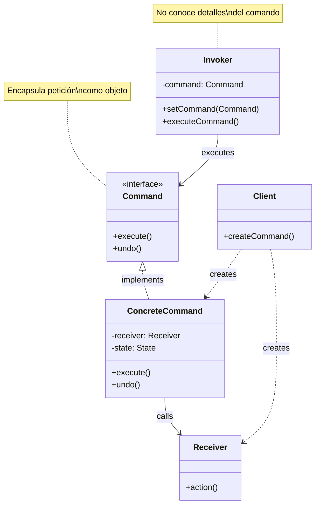

# Command (Comando)

## Categoría
**Patrón de Comportamiento**

---

## Propósito

Encapsula una solicitud como un objeto, permitiendo parametrizar clientes con diferentes solicitudes, encolar solicitudes, registrar solicitudes y soportar operaciones reversibles.

---

## Definición Formal

**Command** es un patrón de diseño de comportamiento que convierte una solicitud en un objeto independiente que contiene toda la información sobre la solicitud. Esta transformación permite parametrizar métodos con diferentes solicitudes, retrasar o encolar la ejecución de solicitudes, y soportar operaciones reversibles.

### Intención del GoF

> "Encapsula una petición como un objeto, permitiendo así parametrizar a los clientes con diferentes peticiones, hacer cola o registro de peticiones y soportar operaciones que se puedan deshacer."

---

## Explicación Detallada

El patrón Command desacopla completamente el objeto que invoca la operación del objeto que sabe cómo realizarla. La clave es encapsular una petición como un objeto.

### Conceptos Clave

1. **Encapsulación de peticiones**: Cada comando es un objeto
2. **Desacoplamiento**: Invoker no conoce al Receiver
3. **Parametrización**: Configura objetos con comandos
4. **Cola de comandos**: Encolar, ejecutar más tarde
5. **Deshacer/Rehacer**: Almacenar comandos para undo/redo
6. **Logging**: Registrar comandos ejecutados

### Metáfora: Restaurante

```
Cliente (Client) → Orden escrita (Command) → Mesero (Invoker) → Cocinero (Receiver)

El mesero no sabe cocinar, solo entrega órdenes.
La orden contiene toda la información necesaria.
```

---

## Problema Detallado

### Escenario: Control Remoto Universal

Tienes un control remoto con botones que deben controlar diferentes dispositivos (TV, luces, estéreo). Cada botón debe poder configurarse para ejecutar diferentes acciones.

**Sin Command**:
```java
// ❌ Acoplamiento fuerte
class RemoteControl {
    private TV tv;
    private Light light;
    private Stereo stereo;
    
    public void button1Pressed() {
        tv.turnOn();  // ❌ Control conoce dispositivos específicos
    }
    
    public void button2Pressed() {
        light.turnOn();
    }
    
    // ❌ Para cambiar qué hace button1, modificar código
    // ❌ No hay deshacer
    // ❌ No puedes encolar acciones
}
```

**Problemas**:
1. **Acoplamiento fuerte**: RemoteControl depende de dispositivos concretos
2. **No flexible**: Cambiar asignación de botones requiere modificar código
3. **Sin deshacer**: No hay forma de revertir acciones
4. **Sin cola**: No puedes programar acciones
5. **Sin logging**: No puedes registrar qué se ejecutó

---

## Solución con Command

```java
// ===========================================
// COMMAND INTERFACE
// ===========================================
interface Command {
    void execute();
    void undo();  // Opcional
}

// ===========================================
// CONCRETE COMMANDS
// ===========================================
class LightOnCommand implements Command {
    private Light light;
    
    public LightOnCommand(Light light) {
        this.light = light;
    }
    
    @Override
    public void execute() {
        light.turnOn();
    }
    
    @Override
    public void undo() {
        light.turnOff();
    }
}

class LightOffCommand implements Command {
    private Light light;
    
    public LightOffCommand(Light light) {
        this.light = light;
    }
    
    @Override
    public void execute() {
        light.turnOff();
    }
    
    @Override
    public void undo() {
        light.turnOn();
    }
}

// ===========================================
// RECEIVERS (los que hacen el trabajo real)
// ===========================================
class Light {
    public void turnOn() {
        System.out.println("💡 Light ON");
    }
    
    public void turnOff() {
        System.out.println("💡 Light OFF");
    }
}

class TV {
    public void turnOn() {
        System.out.println("📺 TV ON");
    }
    
    public void turnOff() {
        System.out.println("📺 TV OFF");
    }
}

// ===========================================
// INVOKER
// ===========================================
class RemoteControl {
    private Command[] onCommands;
    private Command[] offCommands;
    private Stack<Command> undoStack;
    
    public RemoteControl(int slots) {
        onCommands = new Command[slots];
        offCommands = new Command[slots];
        undoStack = new Stack<>();
        
        // NoCommand = Null Object Pattern
        Command noCommand = new NoCommand();
        for (int i = 0; i < slots; i++) {
            onCommands[i] = noCommand;
            offCommands[i] = noCommand;
        }
    }
    
    public void setCommand(int slot, Command onCmd, Command offCmd) {
        onCommands[slot] = onCmd;
        offCommands[slot] = offCmd;
    }
    
    public void onButtonPressed(int slot) {
        onCommands[slot].execute();
        undoStack.push(onCommands[slot]);
    }
    
    public void offButtonPressed(int slot) {
        offCommands[slot].execute();
        undoStack.push(offCommands[slot]);
    }
    
    public void undoButtonPressed() {
        if (!undoStack.isEmpty()) {
            Command command = undoStack.pop();
            command.undo();
        }
    }
}

// Cliente configura el control
Light livingRoomLight = new Light();
TV tv = new TV();

RemoteControl remote = new RemoteControl(7);

remote.setCommand(0, new LightOnCommand(livingRoomLight), new LightOffCommand(livingRoomLight));
remote.setCommand(1, new TVOnCommand(tv), new TVOffCommand(tv));

remote.onButtonPressed(0);   // Light ON
remote.undoButtonPressed();  // Light OFF (undo)
remote.onButtonPressed(1);   // TV ON
```

---

## Estructura UML



---

## Casos de Uso Reales

### 1. **Sistemas de Deshacer/Rehacer**
Editores de texto, gráficos, IDEs

### 2. **Transacciones**
Operaciones que se pueden commit/rollback

### 3. **Macros**
Secuencias de comandos grabados

### 4. **Colas de Tareas**
Job queues, background processing

### 5. **Menús y Botones**
UI elements que ejecutan acciones

---

## Errores Comunes

### ❌ Error 1: Command con lógica de negocio

```java
// ❌ INCORRECTO
class SaveCommand implements Command {
    public void execute() {
        // ❌ Lógica de negocio en el comando
        validateData();
        connectToDatabase();
        saveToDatabase();
        closeConnection();
    }
}

// ✅ CORRECTO
class SaveCommand implements Command {
    private DocumentRepository repo;
    private Document doc;
    
    public void execute() {
        repo.save(doc);  // ✅ Delega a Receiver
    }
}
```

### ❌ Error 2: No implementar undo

```java
// ✅ Si ofreces undo, TODOS los comandos deben implementarlo
interface Command {
    void execute();
    void undo();  // Obligatorio
}

// No mezclar comandos con/sin undo
```

---

## Ejercicios Prácticos

### Ejercicio 1: Editor de Texto
Commands: InsertText, DeleteText, FormatText con undo/redo

### Ejercicio 2: Smart Home
Commands: TurnOnLight, SetTemperature, LockDoor

### Ejercicio 3: Game Actions
Commands: MoveCharacter, Attack, UseItem con replay

---

## Referencias

- [Refactoring Guru - Command](https://refactoring.guru/design-patterns/command)
- [SourceMaking - Command](https://sourcemaking.com/design_patterns/command)

---

[📂 Ver patrones de comportamiento](../Comportamiento.md)

---

*Última actualización: Octubre 2025*
