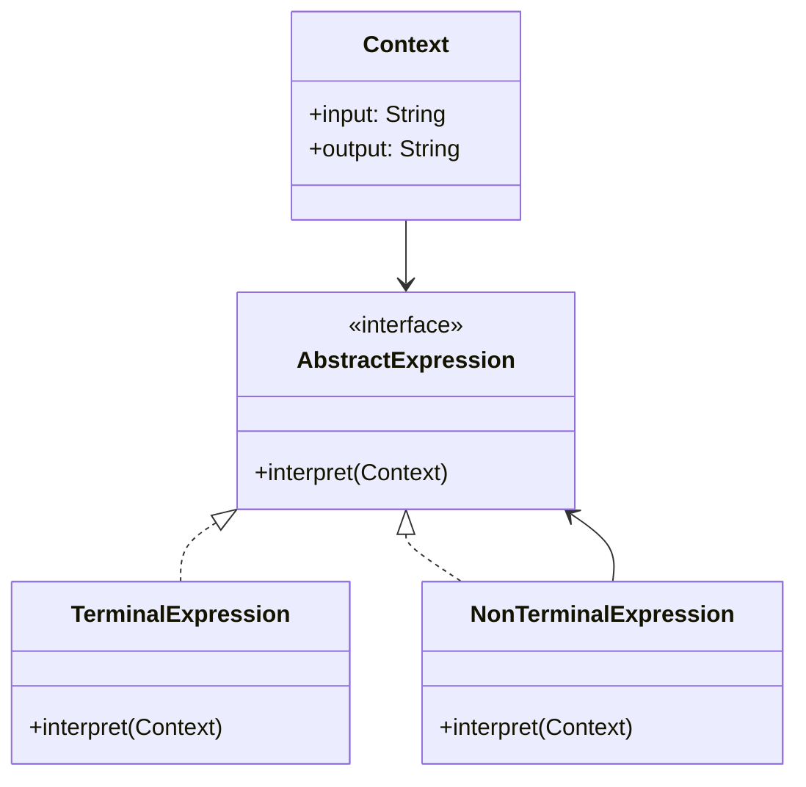

# Interpreter (Intérprete)

## Categoría
**Patrón de Comportamiento**

---

## Propósito

Define una representación para la gramática de un lenguaje junto con un intérprete que usa la representación para interpretar sentencias del lenguaje.

---

## Definición Formal

**Interpreter** es un patrón de diseño de comportamiento que define una representación gramatical para un lenguaje y proporciona un intérprete para evaluar sentencias de ese lenguaje.

### Intención del GoF

> "Dado un lenguaje, define una representación para su gramática junto con un intérprete que usa la representación para interpretar sentencias en el lenguaje."

---

## Explicación

Interpreter es útil cuando necesitas evaluar expresiones en un lenguaje específico (como expresiones matemáticas, consultas, reglas de negocio).

---

## Solución

```java
// Expression Interface
interface Expression {
    int interpret();
}

// Terminal Expression: Number
class NumberExpression implements Expression {
    private int number;
    
    public NumberExpression(int number) {
        this.number = number;
    }
    
    public int interpret() {
        return number;
    }
}

// Non-Terminal Expression: Add
class AddExpression implements Expression {
    private Expression left;
    private Expression right;
    
    public AddExpression(Expression left, Expression right) {
        this.left = left;
        this.right = right;
    }
    
    public int interpret() {
        return left.interpret() + right.interpret();
    }
}

// Uso: Evaluar "5 + (10 + 3)"
Expression expr = new AddExpression(
    new NumberExpression(5),
    new AddExpression(
        new NumberExpression(10),
        new NumberExpression(3)
    )
);

System.out.println("Result: " + expr.interpret());  // 18
```

---

## Estructura UML



**Diagrama basado en**: Resultados de búsqueda web

---

## Implementaciones por Lenguaje

### 📁 Ejemplos Disponibles

- **[Java](./java/)** - Expression evaluator
- **[C#](./csharp/)** - Grammar interpreter
- **[TypeScript](./typescript/)** - Query language

---

## Referencias

- [Refactoring Guru - Interpreter](https://refactoring.guru/design-patterns/interpreter)

---

[📂 Ver patrones de comportamiento](../Comportamiento.md)
