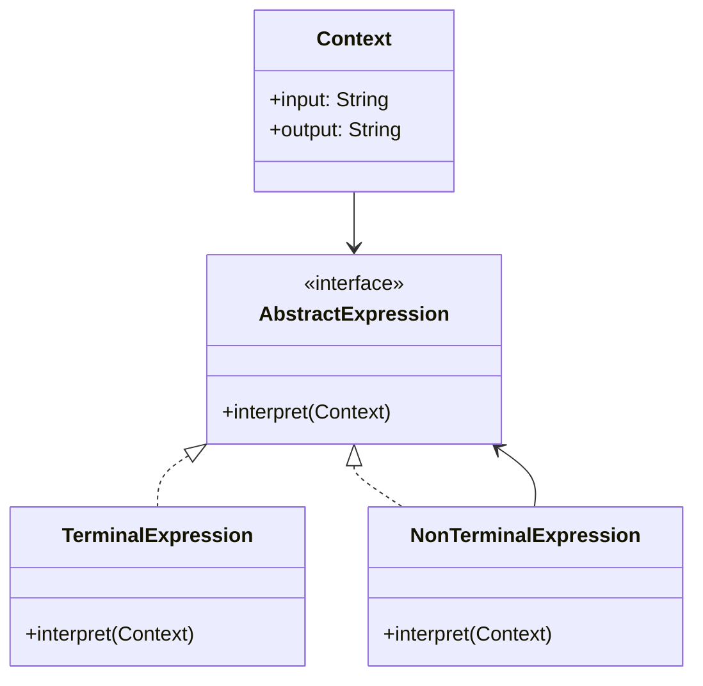
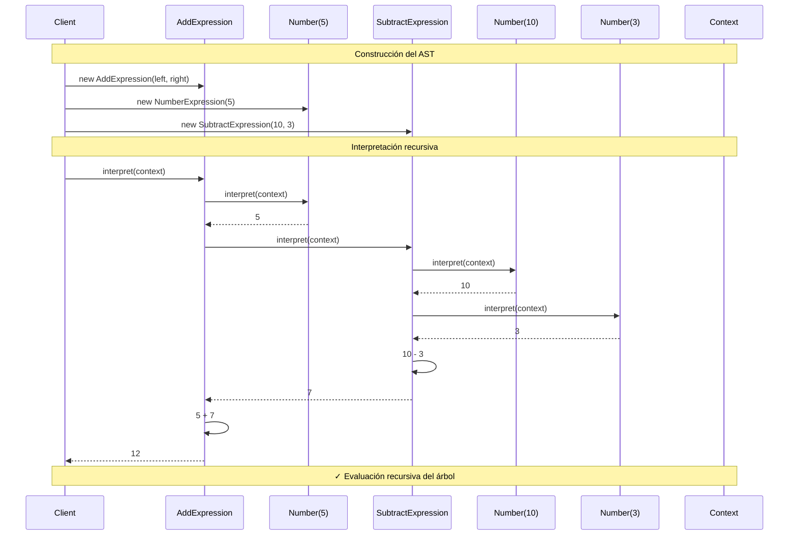
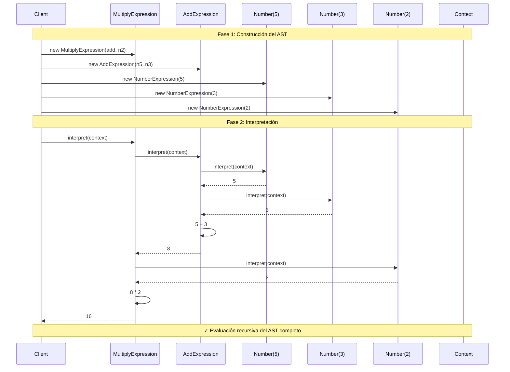

# Interpreter (Intérprete)

## Categoría
**Patrón de Comportamiento**

---

## Propósito

Define una representación para la gramática de un lenguaje junto con un intérprete que usa la representación para interpretar sentencias del lenguaje.

---

## Definición Formal

**Interpreter** es un patrón de diseño de comportamiento que define una representación gramatical para un lenguaje y proporciona un intérprete para evaluar sentencias de ese lenguaje.

### Intención del GoF

> "Dado un lenguaje, define una representación para su gramática junto con un intérprete que usa la representación para interpretar sentencias en el lenguaje."

---

## Explicación Detallada

El patrón Interpreter se utiliza cuando necesitas evaluar sentencias en un lenguaje especializado. Define una representación gramatical del lenguaje y un intérprete que procesa esa gramática.

### Conceptos Clave

1. **Gramática**: Reglas que definen el lenguaje
2. **Abstract Syntax Tree (AST)**: Representación en árbol de expresiones
3. **Terminal Expressions**: Nodos hoja que no contienen otras expresiones
4. **Non-Terminal Expressions**: Nodos compuestos que contienen otras expresiones
5. **Context**: Información global para la interpretación
6. **Composite Structure**: Usa patrón Composite para construir el árbol

### Metáfora: Traductor de Lenguaje

```
Frase en inglés: "Hello World"
       ↓
Gramática (reglas de traducción)
       ↓
Intérprete (traductor)
       ↓
Frase en español: "Hola Mundo"

El intérprete conoce las reglas del lenguaje y las aplica.
```

### ¿Cómo funciona?

```
1. Define gramática del lenguaje
   Terminal: Number, Variable
   Non-Terminal: Add, Subtract, Multiply

2. Construye Abstract Syntax Tree (AST)
   "5 + 3" → AddExpression(Number(5), Number(3))

3. Interpreta el árbol recursivamente
   AddExpression.interpret() →
     left.interpret() + right.interpret() →
     5 + 3 = 8
```

---

## Problema Detallado

### Escenario: Sistema de Reglas de Negocio

Una empresa tiene reglas de descuento complejas en formato de texto:
- "SI edad > 65 ENTONCES descuento = 20%"
- "SI compra > $1000 Y cliente_premium ENTONCES descuento = 15%"
- "SI dia = viernes Y hora > 18:00 ENTONCES descuento = 10%"

**Sin Interpreter**:
```java
// ❌ Código rígido con if/else anidados
class DiscountCalculator {
    public double calculateDiscount(Customer customer, Order order) {
        double discount = 0;
        
        // Regla 1: hardcodeada
        if (customer.getAge() > 65) {
            discount = 0.20;
        }
        
        // Regla 2: hardcodeada
        if (order.getTotal() > 1000 && customer.isPremium()) {
            discount = Math.max(discount, 0.15);
        }
        
        // Regla 3: hardcodeada
        LocalDateTime now = LocalDateTime.now();
        if (now.getDayOfWeek() == DayOfWeek.FRIDAY && now.getHour() >= 18) {
            discount = Math.max(discount, 0.10);
        }
        
        // ❌ Para añadir nueva regla: modificar código
        // ❌ No puedes cargar reglas de BD o archivo
        // ❌ Lógica de negocio mezclada con implementación
        
        return discount;
    }
}
```

**Problemas críticos**:
1. **Violación de OCP**: Añadir regla requiere modificar código fuente
2. **No configurable**: Reglas hardcodeadas, no pueden cargarse dinámicamente
3. **Difícil testear**: Todas las reglas en un método gigante
4. **No reutilizable**: Lógica específica no se puede componer
5. **Mantenimiento**: Cambiar una regla requiere recompilar y redesplegar
6. **Escalabilidad**: Con 100 reglas = método inmanejable

---

## Solución con Interpreter

```java
// Expression Interface
interface Expression {
    int interpret();
}

// Terminal Expression: Number
class NumberExpression implements Expression {
    private int number;
    
    public NumberExpression(int number) {
        this.number = number;
    }
    
    public int interpret() {
        return number;
    }
}

// Non-Terminal Expression: Add
class AddExpression implements Expression {
    private Expression left;
    private Expression right;
    
    public AddExpression(Expression left, Expression right) {
        this.left = left;
        this.right = right;
    }
    
    public int interpret() {
        return left.interpret() + right.interpret();
    }
}

// Uso: Evaluar "5 + (10 + 3)"
Expression expr = new AddExpression(
    new NumberExpression(5),
    new AddExpression(
        new NumberExpression(10),
        new NumberExpression(3)
    )
);

System.out.println("Result: " + expr.interpret());  // 18
```

**Ventajas de esta solución**:
- ✅ Reglas en estructura de datos interpretable
- ✅ Nuevas reglas sin modificar código
- ✅ Composición de expresiones complejas
- ✅ Gramática extensible

---

## Componentes

1. **AbstractExpression**: Interfaz que declara `interpret()`
2. **TerminalExpression**: Expresiones hoja (números, variables)
3. **NonTerminalExpression**: Expresiones compuestas (operaciones)
4. **Context**: Almacena estado global (variables, configuración)
5. **Client**: Construye el árbol de sintaxis abstracta (AST)

---

## Estructura UML



**Diagrama basado en**: Resultados de búsqueda web

---

## Implementaciones por Lenguaje

### 📁 Ejemplos Disponibles

- **[Java](./java/)** - Expression evaluator
- **[C#](./csharp/)** - Grammar interpreter
- **[TypeScript](./typescript/)** - Query language

Cada carpeta contiene:
- ✅ Gramáticas simples y complejas
- ✅ Terminal y Non-Terminal expressions
- ✅ Parsing de strings a AST
- ✅ Context management
- ✅ Referencias a repositorios reconocidos

---

## Diagrama de Secuencia

**Escenario**: Cliente evalúa expresión matemática "5 + (10 - 3)"



---

## Ventajas ✅

1. **Gramática extensible**: Fácil añadir nuevas reglas
2. **Fácil implementar**: Una clase por regla gramatical
3. **Open/Closed Principle**: Nuevas expresiones sin modificar existentes
4. **Composición**: Puedes combinar expresiones
5. **Reutilización**: Expresiones reutilizables en diferentes contextos
6. **Cambio dinámico**: Reglas pueden cargarse de archivos/BD

---

## Desventajas ❌

1. **Gramática compleja = muchas clases**: Explosión de clases
2. **Difícil mantener gramáticas grandes**: Mejor usar parser generators (ANTLR, Yacc)
3. **Rendimiento**: Interpretación es más lenta que código compilado
4. **Debugging complicado**: Difícil seguir ejecución recursiva
5. **Gramáticas ambiguas**: Pueden causar problemas

---

## Cuándo Usar

✅ **Usa Interpreter cuando:**

- Tienes un lenguaje simple con gramática bien definida
- La gramática es relativamente pequeña (< 20 reglas)
- La eficiencia no es crítica
- Quieres que usuarios/admins definan reglas sin programar
- Necesitas evaluar expresiones matemáticas, lógicas o de negocio

❌ **Evita Interpreter cuando:**

- La gramática es muy compleja (usa parser generators)
- El rendimiento es crítico (usa compilación)
- El lenguaje cambia frecuentemente
- Prefieres un DSL externo (SQL, Regex engines existentes)

---

## Casos de Uso Reales

### 1. **Expresiones Regulares**
```java
Pattern pattern = Pattern.compile("a*b");
// Internamente usa Interpreter para evaluar regex
```

### 2. **Consultas SQL Simples**
```
SELECT * FROM users WHERE age > 18
  ↓
Interpreter evalúa la condición "age > 18"
```

### 3. **Reglas de Negocio**
```
IF (customer.premium AND purchase > 1000) THEN discount = 15%
```

### 4. **Lenguajes de Configuración**
```
route "/api/users" to UserController
```

### 5. **Calculadoras de Expresiones**
```
(5 + 3) * (10 - 2) = 64
```

---

## Errores Comunes

### ❌ Error 1: Gramática sin optimización

```java
// ❌ INCORRECTO: Re-parsear cada vez
class BadInterpreter {
    public int evaluate(String expression) {
        Expression tree = parse(expression);  // ❌ Parse cada vez
        return tree.interpret();
    }
}

// ✅ CORRECTO: Cachear AST parseado
class GoodInterpreter {
    private Map<String, Expression> cache = new HashMap<>();
    
    public int evaluate(String expression) {
        if (!cache.containsKey(expression)) {
            cache.put(expression, parse(expression));  // ✅ Parse una vez
        }
        return cache.get(expression).interpret();
    }
}
```

### ❌ Error 2: No usar Context

```java
// ❌ INCORRECTO: Variables globales
class BadVariableExpression implements Expression {
    private static Map<String, Integer> variables = new HashMap<>();  // ❌ Global
    
    public int interpret() {
        return variables.get(name);  // ❌ Estado compartido
    }
}

// ✅ CORRECTO: Usar Context
class GoodVariableExpression implements Expression {
    private String name;
    
    public int interpret(Context context) {
        return context.getVariable(name);  // ✅ Context separado
    }
}
```

### ❌ Error 3: Recursión infinita sin validación

```java
// ❌ INCORRECTO: Gramática circular sin protección
class RecursiveExpression implements Expression {
    private Expression expr;
    
    public int interpret() {
        return expr.interpret();  // ❌ Puede causar loop infinito
    }
}

// ✅ CORRECTO: Validar gramática al construir
class SafeExpression implements Expression {
    private Expression expr;
    
    public SafeExpression(Expression expr) {
        validateNoCircularReference(expr);  // ✅ Validar
        this.expr = expr;
    }
}
```

### ❌ Error 4: Terminal Expression con lógica compleja

```java
// ❌ INCORRECTO: Terminal con lógica de negocio
class BadNumberExpression implements Expression {
    public int interpret() {
        // ❌ Lógica compleja en terminal
        int value = fetchFromDatabase();
        value = applyBusinessRules(value);
        return validateAndTransform(value);
    }
}

// ✅ CORRECTO: Terminal simple
class GoodNumberExpression implements Expression {
    private final int value;
    
    public GoodNumberExpression(int value) {
        this.value = value;
    }
    
    public int interpret() {
        return value;  // ✅ Simple, solo retorna valor
    }
}
```

### ❌ Error 5: No separar parsing de interpretación

```java
// ❌ INCORRECTO: Parse y eval mezclados
class BadInterpreter {
    public int evaluate(String expr) {
        // ❌ Todo en un método
        if (expr.contains("+")) {
            String[] parts = expr.split("\\+");
            return Integer.parseInt(parts[0]) + Integer.parseInt(parts[1]);
        }
        // ... más lógica de parsing
    }
}

// ✅ CORRECTO: Separar Parser e Interpreter
class Parser {
    public Expression parse(String expr) {
        // Solo parsing → retorna AST
    }
}

class Interpreter {
    public int interpret(Expression expr) {
        return expr.interpret();  // Solo interpretación
    }
}
```

---

## Anti-Patrones

### 1. **Interpreter God Class**

```java
// ❌ ANTI-PATRÓN: Una clase hace todo
class MegaInterpreter {
    public Object interpret(String expression) {
        // ❌ Maneja todos los tipos de expresiones
        if (expression.matches("\\d+")) {
            return parseNumber(expression);
        } else if (expression.contains("+")) {
            return parseAddition(expression);
        } else if (expression.contains("-")) {
            return parseSubtraction(expression);
        }
        // ... 50 tipos más
        // ❌ Viola SRP, OCP, todo
    }
}
```

**Problema**: Imposible de mantener y extender.  
**Solución**: Una clase Expression por tipo.

### 2. **Parser sin Validación**

```java
// ❌ ANTI-PATRÓN: Asumir input válido
class UnsafeParser {
    public Expression parse(String expr) {
        // ❌ No valida
        String[] parts = expr.split(" ");
        return new AddExpression(
            new NumberExpression(Integer.parseInt(parts[0])),  // ❌ Puede fallar
            new NumberExpression(Integer.parseInt(parts[2]))
        );
    }
}

// ✅ CORRECTO: Validar y manejar errores
class SafeParser {
    public Expression parse(String expr) throws ParseException {
        if (expr == null || expr.isBlank()) {
            throw new ParseException("Expression cannot be empty");
        }
        
        String[] parts = expr.split(" ");
        if (parts.length != 3) {
            throw new ParseException("Invalid expression format");
        }
        
        try {
            return new AddExpression(
                new NumberExpression(Integer.parseInt(parts[0])),
                new NumberExpression(Integer.parseInt(parts[2]))
            );
        } catch (NumberFormatException e) {
            throw new ParseException("Invalid number format", e);
        }
    }
}
```

---

## Relación con Otros Patrones

- **Composite**: Interpreter usa Composite para construir el AST
- **Iterator**: Puede usarse para recorrer el AST
- **Visitor**: Visitor puede procesar nodos del AST
- **Flyweight**: Puede compartir Terminal Expressions

---

## Relación con Principios SOLID

| Principio | Cómo lo cumple |
|-----------|----------------|
| **SRP** | Cada expresión tiene una responsabilidad: interpretar su tipo |
| **OCP** | Abierto a nuevas expresiones, cerrado a modificación |
| **LSP** | Expresiones son intercambiables a través de interfaz |
| **ISP** | Interfaz Expression es mínima |
| **DIP** | Intérprete depende de interfaz Expression, no de implementaciones |

---

## Diagrama de Secuencia Completo

**Escenario**: Evaluación de "(5 + 3) * 2"



---

## Variantes del Patrón

### 1. Con Context Object

```java
class Context {
    private Map<String, Integer> variables = new HashMap<>();
    
    public void setVariable(String name, int value) {
        variables.put(name, value);
    }
    
    public int getVariable(String name) {
        return variables.getOrDefault(name, 0);
    }
}

class VariableExpression implements Expression {
    private String name;
    
    public int interpret(Context context) {
        return context.getVariable(name);
    }
}

// Uso
Context ctx = new Context();
ctx.setVariable("x", 10);
ctx.setVariable("y", 5);

Expression expr = new AddExpression(
    new VariableExpression("x"),
    new VariableExpression("y")
);

int result = expr.interpret(ctx);  // 15
```

### 2. Con Visitor Pattern

```java
// Combinar Interpreter con Visitor para diferentes operaciones
interface ExpressionVisitor {
    void visitNumber(NumberExpression expr);
    void visitAdd(AddExpression expr);
}

interface Expression {
    int interpret(Context context);
    void accept(ExpressionVisitor visitor);
}

class PrintVisitor implements ExpressionVisitor {
    public void visitAdd(AddExpression expr) {
        System.out.print("(");
        expr.getLeft().accept(this);
        System.out.print(" + ");
        expr.getRight().accept(this);
        System.out.print(")");
    }
}
```

---

## Ejercicios Prácticos

### Ejercicio 1: Calculadora de Expresiones Booleanas

Implementa un intérprete para evaluar expresiones como:
- `TRUE AND FALSE` → `false`
- `(TRUE OR FALSE) AND TRUE` → `true`
- `NOT (FALSE AND TRUE)` → `true`

**Requisitos**:
- Terminal: `TrueExpression`, `FalseExpression`
- Non-Terminal: `AndExpression`, `OrExpression`, `NotExpression`

### Ejercicio 2: Lenguaje de Reglas de Validación

Crea un intérprete para reglas como:
- `age > 18`
- `email CONTAINS "@"`
- `(age > 18 AND country = "US") OR admin = true`

**Requisitos**:
- Context con variables del usuario
- Operadores: `>`, `<`, `=`, `AND`, `OR`

### Ejercicio 3: Mini SQL Query Interpreter

Implementa evaluador simple para:
- `SELECT name FROM users WHERE age > 25`

**Requisitos**:
- Terminal: ColumnExpression, ValueExpression
- Non-Terminal: SelectExpression, WhereExpression
- Context con datos

---

## Casos de Uso Adicionales

### 4. **Sistemas de Configuración**
```
server.port = 8080
server.host = "localhost"
```

### 5. **Lenguajes de Scripting Simples**
```
move player 10 steps
turn player 90 degrees
```

### 6. **Validadores de Formularios**
```
field.required AND field.length > 5 AND field.matches("[a-z]+")
```

---

## Relación Detallada con Composite

Interpreter es una aplicación especializada de Composite:

```
Composite:
  Component → Expression
  Leaf → TerminalExpression
  Composite → NonTerminalExpression
  
La operación operation() es interpret()
```

---

## Referencias

- **Gang of Four** - "Design Patterns" (Capítulo sobre Interpreter)
- [Refactoring Guru - Interpreter](https://refactoring.guru/design-patterns/interpreter)
- [SourceMaking - Interpreter](https://sourcemaking.com/design_patterns/interpreter)
- [ANTLR](https://www.antlr.org/) - Parser generator para gramáticas complejas

---

## Recursos Adicionales

### Libros
- **"Design Patterns Explained"** - Alan Shalloway
- **"Domain-Specific Languages"** - Martin Fowler

### Herramientas
- **ANTLR** - Parser generator
- **JavaCC** - Java Compiler Compiler
- **Bison/Yacc** - Parser generators clásicos

---

[📂 Ver patrones de comportamiento](../Comportamiento.md) | [🏠 Volver a inicio](../../README.md)

---

*Última actualización: Octubre 2025*
