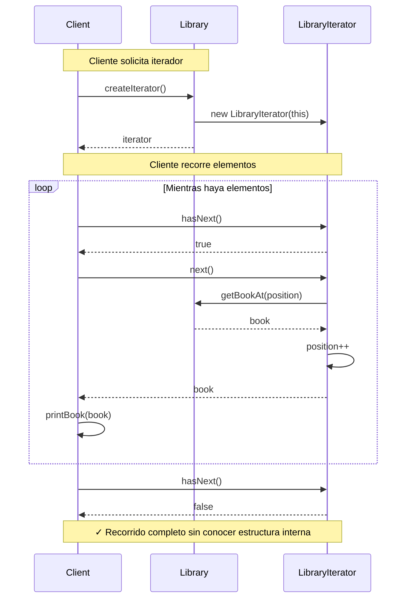

# Iterator (Iterador)

## Categoría
**Patrón de Comportamiento**

---

## Propósito

Proporciona una forma de acceder secuencialmente a los elementos de un objeto agregado sin exponer su representación subyacente.

---

## Definición Formal

**Iterator** es un patrón de diseño de comportamiento que permite recorrer elementos de una colección sin exponer su representación subyacente (lista, pila, árbol, etc.).

### Intención del GoF

> "Proporciona una manera de acceder a los elementos de un objeto agregado secuencialmente sin exponer su representación subyacente."

---

## Explicación Detallada

El patrón Iterator extrae el comportamiento de recorrido de una colección a un objeto separado llamado iterador. Este iterador encapsula todos los detalles del recorrido, como la posición actual y cuántos elementos quedan.

### Conceptos Clave

1. **Encapsulación del recorrido**: La lógica de iteración está separada de la colección
2. **Interfaz uniforme**: Misma interfaz para recorrer diferentes estructuras
3. **Múltiples iteradores**: Puedes tener varios iteradores simultáneos sobre la misma colección
4. **Independencia**: Cambiar la estructura de datos no afecta al código cliente

### Metáfora: Tour Guiado

```
Museo (Colección)
  ↓
Guía Turístico (Iterator)
  - Sabe dónde estamos
  - Sabe cuál es el siguiente
  - Puede recorrer en diferentes órdenes

Visitante (Cliente) solo sigue al guía,
no necesita conocer la distribución del museo.
```

---

## Problema Detallado

### Escenario: Biblioteca Digital

Tienes una biblioteca con libros almacenados en diferentes estructuras de datos según la categoría:
- Libros de ficción: ArrayList
- Libros técnicos: HashSet
- Libros históricos: TreeMap

**Sin Iterator**:
```java
// ❌ Cliente debe conocer la estructura interna
ArrayList<Book> fiction = library.getFictionBooks();
for (int i = 0; i < fiction.size(); i++) {
    Book book = fiction.get(i);  // ❌ Específico para ArrayList
    printBook(book);
}

HashSet<Book> technical = library.getTechnicalBooks();
for (Book book : technical) {  // ❌ Específico para HashSet
    printBook(book);
}

TreeMap<String, Book> historical = library.getHistoricalBooks();
for (Map.Entry<String, Book> entry : historical.entrySet()) {
    printBook(entry.getValue());  // ❌ Específico para TreeMap
}

// ❌ Código diferente para cada tipo de colección
```

**Problemas**:
1. **Acoplamiento**: Cliente acoplado a estructura de datos concreta
2. **Código duplicado**: Lógica de recorrido repetida
3. **Difícil cambiar**: Cambiar ArrayList a LinkedList rompe código cliente
4. **Violación de encapsulación**: Cliente accede a detalles internos
5. **No reutilizable**: Cada estructura necesita código diferente

---

## Solución con Iterator

```java
// ===========================================
// ITERATOR INTERFACE
// ===========================================
interface Iterator<T> {
    boolean hasNext();
    T next();
    void remove();  // Opcional
}

// ===========================================
// COLLECTION INTERFACE
// ===========================================
interface BookCollection {
    Iterator<Book> createIterator();
}

// ===========================================
// CONCRETE COLLECTION
// ===========================================
class Library implements BookCollection {
    private ArrayList<Book> books = new ArrayList<>();
    
    public void addBook(Book book) {
        books.add(book);
    }
    
    @Override
    public Iterator<Book> createIterator() {
        return new LibraryIterator(this);
    }
    
    public int getSize() {
        return books.size();
    }
    
    public Book getBookAt(int index) {
        return books.get(index);
    }
}

// ===========================================
// CONCRETE ITERATOR
// ===========================================
class LibraryIterator implements Iterator<Book> {
    private Library library;
    private int position = 0;
    
    public LibraryIterator(Library library) {
        this.library = library;
    }
    
    @Override
    public boolean hasNext() {
        return position < library.getSize();
    }
    
    @Override
    public Book next() {
        if (!hasNext()) {
            throw new NoSuchElementException();
        }
        return library.getBookAt(position++);
    }
    
    @Override
    public void remove() {
        throw new UnsupportedOperationException("Remove not supported");
    }
}

// ===========================================
// CLIENTE (código uniforme para cualquier colección)
// ===========================================
public class Demo {
    public static void printLibrary(BookCollection collection) {
        Iterator<Book> iterator = collection.createIterator();
        
        while (iterator.hasNext()) {
            Book book = iterator.next();
            System.out.println(book.getTitle());
        }
        // ✅ Mismo código funciona para ArrayList, HashSet, TreeMap, etc.
    }
    
    public static void main(String[] args) {
        Library library = new Library();
        library.addBook(new Book("1984", "George Orwell"));
        library.addBook(new Book("Brave New World", "Aldous Huxley"));
        
        printLibrary(library);  // Funciona sin conocer estructura interna
    }
}
```

---

## Implementaciones por Lenguaje

### 📁 Ejemplos Disponibles

- **[Java](./java/)** - Iterator interface, Iterable, for-each loop
- **[C#](./csharp/)** - IEnumerable<T>, IEnumerator<T>, yield return
- **[TypeScript](./typescript/)** - Symbol.iterator, generators, for-of

Cada carpeta contiene:
- ✅ Iteradores personalizados
- ✅ Uso de iteradores nativos del lenguaje
- ✅ Iteradores bidireccionales
- ✅ Generadores (yield)
- ✅ Referencias a documentación oficial

---

## Diagrama de Secuencia



---

## Casos de Uso Reales

### 1. **Java Collections Framework**
```java
List<String> list = Arrays.asList("A", "B", "C");
Iterator<String> it = list.iterator();
while (it.hasNext()) {
    System.out.println(it.next());
}

// O con for-each (usa Iterator internamente)
for (String item : list) {
    System.out.println(item);
}
```

### 2. **C# IEnumerable**
```csharp
IEnumerable<int> numbers = GetNumbers();
foreach (var num in numbers) {  // Usa IEnumerator internamente
    Console.WriteLine(num);
}

// Con yield return (genera iterador automáticamente)
public IEnumerable<int> GetEvenNumbers(int max)
{
    for (int i = 0; i <= max; i += 2)
    {
        yield return i;
    }
}
```

### 3. **JavaScript/TypeScript**
```javascript
const array = [1, 2, 3];
const iterator = array[Symbol.iterator]();

let item = iterator.next();
while (!item.done) {
    console.log(item.value);
    item = iterator.next();
}

// O con for...of
for (const item of array) {
    console.log(item);
}
```

---

## Variantes del Patrón

### 1. External Iterator (Activo)
```java
// Cliente controla la iteración
Iterator<T> it = collection.iterator();
while (it.hasNext()) {
    T item = it.next();
    // Cliente decide cuándo avanzar
}
```

### 2. Internal Iterator (Pasivo)
```java
// Colección controla la iteración
collection.forEach(item -> {
    System.out.println(item);
});

// Java Streams
collection.stream()
          .filter(item -> item.isActive())
          .forEach(System.out::println);
```

### 3. Bidirectional Iterator
```java
interface BidirectionalIterator<T> extends Iterator<T> {
    boolean hasPrevious();
    T previous();
}

// Permite recorrer hacia adelante y atrás
```

---

## Errores Comunes

### ❌ Error 1: Modificar colección durante iteración

```java
// ❌ INCORRECTO
List<String> list = new ArrayList<>(Arrays.asList("A", "B", "C"));
for (String item : list) {
    if (item.equals("B")) {
        list.remove(item);  // ❌ ConcurrentModificationException
    }
}

// ✅ CORRECTO: Usar iterator.remove()
Iterator<String> it = list.iterator();
while (it.hasNext()) {
    String item = it.next();
    if (item.equals("B")) {
        it.remove();  // ✅ Safe removal
    }
}
```

### ❌ Error 2: Llamar next() sin hasNext()

```java
// ❌ INCORRECTO
Iterator<String> it = collection.iterator();
String first = it.next();   // ✅ OK si hay elementos
String second = it.next();  // ❌ Puede lanzar NoSuchElementException

// ✅ CORRECTO
while (it.hasNext()) {
    String item = it.next();  // Seguro
}
```

---

## Relación con Otros Patrones

- **Composite**: Iterator recorre estructuras Composite
- **Factory Method**: Para crear iteradores
- **Memento**: Puede usar Iterator para recorrer snapshots
- **Visitor**: Usa Iterator para recorrer estructuras

---

## Ejercicios Prácticos

### Ejercicio 1: Iterador de Árbol
Implementa iterador para recorrer árbol binario (inorder, preorder, postorder)

### Ejercicio 2: Iterador con Filtro
Crea iterador que solo retorne elementos que cumplan condición

### Ejercicio 3: Iterador de Rangos
Implementa iterador para rangos (1..100, A..Z)

---

## Referencias

- [Refactoring Guru - Iterator](https://refactoring.guru/design-patterns/iterator)
- [Java Iterator](https://docs.oracle.com/javase/8/docs/api/java/util/Iterator.html)
- [C# IEnumerable](https://learn.microsoft.com/en-us/dotnet/api/system.collections.ienumerable)

---

[📂 Ver patrones de comportamiento](../Comportamiento.md)

---

*Última actualización: Octubre 2025*