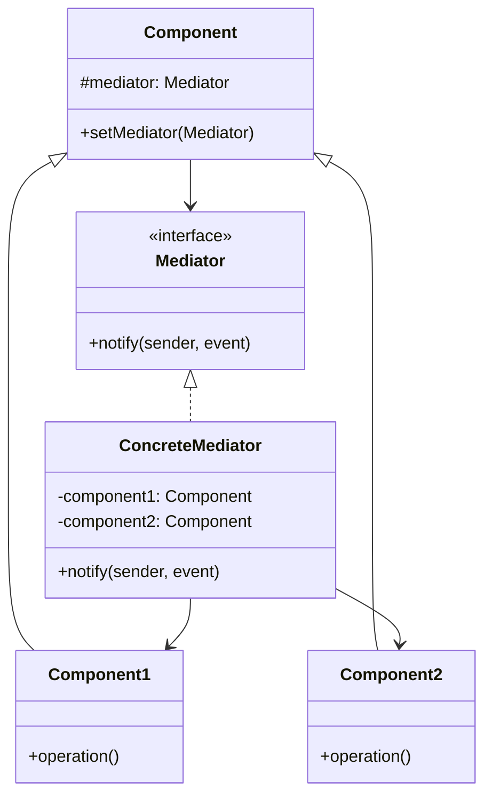
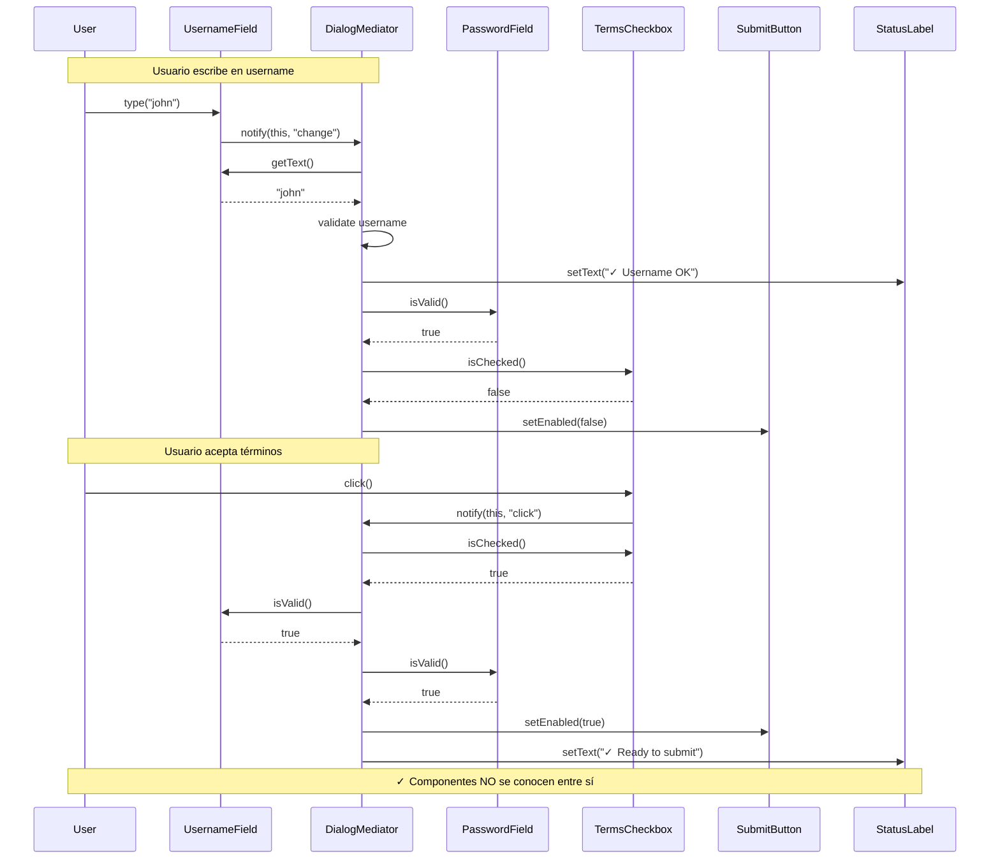
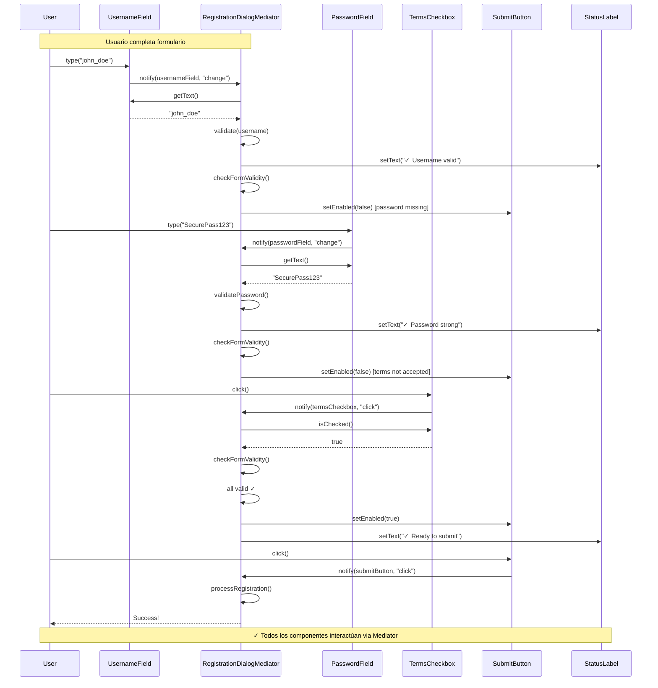

# Mediator (Mediador)

## Categoría
**Patrón de Comportamiento**

---

## Propósito

Define un objeto que encapsula cómo un conjunto de objetos interactúan. Mediator promueve el acoplamiento débil al evitar que los objetos se refieran entre sí explícitamente.

---

## Definición Formal

**Mediator** es un patrón de diseño de comportamiento que reduce las dependencias caóticas entre objetos. El patrón restringe las comunicaciones directas entre objetos y los obliga a colaborar únicamente a través de un objeto mediador.

### Intención del GoF

> "Define un objeto que encapsula cómo interactúan un conjunto de objetos. Mediator promueve el acoplamiento débil al evitar que los objetos se refieran entre sí explícitamente."

---

## Explicación Detallada

Sin un mediador, los componentes deben conocerse entre sí, creando una red compleja de dependencias. El Mediator centraliza la comunicación.

### Metáfora: Torre de Control de Aeropuerto

```
Sin Mediator:
Avión 1 ←→ Avión 2
   ↕        ↕
Avión 3 ←→ Avión 4
(n² conexiones)

Con Mediator (Torre de Control):
Avión 1 → Torre ← Avión 2
Avión 3 → Torre ← Avión 4
(n conexiones)
```

---

## Problema Detallado

### Escenario: Formulario de Registro Complejo

Tienes un formulario con múltiples componentes que interactúan:
- **TextField username**: Al escribir, valida y habilita/deshabilita botones
- **TextField password**: Valida fortaleza, muestra/oculta requisitos
- **Checkbox terms**: Debe aceptarse para habilitar submit
- **Button submit**: Solo habilitado si todo es válido
- **Button cancel**: Siempre habilitado
- **Label status**: Muestra mensajes de validación

**Sin Mediator (Acoplamiento directo)**:

```java
// ❌ Cada componente conoce a TODOS los demás
class UsernameField extends TextField {
    private PasswordField passwordField;
    private Checkbox termsCheckbox;
    private Button submitButton;
    private Label statusLabel;
    
    public void onChange() {
        String username = getText();
        
        // ❌ Button conoce múltiples componentes
        if (username.length() >= 3) {
            statusLabel.setText("✓ Username OK");
            
            // ❌ Lógica compleja de coordinación
            if (passwordField.isValid() && termsCheckbox.isChecked()) {
                submitButton.setEnabled(true);
            }
        } else {
            statusLabel.setText("❌ Username too short");
            submitButton.setEnabled(false);
        }
    }
}

class PasswordField extends TextField {
    private UsernameField usernameField;
    private Checkbox termsCheckbox;
    private Button submitButton;
    private Label statusLabel;
    private Label requirementsLabel;
    
    public void onChange() {
        // ❌ Más lógica duplicada y acoplada
        String password = getText();
        
        if (password.length() < 8) {
            requirementsLabel.show();
            statusLabel.setText("❌ Password too weak");
            submitButton.setEnabled(false);
        } else {
            requirementsLabel.hide();
            
            if (usernameField.isValid() && termsCheckbox.isChecked()) {
                submitButton.setEnabled(true);
            }
        }
    }
}

class TermsCheckbox extends Checkbox {
    private UsernameField usernameField;
    private PasswordField passwordField;
    private Button submitButton;
    
    public void onClick() {
        // ❌ Más lógica de coordinación repetida
        if (isChecked() && usernameField.isValid() && passwordField.isValid()) {
            submitButton.setEnabled(true);
        } else {
            submitButton.setEnabled(false);
        }
    }
}
```

**Diagrama de dependencias sin Mediator**:
```
      UsernameField
       /  |  |  \
      /   |  |   \
Password  |  |  Submit
  \       |  |    /
   \      |  |   /
    \     |  |  /
     Terms Checkbox
     
n componentes = n² conexiones (complejidad O(n²))
5 componentes = 25 posibles dependencias ❌
```

**Problemas críticos**:
1. **Acoplamiento n²**: Cada componente conoce a todos los demás
2. **Lógica duplicada**: Validación repetida en múltiples lugares
3. **Difícil de mantener**: Añadir componente requiere modificar todos
4. **Violación de SRP**: Componentes hacen coordinación + su función
5. **Testing difícil**: Necesitas todos los componentes para testear uno
6. **No reusable**: Componentes específicos para este formulario

---

## Solución con Mediator

```java
// Mediator Interface
interface DialogMediator {
    void notify(Component sender, String event);
}

// Concrete Mediator
class AuthenticationDialog implements DialogMediator {
    private Button loginButton;
    private TextField username;
    private TextField password;
    
    public void notify(Component sender, String event) {
        if (sender == loginButton && event.equals("click")) {
            String user = username.getText();
            String pass = password.getText();
            authenticate(user, pass);
        }
    }
}

// Components
abstract class Component {
    protected DialogMediator mediator;
    
    public void setMediator(DialogMediator mediator) {
        this.mediator = mediator;
    }
}

class Button extends Component {
    public void click() {
        mediator.notify(this, "click");  // ✅ Solo conoce al mediator
    }
}
```

---

## Estructura UML



**Diagrama basado en**: Resultados de búsqueda web

---

## Implementaciones por Lenguaje

### 📁 Ejemplos Disponibles

- **[Java](./java/)** - Implementación con componentes UI
- **[C#](./csharp/)** - Implementación con MVVM mediator
- **[TypeScript](./typescript/)** - Implementación con event bus

Cada carpeta contiene:
- ✅ Mediator con múltiples componentes
- ✅ Comunicación centralizada
- ✅ Ejemplos de UI y chat rooms
- ✅ Reducción de acoplamiento demostrada
- ✅ Referencias a repositorios reconocidos

---

## Diagrama de Secuencia

**Escenario**: Usuario interactúa con formulario a través de Mediator



---

## Componentes

1. **Mediator**: Interfaz que declara método de comunicación
2. **ConcreteMediator**: Implementa lógica de coordinación
3. **Component**: Clase base con referencia al mediator
4. **ConcreteComponents**: Componentes que se comunican via mediator

---

## Ventajas ✅

1. **Reduce acoplamiento**: De n² a n conexiones
2. **Single Responsibility Principle**: Coordinación en un lugar
3. **Componentes reutilizables**: No están acoplados entre sí
4. **Open/Closed**: Puedes añadir componentes modificando solo mediator
5. **Centraliza control**: Lógica de interacción en un lugar
6. **Fácil testear**: Componentes se testean independientemente

---

## Desventajas ❌

1. **God Object**: Mediator puede volverse demasiado complejo
2. **Punto único de fallo**: Si mediator falla, todo falla
3. **Complejidad centralizada**: Toda la lógica en mediator
4. **Puede ser overkill**: Para interacciones simples

---

## Cuándo Usar

✅ **Usa Mediator cuando:**

- Múltiples objetos se comunican de manera compleja
- Las dependencias entre objetos son caóticas
- Quieres reutilizar componentes en diferentes contextos
- Es difícil entender el flujo de comunicación
- Tienes acoplamiento n² entre componentes

❌ **Evita Mediator cuando:**

- Solo tienes 2-3 componentes con interacción simple
- La comunicación es unidireccional (usa Observer)
- Los componentes ya están bien encapsulados
- No hay beneficio en centralizar

---

## Casos de Uso Reales

### 1. **Formularios UI Complejos**
```java
// Dialog mediator coordina componentes
RegistrationDialog mediator = new RegistrationDialog();
mediator.addComponent(usernameField);
mediator.addComponent(passwordField);
mediator.addComponent(termsCheckbox);
mediator.addComponent(submitButton);
```

### 2. **Chat Rooms**
```java
class ChatRoom implements Mediator {
    private List<User> users = new ArrayList<>();
    
    public void sendMessage(String message, User sender) {
        for (User user : users) {
            if (user != sender) {
                user.receive(message);  // Mediator distribuye
            }
        }
    }
}

// Usuarios NO se conocen entre sí
User john = new User("John", chatRoom);
User jane = new User("Jane", chatRoom);
john.send("Hello!");  // ChatRoom media → Jane recibe
```

### 3. **Air Traffic Control**
```java
class ControlTower implements Mediator {
    private List<Aircraft> aircrafts = new ArrayList<>();
    
    public void requestLanding(Aircraft aircraft) {
        // Torre coordina todos los aviones
        for (Aircraft other : aircrafts) {
            if (other != aircraft) {
                other.delay();  // Retrasar otros
            }
        }
        aircraft.land();
    }
}
```

### 4. **MVC Controllers**
```java
// Controller actúa como mediator entre Model y View
class UserController {
    private UserModel model;
    private UserView view;
    
    public void onUpdateButtonClick() {
        String name = view.getNameInput();
        model.setName(name);
        view.showSuccess("Updated!");
    }
}
```

---

## Errores Comunes

### ❌ Error 1: Mediator como God Object

```java
// ❌ INCORRECTO: Mediator que hace DEMASIADO
class BadMediator {
    public void notify(Component sender, String event) {
        // ❌ Lógica de negocio compleja
        validateData();
        processPayment();
        updateDatabase();
        sendEmails();
        generateReports();
        updateCache();
        // ... 500 líneas más
        // ❌ Violación masiva de SRP
    }
}

// ✅ CORRECTO: Mediator solo coordina
class GoodMediator {
    private ValidationService validator;
    private PaymentService payment;
    
    public void notify(Component sender, String event) {
        // ✅ Solo coordinación
        if (sender == submitButton && event.equals("click")) {
            if (validator.validate(getFormData())) {
                payment.process(getPaymentInfo());
            }
        }
        // ✅ Delega a servicios especializados
    }
}
```

### ❌ Error 2: Componentes que se comunican directamente

```java
// ❌ INCORRECTO: Componentes bypassean mediator
class BadButton extends Component {
    private TextField textField;  // ❌ Referencia directa
    
    public void onClick() {
        String text = textField.getText();  // ❌ Comunicación directa
        mediator.notify(this, "click");
    }
}

// ✅ CORRECTO: Solo comunicación a través de mediator
class GoodButton extends Component {
    // ✅ No conoce otros componentes
    
    public void onClick() {
        mediator.notify(this, "click");  // ✅ Solo habla con mediator
    }
}
```

### ❌ Error 3: Mediator con demasiada lógica de negocio

```java
// ❌ INCORRECTO: Lógica de negocio en mediator
class BadMediator {
    public void notify(Component sender, String event) {
        if (sender == submitButton) {
            // ❌ Lógica de negocio compleja
            Customer customer = new Customer();
            customer.setName(usernameField.getText());
            customer.hashPassword(passwordField.getText());
            database.save(customer);
            emailService.sendWelcome(customer.getEmail());
            // ❌ Mediator no debería hacer esto
        }
    }
}

// ✅ CORRECTO: Mediator delega a servicios
class GoodMediator {
    private CustomerService customerService;
    
    public void notify(Component sender, String event) {
        if (sender == submitButton) {
            // ✅ Solo coordinación
            FormData data = collectFormData();
            customerService.register(data);  // ✅ Delega
        }
    }
}
```

### ❌ Error 4: No usar interfaz para Mediator

```java
// ❌ INCORRECTO: Componentes acoplados a mediator concreto
class BadComponent {
    private RegistrationDialog mediator;  // ❌ Clase concreta
    
    public void onChange() {
        mediator.onUsernameChange();  // ❌ Método específico
    }
}

// ✅ CORRECTO: Usar interfaz Mediator
interface Mediator {
    void notify(Component sender, String event);  // ✅ Genérico
}

class GoodComponent {
    protected Mediator mediator;  // ✅ Interfaz
    
    public void onChange() {
        mediator.notify(this, "change");  // ✅ Genérico
    }
}
```

---

## Anti-Patrones

### 1. **God Mediator**

```java
// ❌ ANTI-PATRÓN: Mediator con toda la lógica del sistema
class MegaMediator implements Mediator {
    // ❌ Conoce TODOS los componentes de TODA la aplicación
    private Button button1, button2, button3, button4, button5;
    private TextField field1, field2, field3, field4;
    private Checkbox check1, check2, check3;
    private Label label1, label2, label3;
    // ... 50 componentes más
    
    public void notify(Component sender, String event) {
        // ❌ Lógica gigantesca (1000+ líneas)
        if (sender == button1) {
            // 100 líneas
        } else if (sender == button2) {
            // 100 líneas
        }
        // ... infinitos if/else
    }
}
```

**Problema**: Mediator se vuelve inmanejable.  
**Solución**: Dividir en múltiples mediators más pequeños o usar submediators.

### 2. **Mediator Hub Anti-Pattern**

```java
// ❌ ANTI-PATRÓN: Mediator como simple hub sin lógica
class DumbMediator {
    public void notify(Component sender, String event) {
        // ❌ Solo redistribuye eventos sin coordinación
        for (Component c : components) {
            c.onEvent(event);  // ❌ Broadcast ciego
        }
        // Esto es Observer, no Mediator
    }
}
```

**Problema**: No añade valor, solo redirige.  
**Solución**: Mediator debe tener lógica de coordinación inteligente, no solo broadcast.

---

## Ejercicios Prácticos

### Ejercicio 1: Sistema de Chat

Implementa chat room donde usuarios se comunican a través de mediator.

**Requisitos**:
- **Mediator**: ChatRoom
- **Components**: User (múltiples instancias)
- Usuarios envían mensajes a ChatRoom
- ChatRoom distribuye a todos excepto emisor
- Comandos: /private, /broadcast, /users

### Ejercicio 2: Sistema de Subasta

Crea sistema de subastas con mediator.

**Requisitos**:
- **Mediator**: Auction
- **Components**: Bidder (múltiples)
- Bidders hacen ofertas through auction
- Auction valida y notifica a otros bidders
- Auction determina ganador

### Ejercicio 3: Control de Tráfico Aéreo

Diseña sistema de control de tráfico.

**Requisitos**:
- **Mediator**: ControlTower
- **Components**: Aircraft (múltiples)
- Aviones solicitan aterrizar/despegar
- Torre coordina para evitar colisiones
- Torre asigna pistas

---

## Diagrama de Secuencia Completo



---

## Ventajas Detalladas ✅

1. **Reduce acoplamiento**: De n² a n conexiones (n componentes)
2. **Single Responsibility**: Cada componente solo su función + notificar
3. **Reusabilidad**: Componentes independientes son reutilizables
4. **Centraliza lógica**: Interacciones en un lugar fácil de entender
5. **Fácil modificar**: Cambiar interacción solo requiere modificar mediator
6. **Testing simplificado**: Componentes se testean sin dependencias
7. **Open/Closed**: Añade componentes sin modificar existentes

---

## Desventajas Detalladas ❌

1. **God Object risk**: Mediator puede volverse muy complejo
2. **Punto único de fallo**: Bug en mediator afecta todo
3. **Complejidad trasladada**: De componentes a mediator
4. **Puede ser excesivo**: Para pocas interacciones es overkill
5. **Dificulta paralelismo**: Centralización puede ser cuello de botella

---

## Cuándo Usar Detallado

✅ **Usa Mediator cuando:**

- Múltiples objetos se comunican de manera **compleja y estructurada**
- Las dependencias entre objetos son **caóticas** (spagetti)
- Quieres **reutilizar** componentes independientemente
- Difícil cambiar comportamiento porque está **esparcido**
- Tienes **acoplamiento n²** entre componentes
- La lógica de coordinación es **compleja**

❌ **Evita Mediator cuando:**

- Solo tienes **2-3 componentes** con interacción simple
- La comunicación es **unidireccional** (usa Observer)
- Los componentes **no necesitan** conocerse para funcionar
- La centralización **no aporta** claridad
- Prefieres componentes **auto-contenidos**

---

## Casos de Uso Reales Expandidos

### 1. **Formularios UI Complejos**
```java
// Dialog mediator coordina validaciones cruzadas
class RegistrationDialogMediator implements Mediator {
    private UsernameField username;
    private PasswordField password;
    private PasswordField confirmPassword;
    private EmailField email;
    private TermsCheckbox terms;
    private SubmitButton submit;
    
    public void notify(Component sender, String event) {
        if (sender == password && event.equals("change")) {
            // Validar que confirmPassword coincida
            if (!password.getText().equals(confirmPassword.getText())) {
                confirmPassword.setError("Passwords don't match");
                submit.setEnabled(false);
            }
        }
        
        // Coordinar validación completa
        checkFormValidity();
    }
}
```

### 2. **Chat Room (Ejemplo Clásico)**
```java
class ChatRoom implements Mediator {
    private Map<String, User> users = new HashMap<>();
    
    public void register(User user) {
        users.put(user.getName(), user);
    }
    
    public void sendMessage(String message, String from, String to) {
        User recipient = users.get(to);
        if (recipient != null) {
            recipient.receive(message, from);
        }
    }
    
    public void broadcast(String message, String from) {
        for (User user : users.values()) {
            if (!user.getName().equals(from)) {
                user.receive(message, from);
            }
        }
    }
}

// Usuarios se comunican via ChatRoom
User alice = new User("Alice", chatRoom);
User bob = new User("Bob", chatRoom);

alice.send("Hello Bob", "Bob");  // ChatRoom media
```

### 3. **Air Traffic Control**
```java
class ControlTower implements Mediator {
    private List<Aircraft> aircrafts = new ArrayList<>();
    private Set<String> occupiedRunways = new HashSet<>();
    
    public void requestLanding(Aircraft aircraft, String runway) {
        if (occupiedRunways.contains(runway)) {
            aircraft.hold();  // Esperar
        } else {
            occupiedRunways.add(runway);
            aircraft.land(runway);
        }
    }
    
    public void notifyLanded(Aircraft aircraft, String runway) {
        occupiedRunways.remove(runway);
        notifyWaitingAircrafts();
    }
}
```

### 4. **Game Matchmaking**
```java
class Matchmaker implements Mediator {
    private Queue<Player> waitingPlayers = new LinkedList<>();
    
    public void findMatch(Player player) {
        if (waitingPlayers.size() >= 1) {
            Player opponent = waitingPlayers.poll();
            Game game = new Game(player, opponent);
            game.start();
        } else {
            waitingPlayers.add(player);
        }
    }
}
```

---

## Relación con Otros Patrones

- **Facade**: Similar pero unidireccional; Mediator es bidireccional
- **Observer**: Mediator puede usar Observer para notificar componentes
- **Command**: Mediator puede usar Commands para encapsular requests
- **Singleton**: Mediators suelen implementarse como Singleton

---

## Relación con Principios SOLID

| Principio | Cómo lo cumple |
|-----------|----------------|
| **SRP** | Mediator tiene responsabilidad de coordinación, componentes su función |
| **OCP** | Puedes añadir componentes modificando solo mediator |
| **LSP** | Componentes son intercambiables si comparten interfaz |
| **ISP** | Interfaz Mediator es simple (notify) |
| **DIP** | Componentes dependen de interfaz Mediator |

---

## Diferencia con Observer

| Aspecto | Mediator | Observer |
|---------|----------|----------|
| **Comunicación** | Muchos ↔ Mediador ↔ Muchos | Uno → Muchos (broadcast) |
| **Tipo** | Bidireccional, coordinada | Unidireccional, notificación |
| **Conocimiento** | Componentes solo conocen mediator | Observers conocen Subject |
| **Lógica** | Mediator tiene lógica compleja | Subject solo notifica |
| **Propósito** | Reducir acoplamiento | Notificar cambios |

**Combinación**: Mediator puede usar Observer internamente para notificar componentes.

---

## Ejercicios Adicionales

### Ejercicio 4: Sistema de Semáforos

**Requisitos**:
- **Mediator**: TrafficSystem
- **Components**: TrafficLight (múltiples en intersección)
- Coordinar para que solo uno esté verde
- Sincronización de cambios

### Ejercicio 5: Wizard Multi-Step Form

**Requisitos**:
- **Mediator**: WizardMediator
- **Components**: Step1, Step2, Step3, NextButton, BackButton
- Validar paso actual antes de avanzar
- Habilitar/deshabilitar botones según paso

---

## Referencias

- **Gang of Four** - "Design Patterns" (Capítulo sobre Mediator)
- [Refactoring Guru - Mediator](https://refactoring.guru/design-patterns/mediator)
- [SourceMaking - Mediator](https://sourcemaking.com/design_patterns/mediator)

---

## Recursos Adicionales

### Libros
- **"Head First Design Patterns"** - Freeman & Freeman
- **"Design Patterns Explained"** - Alan Shalloway

### Artículos
- [Mediator vs Observer](https://www.baeldung.com/java-mediator-pattern)
- [Event Bus Pattern](https://martinfowler.com/eaaDev/EventBus.html)

---

[📂 Ver patrones de comportamiento](../Comportamiento.md) | [🏠 Volver a inicio](../../README.md)

---

*Última actualización: Octubre 2025*
