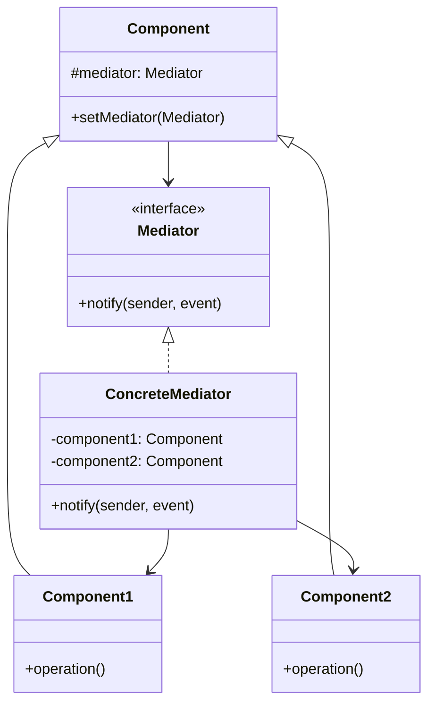

# Mediator (Mediador)

## Categoría
**Patrón de Comportamiento**

---

## Propósito

Define un objeto que encapsula cómo un conjunto de objetos interactúan. Mediator promueve el acoplamiento débil al evitar que los objetos se refieran entre sí explícitamente.

---

## Definición Formal

**Mediator** es un patrón de diseño de comportamiento que reduce las dependencias caóticas entre objetos. El patrón restringe las comunicaciones directas entre objetos y los obliga a colaborar únicamente a través de un objeto mediador.

### Intención del GoF

> "Define un objeto que encapsula cómo interactúan un conjunto de objetos. Mediator promueve el acoplamiento débil al evitar que los objetos se refieran entre sí explícitamente."

---

## Explicación Detallada

Sin un mediador, los componentes deben conocerse entre sí, creando una red compleja de dependencias. El Mediator centraliza la comunicación.

### Metáfora: Torre de Control de Aeropuerto

```
Sin Mediator:
Avión 1 ←→ Avión 2
   ↕        ↕
Avión 3 ←→ Avión 4
(n² conexiones)

Con Mediator (Torre de Control):
Avión 1 → Torre ← Avión 2
Avión 3 → Torre ← Avión 4
(n conexiones)
```

---

## Problema

```java
// ❌ Sin Mediator: Componentes acoplados
class Button {
    private TextField textField;
    private Listbox listbox;
    
    public void click() {
        String text = textField.getText();
        listbox.addItem(text);  // ❌ Button conoce TextField y Listbox
    }
}
```

---

## Solución

```java
// Mediator Interface
interface DialogMediator {
    void notify(Component sender, String event);
}

// Concrete Mediator
class AuthenticationDialog implements DialogMediator {
    private Button loginButton;
    private TextField username;
    private TextField password;
    
    public void notify(Component sender, String event) {
        if (sender == loginButton && event.equals("click")) {
            String user = username.getText();
            String pass = password.getText();
            authenticate(user, pass);
        }
    }
}

// Components
abstract class Component {
    protected DialogMediator mediator;
    
    public void setMediator(DialogMediator mediator) {
        this.mediator = mediator;
    }
}

class Button extends Component {
    public void click() {
        mediator.notify(this, "click");  // ✅ Solo conoce al mediator
    }
}
```

---

## Estructura UML



**Diagrama basado en**: Resultados de búsqueda web

---

## Implementaciones por Lenguaje

### 📁 Ejemplos Disponibles

- **[Java](./java/)** - Implementación con componentes UI
- **[C#](./csharp/)** - Implementación con MVVM mediator
- **[TypeScript](./typescript/)** - Implementación con event bus

---

## Casos de Uso

### 1. **Formularios UI**
Componentes coordinan a través de dialog mediator

### 2. **Chat Rooms**
ChatRoom media entre Users

### 3. **Air Traffic Control**
Torre coordina aviones

---

## Referencias

- [Refactoring Guru - Mediator](https://refactoring.guru/design-patterns/mediator)

---

[📂 Ver patrones de comportamiento](../Comportamiento.md)
