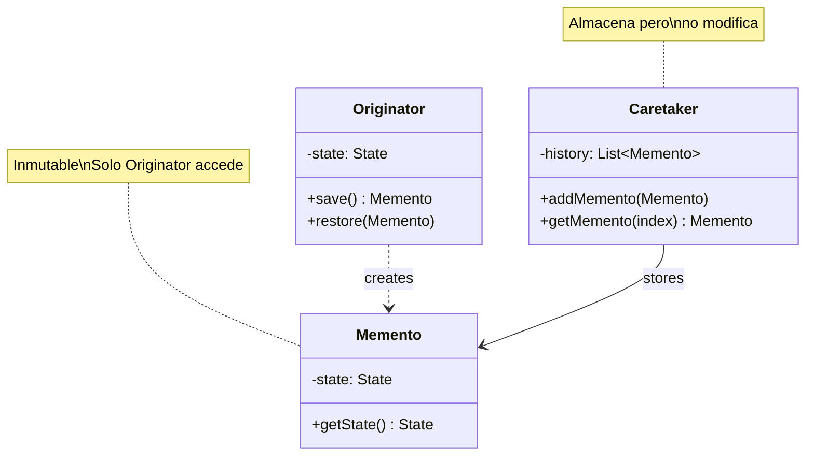
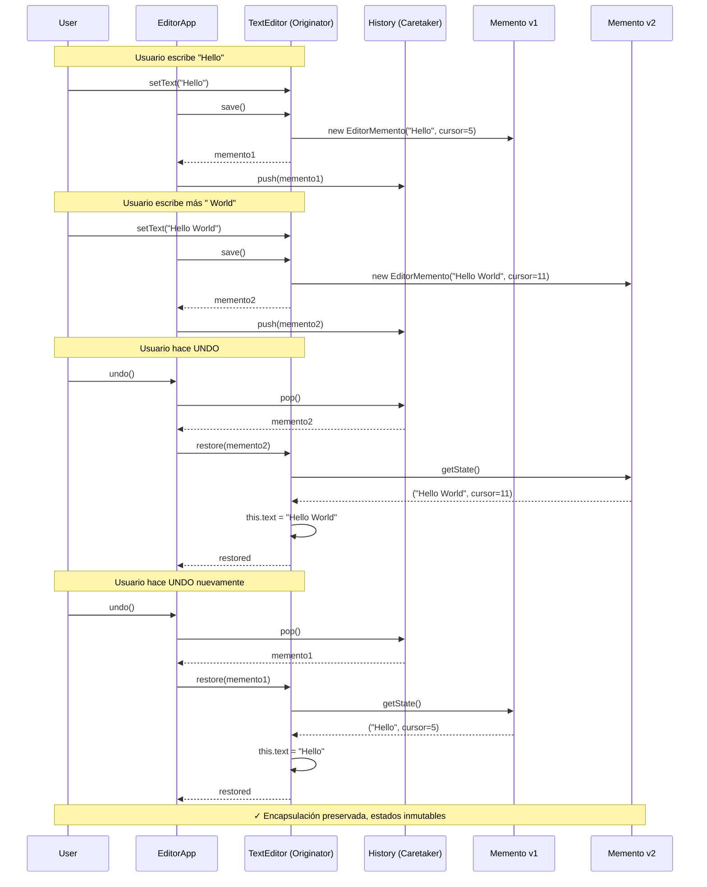
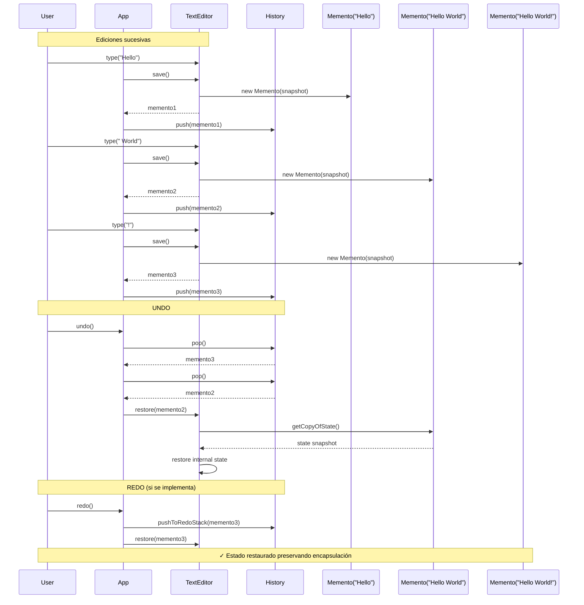

# Memento (Recuerdo)

## Categoría
**Patrón de Comportamiento**

---

## Propósito

Captura y externaliza el estado interno de un objeto sin violar su encapsulación, de modo que el objeto pueda ser restaurado a este estado más tarde.

---

## Definición Formal

**Memento** es un patrón de diseño de comportamiento que permite guardar y restaurar el estado previo de un objeto sin revelar los detalles de su implementación.

### Intención del GoF

> "Sin violar la encapsulación, captura y externaliza el estado interno de un objeto de manera que el objeto pueda ser restaurado a este estado más tarde."

---

## Explicación Detallada

El patrón Memento proporciona una forma de implementar "deshacer" (undo) guardando snapshots del estado de un objeto. La clave es que el objeto mismo crea el snapshot y solo él puede restaurarlo, preservando la encapsulación.

### Conceptos Clave

1. **Originator**: Objeto cuyo estado queremos guardar
2. **Memento**: Snapshot inmutable del estado
3. **Caretaker**: Almacena mementos pero no los modifica
4. **Encapsulación preservada**: Solo Originator accede al contenido del Memento
5. **Snapshots**: Estados guardados en puntos específicos del tiempo

### Metáfora: Guardado de Videojuego

```
Juego (Originator)
  ↓
Crear punto de guardado (Memento)
  ↓
Guardar en slot (Caretaker)
  ↓
Más tarde: Cargar desde slot
  ↓
Restaurar estado del juego
```

---

## Problema Detallado

### Escenario: Editor de Texto con Undo/Redo

Necesitas implementar funcionalidad de deshacer/rehacer en un editor de texto que mantiene:
- Texto completo del documento
- Posición del cursor
- Selección actual
- Fuente y formato
- Configuración de vista (zoom, scroll)

**Sin Memento (Violando encapsulación)**:

```java
// ❌ Editor con estado público para permitir "guardar"
class TextEditor {
    public String text;              // ❌ Público para que cliente guarde
    public int cursorPosition;       // ❌ Público
    public Selection selection;      // ❌ Público
    public String fontFamily;        // ❌ Público
    public int fontSize;             // ❌ Público
    public int scrollPosition;       // ❌ Público
    
    public void type(String chars) {
        text = text.substring(0, cursorPosition) + 
               chars + 
               text.substring(cursorPosition);
        cursorPosition += chars.length();
    }
}

// ❌ Cliente maneja guardado manualmente
class EditorApp {
    private TextEditor editor = new TextEditor();
    
    // ❌ Cliente conoce TODA la estructura interna
    private Stack<EditorState> history = new Stack<>();
    
    public void save() {
        // ❌ Crear snapshot manualmente
        EditorState state = new EditorState();
        state.text = editor.text;                    // ❌ Acceso directo
        state.cursorPos = editor.cursorPosition;     // ❌ Violación
        state.selection = editor.selection.clone();  // ❌ Conoce internals
        state.font = editor.fontFamily;
        state.fontSize = editor.fontSize;
        state.scroll = editor.scrollPosition;
        
        history.push(state);
    }
    
    public void undo() {
        if (!history.isEmpty()) {
            EditorState state = history.pop();
            
            // ❌ Restaurar manualmente
            editor.text = state.text;                   // ❌ Acceso directo
            editor.cursorPosition = state.cursorPos;    // ❌ Violación
            editor.selection = state.selection;
            editor.fontFamily = state.font;
            editor.fontSize = state.fontSize;
            editor.scrollPosition = state.scroll;
        }
    }
}

// ❌ Si editor añade nuevo campo → cliente debe actualizarse
```

**Problemas críticos**:
1. **Violación masiva de encapsulación**: Todo público
2. **Acoplamiento fuerte**: Cliente conoce estructura interna completa
3. **Frágil**: Añadir campo en editor requiere modificar cliente
4. **No escalable**: ¿Qué pasa con 50 campos?
5. **Responsabilidades confusas**: ¿Quién es responsable del snapshot?
6. **Sin protección**: Cliente puede modificar estado guardado
7. **Referencias compartidas**: `selection` puede ser modificada

---

## Solución con Memento

```java
// ===========================================
// MEMENTO
// ===========================================
class EditorMemento {
    private final String text;
    private final int cursorPos;
    private final String font;
    
    // Package-private o inner class
    EditorMemento(String text, int cursorPos, String font) {
        this.text = text;
        this.cursorPos = cursorPos;
        this.font = font;
    }
    
    String getText() { return text; }
    int getCursorPos() { return cursorPos; }
    String getFont() { return font; }
}

// ===========================================
// ORIGINATOR
// ===========================================
class TextEditor {
    private String text = "";
    private int cursorPos = 0;
    private String font = "Arial";
    
    public void setText(String text) {
        this.text = text;
    }
    
    public void setCursor(int pos) {
        this.cursorPos = pos;
    }
    
    // Crear snapshot
    public EditorMemento save() {
        return new EditorMemento(text, cursorPos, font);
    }
    
    // Restaurar desde snapshot
    public void restore(EditorMemento memento) {
        this.text = memento.getText();
        this.cursorPos = memento.getCursorPos();
        this.font = memento.getFont();
    }
}

// ===========================================
// CARETAKER
// ===========================================
class History {
    private Stack<EditorMemento> history = new Stack<>();
    
    public void push(EditorMemento memento) {
        history.push(memento);
    }
    
    public EditorMemento pop() {
        if (!history.isEmpty()) {
            return history.pop();
        }
        return null;
    }
}

// Cliente
TextEditor editor = new TextEditor();
History history = new History();

editor.setText("Version 1");
history.push(editor.save());  // Checkpoint 1

editor.setText("Version 2");
history.push(editor.save());  // Checkpoint 2

editor.setText("Version 3");  // Current

// Undo
editor.restore(history.pop());  // Back to Version 2
editor.restore(history.pop());  // Back to Version 1
```

---

## Estructura UML



**Diagrama basado en**: Estructura estándar Memento del GoF

---

## Implementaciones por Lenguaje

### 📁 Ejemplos Disponibles

- **[Java](./java/)** - Implementación clásica + Serializable
- **[C#](./csharp/)** - Implementación con records inmutables
- **[TypeScript](./typescript/)** - Implementación con snapshots

---

## Casos de Uso Reales

### 1. **Editores (Texto, Gráficos, CAD)**
Undo/Redo operations

### 2. **Transacciones de BD**
Savepoints, Rollback

### 3. **Juegos**
Save game state, Checkpoints

### 4. **Simulaciones**
Save simulation state

---

## Errores Comunes

### ❌ Error 1: Memento mutable

```java
// ❌ INCORRECTO
class BadMemento {
    public String state;  // ❌ Público y mutable
}

// ✅ CORRECTO
class GoodMemento {
    private final String state;  // ✅ Privado e inmutable
    
    GoodMemento(String state) {
        this.state = state;
    }
    
    String getState() { return state; }
}
```

### ❌ Error 2: Caretaker accede al contenido

```java
// ❌ INCORRECTO
class BadCaretaker {
    public void process(Memento m) {
        String state = m.getState();  // ❌ Viola encapsulación
        // modificar state...
    }
}

// ✅ CORRECTO
class GoodCaretaker {
    public void store(Memento m) {
        history.add(m);  // ✅ Solo almacena, no accede
    }
}
```

### ❌ Error 3: No limitar el historial (Memory Leak)

```java
// ❌ INCORRECTO: Historial que crece infinitamente
class BadHistory {
    private Stack<EditorMemento> history = new Stack<>();
    
    public void push(EditorMemento memento) {
        history.push(memento);  // ❌ Crece sin límite
        // Después de 10,000 operaciones = OutOfMemoryError
    }
}

// ✅ CORRECTO: Limitar tamaño del historial
class GoodHistory {
    private static final int MAX_HISTORY = 100;
    private Deque<EditorMemento> history = new ArrayDeque<>();
    
    public void push(EditorMemento memento) {
        if (history.size() >= MAX_HISTORY) {
            history.removeFirst();  // ✅ Eliminar el más antiguo
        }
        history.addLast(memento);
    }
}
```

### ❌ Error 4: Memento que expone setters

```java
// ❌ INCORRECTO: Memento mutable desde fuera
class BadMemento {
    private String state;
    
    public String getState() {
        return state;
    }
    
    public void setState(String state) {  // ❌ Setter público
        this.state = state;
    }
}

// Caretaker puede hacer:
EditorMemento m = editor.save();
m.setState("hacked");  // ❌ Modifica snapshot guardado
editor.restore(m);     // ❌ Restaura estado corrupto

// ✅ CORRECTO: Memento completamente inmutable
class GoodMemento {
    private final String state;  // ✅ Final
    
    // Package-private: solo Originator accede
    GoodMemento(String state) {
        this.state = state;
    }
    
    String getState() {  // ✅ Package-private
        return state;
    }
    
    // ✅ Sin setters
}
```

### ❌ Error 5: No usar inmutabilidad (deep copy necesario)

```java
// ❌ INCORRECTO: Referencias compartidas
class BadMemento {
    private final List<String> items;  // ❌ Final pero mutable
    
    BadMemento(List<String> items) {
        this.items = items;  // ❌ Comparte referencia
    }
    
    List<String> getItems() {
        return items;  // ❌ Retorna referencia mutable
    }
}

// Problema:
List<String> original = Arrays.asList("A", "B");
Memento m = new BadMemento(original);
original.clear();  // ❌ Modifica el memento también

// ✅ CORRECTO: Deep copy para inmutabilidad
class GoodMemento {
    private final List<String> items;
    
    GoodMemento(List<String> items) {
        this.items = new ArrayList<>(items);  // ✅ Copia defensiva
    }
    
    List<String> getItems() {
        return new ArrayList<>(items);  // ✅ Retorna copia
    }
}
```

---

## Diagrama de Secuencia

**Escenario**: Usuario edita texto y usa undo/redo



---

## Ventajas ✅

1. **Preserva encapsulación**: No expone estado interno del originator
2. **Simplifica Originator**: No necesita mantener versiones de su estado
3. **Snapshots baratos**: Crear memento es rápido
4. **Inmutabilidad**: Mementos son inmutables y seguros
5. **Undo/Redo fácil**: Implementación directa con stack
6. **Transacciones**: Permite rollback a estado anterior

---

## Desventajas ❌

1. **Consumo de memoria**: Cada snapshot usa RAM
2. **Overhead de creación**: Copiar estado puede ser costoso
3. **Serialización compleja**: Para objetos grandes
4. **Caretaker puede ser grande**: Almacenar muchos mementos

---

## Cuándo Usar

✅ **Usa Memento cuando:**

- Necesitas guardar y restaurar estado de un objeto
- Quieres implementar undo/redo
- Necesitas crear snapshots/checkpoints
- Quieres preservar encapsulación al guardar estado
- Implementas transacciones con rollback

❌ **Evita Memento cuando:**

- El estado es trivial de guardar (usa simple copy)
- El objeto es inmutable (no cambia)
- Crear snapshots es muy costoso
- La memoria es muy limitada

---

## Diagrama de Secuencia Completo

**Escenario**: Editor con undo/redo completo



---

## Componentes Detallados

1. **Originator**: Crea mementos con snapshot de su estado y puede restaurarse
2. **Memento**: Almacena snapshot del estado (inmutable, package-private)
3. **Caretaker**: Mantiene historial de mementos pero NO los modifica ni accede
4. **Client**: Coordina save/restore a través de Caretaker

---

## Ventajas Detalladas ✅

1. **Encapsulación perfecta**: Solo Originator accede al contenido del Memento
2. **Originator simple**: No maneja versiones de su estado
3. **Undo/Redo trivial**: Stack de mementos
4. **Snapshots seguros**: Mementos inmutables
5. **Testing**: Puedes guardar estado para tests
6. **Transacciones**: Begin → Operations → Commit/Rollback

---

## Desventajas Detalladas ❌

1. **RAM intensivo**: Cada memento consume memoria
2. **Copia costosa**: Para objetos grandes
3. **Caretaker grande**: Historial extenso usa mucha RAM
4. **Serialización**: Para persistir mementos puede ser complejo
5. **No para objetos muy grandes**: No práctico para BDs completas

---

## Variantes del Patrón

### 1. Con Serialización

```java
class SerializableMemento implements Serializable {
    private static final long serialVersionUID = 1L;
    private final String state;
    
    // Puede guardarse en disco
}
```

### 2. Con Compresión

```java
class CompressedMemento {
    private final byte[] compressedState;
    
    CompressedMemento(String state) {
        this.compressedState = compress(state);
    }
    
    String getState() {
        return decompress(compressedState);
    }
}
```

---

## Ejercicios Prácticos

### Ejercicio 1: Editor de Texto con Undo/Redo Completo

Implementa editor con undo/redo ilimitado.

**Requisitos**:
- Originator: TextEditor con texto, cursor, formato
- Historial limitado a 100 operaciones
- Soporte para redo (stack adicional)
- Comando Ctrl+Z (undo), Ctrl+Y (redo)

### Ejercicio 2: Juego con Sistema de Guardado

Crea juego con checkpoints.

**Requisitos**:
- Originator: GameState (player, level, inventory, enemies)
- Caretaker: SaveManager
- Guardar en slots (slot 1, slot 2, slot 3)
- Cargar desde cualquier slot
- Auto-save cada 5 minutos

### Ejercicio 3: Transacciones de Carrito de Compra

Diseña carrito con capacidad de cancelar operaciones.

**Requisitos**:
- Originator: ShoppingCart
- Operaciones: addItem, removeItem, applyDiscount
- Cada operación guarda memento
- Botón "Cancel last operation"
- Botón "Clear all" restaura a estado inicial

---

## Relación con Otros Patrones

- **Command**: Command puede usar Memento para implementar undo
- **Iterator**: Puede usar Memento para guardar posición de iteración
- **Prototype**: Memento puede usar Prototype para clonar estado
- **Serializable**: A menudo se combina para persistencia

---

## Relación con Principios SOLID

| Principio | Cómo lo cumple |
|-----------|----------------|
| **SRP** | Originator maneja lógica, Memento almacena estado, Caretaker maneja historial |
| **OCP** | Puedes añadir nuevos tipos de mementos sin modificar Originator |
| **LSP** | Mementos son intercambiables |
| **ISP** | Interfaz Memento es mínima (puede ser opaca para Caretaker) |
| **DIP** | Caretaker depende de interfaz Memento (si se usa) |

---

## Ejemplo Completo con Undo/Redo

```java
// ===========================================
// MEMENTO
// ===========================================
class EditorMemento {
    private final String text;
    private final int cursorPos;
    private final String font;
    
    EditorMemento(String text, int cursorPos, String font) {
        this.text = text;
        this.cursorPos = cursorPos;
        this.font = font;
    }
    
    String getText() { return text; }
    int getCursorPos() { return cursorPos; }
    String getFont() { return font; }
}

// ===========================================
// ORIGINATOR
// ===========================================
class TextEditor {
    private String text = "";
    private int cursorPos = 0;
    private String font = "Arial";
    
    public void setText(String text) {
        this.text = text;
    }
    
    public void setCursor(int pos) {
        this.cursorPos = pos;
    }
    
    public EditorMemento save() {
        return new EditorMemento(text, cursorPos, font);
    }
    
    public void restore(EditorMemento memento) {
        this.text = memento.getText();
        this.cursorPos = memento.getCursorPos();
        this.font = memento.getFont();
    }
}

// ===========================================
// CARETAKER con Undo/Redo
// ===========================================
class History {
    private static final int MAX_HISTORY = 100;
    private Deque<EditorMemento> undoStack = new ArrayDeque<>();
    private Deque<EditorMemento> redoStack = new ArrayDeque<>();
    
    public void save(EditorMemento memento) {
        if (undoStack.size() >= MAX_HISTORY) {
            undoStack.removeFirst();
        }
        undoStack.addLast(memento);
        redoStack.clear();  // Nueva operación limpia redo
    }
    
    public EditorMemento undo() {
        if (undoStack.isEmpty()) {
            return null;
        }
        EditorMemento current = undoStack.removeLast();
        redoStack.addLast(current);
        return undoStack.isEmpty() ? null : undoStack.peekLast();
    }
    
    public EditorMemento redo() {
        if (redoStack.isEmpty()) {
            return null;
        }
        EditorMemento memento = redoStack.removeLast();
        undoStack.addLast(memento);
        return memento;
    }
}

// ===========================================
// CLIENTE
// ===========================================
TextEditor editor = new TextEditor();
History history = new History();

// Operación 1
editor.setText("Hello");
history.save(editor.save());

// Operación 2
editor.setText("Hello World");
history.save(editor.save());

// Undo
EditorMemento previous = history.undo();
if (previous != null) {
    editor.restore(previous);  // Vuelve a "Hello"
}

// Redo
EditorMemento next = history.redo();
if (next != null) {
    editor.restore(next);  // Vuelve a "Hello World"
}
```

---

## Casos de Uso Adicionales

### 5. **Sistemas de Workflow**
```java
// Guardar estado de proceso de aprobación
WorkflowMemento checkpoint = workflow.save();
// ... múltiples aprobaciones
if (errorDetected) {
    workflow.restore(checkpoint);  // Volver al checkpoint
}
```

### 6. **Configuración de Aplicación**
```java
// Guardar configuración antes de cambios
ConfigMemento backup = config.save();
try {
    config.applyExperimentalSettings();
} catch (Exception e) {
    config.restore(backup);  // Restaurar si falla
}
```

---

## Combinación con Command

Memento y Command trabajan muy bien juntos para undo/redo:

```java
interface Command {
    void execute();
    void undo();
}

class TypeTextCommand implements Command {
    private TextEditor editor;
    private EditorMemento backup;  // Memento
    private String textToAdd;
    
    public void execute() {
        backup = editor.save();  // Guardar antes de ejecutar
        editor.type(textToAdd);
    }
    
    public void undo() {
        editor.restore(backup);  // Restaurar estado previo
    }
}
```

---

## Ejercicios Adicionales

### Ejercicio 4: Sistema de Transacciones

**Requisitos**:
- Originator: BankAccount
- Operaciones: deposit, withdraw, transfer
- Cada operación guarda memento
- Método rollback() restaura estado anterior
- Método commit() descarta mementos

### Ejercicio 5: Formulario con "Descartar Cambios"

**Requisitos**:
- Originator: FormData
- Guardar memento al abrir formulario
- Usuario modifica múltiples campos
- Botón "Discard Changes" restaura memento inicial
- Botón "Save" descarta memento

---

## Referencias

- **Gang of Four** - "Design Patterns" (Capítulo sobre Memento)
- [Refactoring Guru - Memento](https://refactoring.guru/design-patterns/memento)
- [SourceMaking - Memento](https://sourcemaking.com/design_patterns/memento)

---

## Recursos Adicionales

### Libros
- **"Design Patterns Explained"** - Alan Shalloway
- **"Head First Design Patterns"** - Freeman & Freeman

### Artículos
- [Memento Pattern in Java](https://www.baeldung.com/java-memento-design-pattern)
- [Undo/Redo Implementation](https://stackoverflow.com/questions/3541383/undo-redo-implementation)

---

[📂 Ver patrones de comportamiento](../Comportamiento.md) | [🏠 Volver a inicio](../../README.md)

---

*Última actualización: Octubre 2025*
