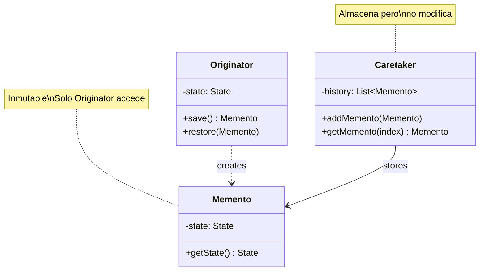

# Memento (Recuerdo)

## Categoría
**Patrón de Comportamiento**

---

## Propósito

Captura y externaliza el estado interno de un objeto sin violar su encapsulación, de modo que el objeto pueda ser restaurado a este estado más tarde.

---

## Definición Formal

**Memento** es un patrón de diseño de comportamiento que permite guardar y restaurar el estado previo de un objeto sin revelar los detalles de su implementación.

### Intención del GoF

> "Sin violar la encapsulación, captura y externaliza el estado interno de un objeto de manera que el objeto pueda ser restaurado a este estado más tarde."

---

## Explicación Detallada

El patrón Memento proporciona una forma de implementar "deshacer" (undo) guardando snapshots del estado de un objeto. La clave es que el objeto mismo crea el snapshot y solo él puede restaurarlo, preservando la encapsulación.

### Conceptos Clave

1. **Originator**: Objeto cuyo estado queremos guardar
2. **Memento**: Snapshot inmutable del estado
3. **Caretaker**: Almacena mementos pero no los modifica
4. **Encapsulación preservada**: Solo Originator accede al contenido del Memento
5. **Snapshots**: Estados guardados en puntos específicos del tiempo

### Metáfora: Guardado de Videojuego

```
Juego (Originator)
  ↓
Crear punto de guardado (Memento)
  ↓
Guardar en slot (Caretaker)
  ↓
Más tarde: Cargar desde slot
  ↓
Restaurar estado del juego
```

---

## Problema

### Escenario: Editor de Texto con Undo

```java
// ❌ Sin Memento: Expone estado interno
class TextEditor {
    public String text;      // ❌ Público
    public int cursorPos;    // ❌ Público
    public String font;      // ❌ Público
}

// Cliente guarda estado manualmente
String savedText = editor.text;
int savedPos = editor.cursorPos;
// ❌ Viola encapsulación
// ❌ Cliente conoce estructura interna
```

**Problemas**:
1. Viola encapsulación
2. Cliente acoplado a estructura interna
3. Difícil mantener múltiples estados
4. No hay interfaz clara para save/restore

---

## Solución

```java
// ===========================================
// MEMENTO
// ===========================================
class EditorMemento {
    private final String text;
    private final int cursorPos;
    private final String font;
    
    // Package-private o inner class
    EditorMemento(String text, int cursorPos, String font) {
        this.text = text;
        this.cursorPos = cursorPos;
        this.font = font;
    }
    
    String getText() { return text; }
    int getCursorPos() { return cursorPos; }
    String getFont() { return font; }
}

// ===========================================
// ORIGINATOR
// ===========================================
class TextEditor {
    private String text = "";
    private int cursorPos = 0;
    private String font = "Arial";
    
    public void setText(String text) {
        this.text = text;
    }
    
    public void setCursor(int pos) {
        this.cursorPos = pos;
    }
    
    // Crear snapshot
    public EditorMemento save() {
        return new EditorMemento(text, cursorPos, font);
    }
    
    // Restaurar desde snapshot
    public void restore(EditorMemento memento) {
        this.text = memento.getText();
        this.cursorPos = memento.getCursorPos();
        this.font = memento.getFont();
    }
}

// ===========================================
// CARETAKER
// ===========================================
class History {
    private Stack<EditorMemento> history = new Stack<>();
    
    public void push(EditorMemento memento) {
        history.push(memento);
    }
    
    public EditorMemento pop() {
        if (!history.isEmpty()) {
            return history.pop();
        }
        return null;
    }
}

// Cliente
TextEditor editor = new TextEditor();
History history = new History();

editor.setText("Version 1");
history.push(editor.save());  // Checkpoint 1

editor.setText("Version 2");
history.push(editor.save());  // Checkpoint 2

editor.setText("Version 3");  // Current

// Undo
editor.restore(history.pop());  // Back to Version 2
editor.restore(history.pop());  // Back to Version 1
```

---

## Estructura UML



**Diagrama basado en**: Estructura estándar Memento del GoF

---

## Implementaciones por Lenguaje

### 📁 Ejemplos Disponibles

- **[Java](./java/)** - Implementación clásica + Serializable
- **[C#](./csharp/)** - Implementación con records inmutables
- **[TypeScript](./typescript/)** - Implementación con snapshots

---

## Casos de Uso Reales

### 1. **Editores (Texto, Gráficos, CAD)**
Undo/Redo operations

### 2. **Transacciones de BD**
Savepoints, Rollback

### 3. **Juegos**
Save game state, Checkpoints

### 4. **Simulaciones**
Save simulation state

---

## Errores Comunes

### ❌ Error 1: Memento mutable

```java
// ❌ INCORRECTO
class BadMemento {
    public String state;  // ❌ Público y mutable
}

// ✅ CORRECTO
class GoodMemento {
    private final String state;  // ✅ Privado e inmutable
    
    GoodMemento(String state) {
        this.state = state;
    }
    
    String getState() { return state; }
}
```

### ❌ Error 2: Caretaker accede al contenido

```java
// ❌ INCORRECTO
class BadCaretaker {
    public void process(Memento m) {
        String state = m.getState();  // ❌ Viola encapsulación
        // modificar state...
    }
}

// ✅ CORRECTO
class GoodCaretaker {
    public void store(Memento m) {
        history.add(m);  // ✅ Solo almacena, no accede
    }
}
```

---

## Referencias

- [Refactoring Guru - Memento](https://refactoring.guru/design-patterns/memento)

---

[📂 Ver patrones de comportamiento](../Comportamiento.md)

---

*Última actualización: Octubre 2025*
