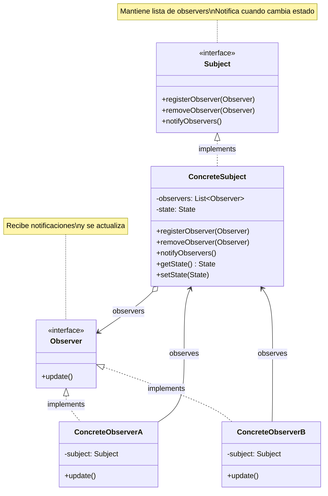
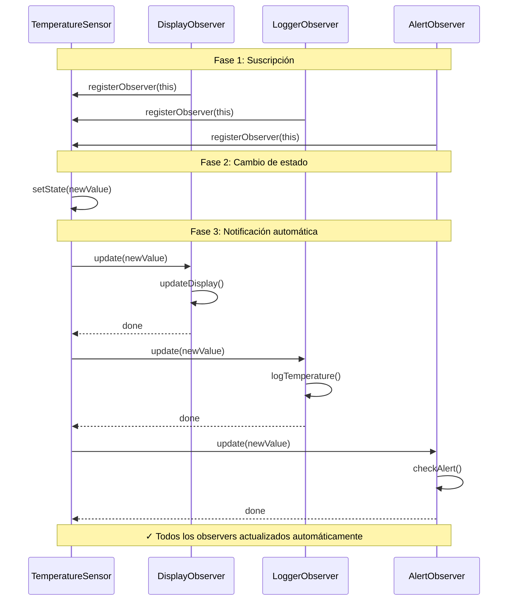

# Observer (Observador)

## Categoría
**Patrón de Comportamiento**

---

## Propósito

Define una dependencia uno-a-muchos entre objetos, de manera que cuando un objeto cambia de estado, todos sus dependientes son notificados y actualizados automáticamente.

---

## Definición Formal

**Observer** (también conocido como **Publish-Subscribe** o **Pub/Sub**) es un patrón de diseño de comportamiento que permite definir un mecanismo de suscripción para notificar a múltiples objetos sobre cualquier evento que le suceda al objeto que están observando.

### Intención del GoF

> "Define una dependencia uno-a-muchos entre objetos de forma que cuando un objeto cambia de estado, todos sus dependientes son notificados y actualizados automáticamente."

---

## Explicación Detallada

El patrón Observer es uno de los patrones más utilizados en el desarrollo de software moderno. Es la base de los sistemas de eventos, reactive programming, y arquitecturas modelo-vista.

### Conceptos Clave

1. **Subject (Sujeto)**: El objeto que tiene un estado interesante
2. **Observers (Observadores)**: Los objetos que quieren ser notificados cuando cambia el sujeto
3. **Suscripción**: Observers se registran (subscribe) en el Subject
4. **Notificación**: Subject notifica automáticamente a todos los observers registrados
5. **Desacoplamiento**: Subject no conoce detalles de los observers, solo su interfaz

### Metáfora: Suscripción a Revista

```
Editorial (Subject)
  ↓
Publica nueva edición
  ↓
Notifica automáticamente a:
  - Suscriptor 1 (Observer)
  - Suscriptor 2 (Observer)
  - Suscriptor 3 (Observer)

Los suscriptores pueden subscribirse o desuscribirse en cualquier momento.
```

### ¿Cómo funciona?

```
1. Observers se registran en Subject
   observer1.subscribe(subject)
   observer2.subscribe(subject)

2. Subject cambia su estado
   subject.setState(newValue)

3. Subject notifica a TODOS los observers
   for each observer:
       observer.update(newValue)

4. Observers reaccionan al cambio
   observer1: Actualiza UI
   observer2: Guarda en DB
   observer3: Envía notificación
```

---

## Problema Detallado

### Escenario: Sistema de Monitoreo de Temperatura

Tienes un sensor de temperatura y múltiples displays que deben mostrar la temperatura actual. Además, un logger debe registrar cambios y un sistema de alertas debe avisar si la temperatura es muy alta.

**Sin Observer**:
```java
// ❌ Acoplamiento fuerte
class TemperatureSensor {
    private float temperature;
    
    // ❌ Sensor conoce y depende de todos los displays
    private CurrentConditionsDisplay currentDisplay;
    private StatisticsDisplay statsDisplay;
    private ForecastDisplay forecastDisplay;
    private Logger logger;
    private AlertSystem alertSystem;
    
    public void setTemperature(float temp) {
        this.temperature = temp;
        
        // ❌ Debe llamar manualmente a cada componente
        currentDisplay.update(temp);
        statsDisplay.update(temp);
        forecastDisplay.update(temp);
        logger.log(temp);
        
        if (temp > 35) {
            alertSystem.sendAlert(temp);
        }
    }
    
    // ❌ Para añadir nuevo display, modificar esta clase
}
```

**Problemas críticos**:
1. **Acoplamiento fuerte**: Sensor conoce todos los displays específicos
2. **Violación de OCP**: Añadir nuevo observer requiere modificar TemperatureSensor
3. **Responsabilidades mezcladas**: Sensor maneja lógica de notificación
4. **No flexible**: No puedes añadir/quitar displays dinámicamente
5. **Difícil testear**: Sensor depende de muchas clases concretas

---

## Solución con Observer Pattern

### Estructura

```
Subject (TemperatureSensor)
    ↓
Lista de Observers
    ├── CurrentConditionsDisplay
    ├── StatisticsDisplay
    ├── ForecastDisplay
    ├── Logger
    └── AlertSystem

Cuando temperatura cambia → notify() → todos reciben update()
```

### Implementación Completa

```java
// ===========================================
// OBSERVER INTERFACE
// ===========================================
interface Observer {
    void update(float temperature);
}

// ===========================================
// SUBJECT INTERFACE
// ===========================================
interface Subject {
    void registerObserver(Observer o);
    void removeObserver(Observer o);
    void notifyObservers();
}

// ===========================================
// CONCRETE SUBJECT
// ===========================================
class TemperatureSensor implements Subject {
    private List<Observer> observers = new ArrayList<>();
    private float temperature;
    
    @Override
    public void registerObserver(Observer o) {
        if (!observers.contains(o)) {
            observers.add(o);
            System.out.println("✓ Observer registered: " + o.getClass().getSimpleName());
        }
    }
    
    @Override
    public void removeObserver(Observer o) {
        observers.remove(o);
        System.out.println("✗ Observer removed: " + o.getClass().getSimpleName());
    }
    
    @Override
    public void notifyObservers() {
        System.out.println("📡 Notifying " + observers.size() + " observers...");
        for (Observer observer : observers) {
            observer.update(temperature);
        }
    }
    
    // Método de negocio
    public void setTemperature(float temperature) {
        System.out.println("\n🌡️  Temperature changed: " + this.temperature + "°C → " + temperature + "°C");
        this.temperature = temperature;
        notifyObservers();  // Notificación automática
    }
    
    public float getTemperature() {
        return temperature;
    }
}

// ===========================================
// CONCRETE OBSERVERS
// ===========================================
class CurrentConditionsDisplay implements Observer {
    private float temperature;
    
    @Override
    public void update(float temperature) {
        this.temperature = temperature;
        display();
    }
    
    private void display() {
        System.out.println("  📺 Current Display: " + temperature + "°C");
    }
}

class StatisticsDisplay implements Observer {
    private List<Float> temperatureHistory = new ArrayList<>();
    
    @Override
    public void update(float temperature) {
        temperatureHistory.add(temperature);
        display();
    }
    
    private void display() {
        float avg = (float) temperatureHistory.stream()
                                              .mapToDouble(Float::doubleValue)
                                              .average()
                                              .orElse(0.0);
        System.out.println("  📊 Statistics: Avg = " + String.format("%.1f", avg) + "°C");
    }
}

class AlertSystem implements Observer {
    private static final float THRESHOLD = 35.0f;
    
    @Override
    public void update(float temperature) {
        if (temperature > THRESHOLD) {
            sendAlert(temperature);
        }
    }
    
    private void sendAlert(float temperature) {
        System.out.println("  🚨 ALERT: High temperature! " + temperature + "°C");
    }
}

class Logger implements Observer {
    @Override
    public void update(float temperature) {
        log(temperature);
    }
    
    private void log(float temperature) {
        System.out.println("  📝 Logger: Recorded " + temperature + "°C at " + new Date());
    }
}

// ===========================================
// CLIENTE
// ===========================================
public class WeatherStation {
    public static void main(String[] args) {
        // Crear subject
        TemperatureSensor sensor = new TemperatureSensor();
        
        // Crear observers
        CurrentConditionsDisplay currentDisplay = new CurrentConditionsDisplay();
        StatisticsDisplay statsDisplay = new StatisticsDisplay();
        AlertSystem alertSystem = new AlertSystem();
        Logger logger = new Logger();
        
        // Registrar observers (suscripción)
        sensor.registerObserver(currentDisplay);
        sensor.registerObserver(statsDisplay);
        sensor.registerObserver(alertSystem);
        sensor.registerObserver(logger);
        
        // Cambios en subject → notificación automática
        sensor.setTemperature(25.5f);
        sensor.setTemperature(30.0f);
        sensor.setTemperature(37.5f);  // Dispara alerta
        
        // Desuscribir un observer
        sensor.removeObserver(alertSystem);
        sensor.setTemperature(40.0f);  // AlertSystem NO recibe esta
    }
}
```

**Salida**:
```
✓ Observer registered: CurrentConditionsDisplay
✓ Observer registered: StatisticsDisplay
✓ Observer registered: AlertSystem
✓ Observer registered: Logger

🌡️  Temperature changed: 0.0°C → 25.5°C
📡 Notifying 4 observers...
  📺 Current Display: 25.5°C
  📊 Statistics: Avg = 25.5°C
  📝 Logger: Recorded 25.5°C

🌡️  Temperature changed: 25.5°C → 30.0°C
📡 Notifying 4 observers...
  📺 Current Display: 30.0°C
  📊 Statistics: Avg = 27.8°C
  📝 Logger: Recorded 30.0°C

🌡️  Temperature changed: 30.0°C → 37.5°C
📡 Notifying 4 observers...
  📺 Current Display: 37.5°C
  📊 Statistics: Avg = 31.0°C
  🚨 ALERT: High temperature! 37.5°C
  📝 Logger: Recorded 37.5°C

✗ Observer removed: AlertSystem

🌡️  Temperature changed: 37.5°C → 40.0°C
📡 Notifying 3 observers...
  📺 Current Display: 40.0°C
  📊 Statistics: Avg = 33.2°C
  📝 Logger: Recorded 40.0°C
```

---

## Estructura UML

### Diagrama de Clases



**Diagrama basado en**: Estructura estándar del patrón Observer del GoF

---

## Componentes

1. **Subject**: Interfaz que declara métodos para gestionar observers
2. **ConcreteSubject**: Implementa Subject, mantiene estado y lista de observers
3. **Observer**: Interfaz que declara el método de actualización
4. **ConcreteObserver**: Implementa Observer y mantiene referencia al Subject

---

## Implementaciones por Lenguaje

### 📁 Ejemplos Disponibles

- **[Java](./java/)** - Observable/Observer (deprecated), PropertyChangeListener, Event listeners
- **[C#](./csharp/)** - event/delegate, IObservable<T>/IObserver<T>, Reactive Extensions (Rx.NET)
- **[TypeScript](./typescript/)** - EventEmitter, RxJS, Custom implementation

Cada carpeta contiene:
- ✅ Implementación clásica del patrón
- ✅ Versión con características nativas del lenguaje
- ✅ Push vs Pull model
- ✅ Referencias a repositorios reconocidos
- ✅ Reactive programming examples

---

## Diagrama de Secuencia



---

## Variantes del Patrón

### 1. Push Model (Modelo Push)

Subject envía todos los datos en la notificación:

```java
interface Observer {
    void update(float temperature, float humidity, float pressure);
}

class ConcreteSubject implements Subject {
    public void notifyObservers() {
        for (Observer o : observers) {
            o.update(temperature, humidity, pressure);  // Push de datos
        }
    }
}
```

**Ventaja**: Observers reciben toda la información
**Desventaja**: Observers reciben datos que tal vez no necesiten

### 2. Pull Model (Modelo Pull)

Observers obtienen datos del Subject según necesiten:

```java
interface Observer {
    void update(Subject subject);  // Solo referencia al subject
}

class ConcreteObserver implements Observer {
    public void update(Subject subject) {
        float temp = subject.getTemperature();  // Pull de datos específicos
        // Solo obtiene lo que necesita
    }
}
```

**Ventaja**: Observers obtienen solo lo que necesitan
**Desventaja**: Observers deben conocer la interfaz del Subject

---

## Casos de Uso Reales

### 1. **Event Listeners (UI)**
```java
button.addActionListener(e -> {
    System.out.println("Button clicked!");
});
```

### 2. **MVC Architecture**
```
Model (Subject) → View (Observer)
Cuando model cambia → View se actualiza automáticamente
```

### 3. **Reactive Programming (RxJava, RxJS)**
```java
Observable.fromIterable(items)
    .subscribe(
        item -> System.out.println(item),  // onNext
        error -> System.err.println(error), // onError
        () -> System.out.println("Done")    // onComplete
    );
```

### 4. **Pub/Sub Messaging**
```
Redis Pub/Sub, RabbitMQ, Kafka
Publishers (Subject) → Subscribers (Observers)
```

### 5. **Cambios en Datos (Data Binding)**
```
Angular, Vue, React
Model changes → UI updates automatically
```

---

## Errores Comunes

### ❌ Error 1: Memory Leaks por no desuscribirse

```java
// ❌ INCORRECTO
class MyComponent {
    public MyComponent(Subject subject) {
        subject.registerObserver(this);
        // ❌ Nunca se desuscribe = memory leak
    }
}

// ✅ CORRECTO
class MyComponent implements Observer {
    private Subject subject;
    
    public MyComponent(Subject subject) {
        this.subject = subject;
        subject.registerObserver(this);
    }
    
    public void dispose() {
        subject.removeObserver(this);  // ✅ Desuscribirse al destruir
    }
}
```

### ❌ Error 2: Notificación durante construcción

```java
// ❌ INCORRECTO
class BadSubject implements Subject {
    public BadSubject() {
        setState(initialValue);  // ❌ Notifica antes de estar listo
    }
}

// ✅ CORRECTO
class GoodSubject implements Subject {
    public void initialize() {
        setState(initialValue);  // ✅ Notifica después de construcción completa
    }
}
```

### ❌ Error 3: Orden de notificación

```java
// ⚠️ CUIDADO: El orden de notificación puede importar
class Subject {
    private List<Observer> observers = new ArrayList<>();
    
    // ❌ Si el orden importa, esto es problemático
    public void notifyObservers() {
        for (Observer o : observers) {  // Orden no garantizado
            o.update();
        }
    }
}

// ✅ MEJOR: Si el orden importa, usar lista ordenada
private List<Observer> observers = new LinkedList<>();  // Orden de inserción
// O usar PriorityQueue con prioridades explícitas
```

### ❌ Error 4: Modificar lista durante iteración

```java
// ❌ INCORRECTO
public void notifyObservers() {
    for (Observer o : observers) {
        o.update();  // ❌ Si update() llama a removeObserver(), ConcurrentModificationException
    }
}

// ✅ CORRECTO: Copiar lista antes de iterar
public void notifyObservers() {
    List<Observer> observersCopy = new ArrayList<>(observers);
    for (Observer o : observersCopy) {
        o.update();  // ✅ Safe
    }
}
```

### ❌ Error 5: Observers que lanzan excepciones

```java
// ❌ PROBLEMA: Una excepción detiene la notificación
public void notifyObservers() {
    for (Observer o : observers) {
        o.update();  // Si lanza excepción, los siguientes no se notifican
    }
}

// ✅ CORRECTO: Proteger notificación
public void notifyObservers() {
    for (Observer o : observers) {
        try {
            o.update();
        } catch (Exception e) {
            System.err.println("Observer failed: " + e.getMessage());
            // Continuar con los siguientes
        }
    }
}
```

---

## Anti-Patrones

### 1. **Observer que modifica el Subject**

```java
// ❌ ANTI-PATRÓN
class BadObserver implements Observer {
    public void update(Subject subject) {
        subject.setState(newValue);  // ❌ Puede causar bucle infinito
        // setState() → notifyObservers() → update() → setState() → ...
    }
}
```

### 2. **Subject que sabe demasiado de Observers**

```java
// ❌ ANTI-PATRÓN
class BadSubject {
    public void notifyObservers() {
        for (Observer o : observers) {
            if (o instanceof DisplayObserver) {
                ((DisplayObserver) o).updateDisplay();  // ❌ Acoplamiento
            } else if (o instanceof LogObserver) {
                ((LogObserver) o).writeLog();  // ❌ Conoce tipos concretos
            }
        }
    }
}

// ✅ CORRECTO: Usar interfaz uniforme
public void notifyObservers() {
    for (Observer o : observers) {
        o.update();  // ✅ Polimorfismo puro
    }
}
```

---

## Relación con Otros Patrones

- **Mediator**: Observer distribuido vs. Mediator centralizado
- **Singleton**: Subject suele ser Singleton
- **Command**: Observer puede usar Command para enviar notificaciones

---

## Relación con Principios SOLID

| Principio | Cómo lo cumple |
|-----------|----------------|
| **SRP** | Subject maneja estado, Observers reaccionan a cambios |
| **OCP** | Puedes añadir observers sin modificar Subject |
| **LSP** | Observers son intercambiables |
| **ISP** | Interfaz Observer es mínima |
| **DIP** | Subject depende de interfaz Observer, no de implementaciones |

---

## Ejercicios Prácticos

### Ejercicio 1: Bolsa de Valores
Subject: Stock, Observers: Investor, Display, Logger
Notifica cambios de precio

### Ejercicio 2: Sistema de Subastas
Subject: Auction, Observers: Bidder
Notifica nuevas pujas

### Ejercicio 3: Chat Room
Subject: ChatRoom, Observers: User
Notifica nuevos mensajes

---

## Referencias

- **Gang of Four** - "Design Patterns" (Capítulo sobre Observer)
- [Refactoring Guru - Observer](https://refactoring.guru/design-patterns/observer)
- [RxJava Documentation](https://github.com/ReactiveX/RxJava)

---

[📂 Ver patrones de comportamiento](../Comportamiento.md)

---

*Última actualización: Octubre 2025*
