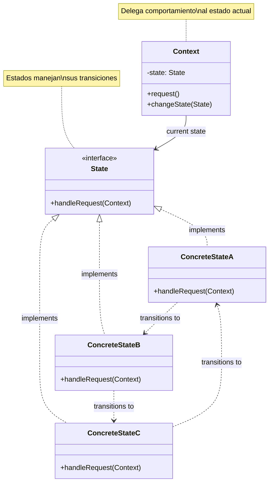
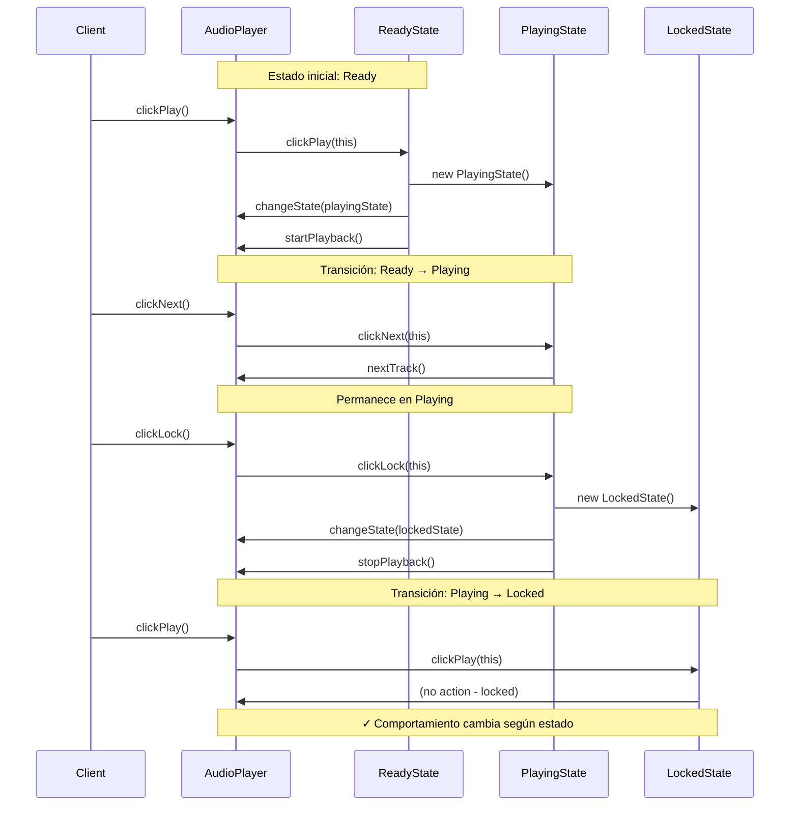
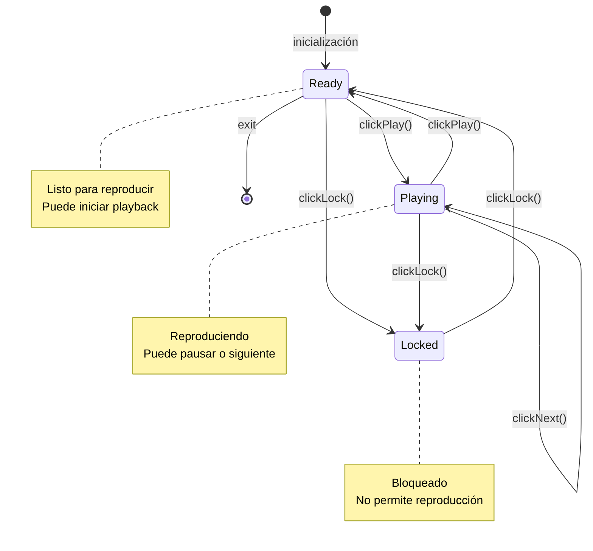

# State (Estado)

## Categoría
**Patrón de Comportamiento**

---

## Propósito

Permite que un objeto altere su comportamiento cuando su estado interno cambia. El objeto parecerá cambiar de clase.

---

## Definición Formal

**State** es un patrón de diseño de comportamiento que permite que un objeto cambie su comportamiento cuando su estado interno cambia, aparentando que el objeto ha cambiado de clase.

### Intención del GoF

> "Permite que un objeto altere su comportamiento cuando su estado interno cambia. El objeto parecerá cambiar su clase."

---

## Explicación Detallada

El patrón State es esencialmente una **máquina de estados finitos** implementada mediante programación orientada a objetos. En lugar de tener un montón de condicionales que verifican el estado, delegas el comportamiento a objetos de estado.

### Conceptos Clave

1. **Estado como Objeto**: Cada estado es una clase separada
2. **Comportamiento Específico**: Cada estado define cómo responde a eventos
3. **Transiciones**: Los estados manejan sus propias transiciones
4. **Contexto**: Mantiene referencia al estado actual y delega llamadas
5. **Polimorfismo**: Mismo método, diferente comportamiento según el estado

### Metáfora: Semáforo

```
Semáforo (Contexto)
Estado actual: Rojo
  ↓
Evento: timer()
  ↓
RedState.handleTimer() → transición a GreenState
  ↓
Estado actual: Verde

Cada estado sabe a cuál estado transicionar.
```

### ¿Cómo funciona?

```
Cliente → Context.request()
             ↓
          CurrentState.handle(context)
             ↓
          ┌─ Ejecuta comportamiento específico del estado
          └─ Cambia a siguiente estado si es necesario
```

---

## Problema Detallado

### Escenario: Reproductor de Audio

Un reproductor de audio tiene diferentes estados: **Locked**, **Ready**, **Playing**. El comportamiento de los botones cambia según el estado:

- **Locked**: No responde a Play, solo a Lock (desbloquear)
- **Ready**: Play inicia reproducción, Lock bloquea
- **Playing**: Play pausa, Lock bloquea y para

### Enfoque Ingenuo: Condicionales

```java
// ❌ Sin State Pattern
class AudioPlayer {
    private String state = "locked";  // String = propenso a errores
    private boolean playing = false;
    
    public void clickLock() {
        if (state.equals("locked")) {
            state = "ready";
            System.out.println("Player unlocked");
        } else if (state.equals("ready")) {
            state = "locked";
            System.out.println("Player locked");
        } else if (state.equals("playing")) {
            state = "locked";
            playing = false;
            System.out.println("Player stopped and locked");
        }
    }
    
    public void clickPlay() {
        if (state.equals("locked")) {
            // No hacer nada
            System.out.println("Player is locked");
        } else if (state.equals("ready")) {
            startPlayback();
            state = "playing";
        } else if (state.equals("playing")) {
            stopPlayback();
            state = "ready";
        }
    }
    
    public void clickNext() {
        if (state.equals("locked")) {
            // No hacer nada
        } else if (state.equals("ready")) {
            // No hacer nada
        } else if (state.equals("playing")) {
            // Ir a siguiente canción
            playNext();
        }
    }
    
    // Con 5 estados y 10 métodos = 50 condicionales ❌
}
```

**Problemas críticos**:
1. **Condicionales por todas partes**: Cada método tiene if/else para cada estado
2. **Violación de OCP**: Añadir nuevo estado requiere modificar TODOS los métodos
3. **Violación de SRP**: La clase hace demasiado
4. **Propenso a errores**: Fácil olvidar un caso o usar string incorrecto
5. **Difícil testear**: Demasiadas rutas de código
6. **Escalabilidad**: Con n estados y m métodos = n*m condicionales

---

## Solución con State Pattern

### Arquitectura

```
Context (AudioPlayer)
    ↓
State (interface)
    ↓
├── LockedState
├── ReadyState
└── PlayingState

Cada estado implementa cómo responder a eventos.
```

### Implementación Completa

```java
// ===========================================
// STATE INTERFACE
// ===========================================
interface State {
    void clickLock(AudioPlayer player);
    void clickPlay(AudioPlayer player);
    void clickNext(AudioPlayer player);
}

// ===========================================
// CONTEXT
// ===========================================
class AudioPlayer {
    private State state;
    private boolean playing = false;
    private int volume = 50;
    private String currentTrack = "";
    
    public AudioPlayer() {
        this.state = new ReadyState();  // Estado inicial
    }
    
    // Delegación pura al estado actual
    public void clickLock() {
        state.clickLock(this);
    }
    
    public void clickPlay() {
        state.clickPlay(this);
    }
    
    public void clickNext() {
        state.clickNext(this);
    }
    
    // Método para cambiar estado
    public void changeState(State state) {
        System.out.println("Changing state to: " + state.getClass().getSimpleName());
        this.state = state;
    }
    
    // Métodos de negocio (usados por estados)
    public void startPlayback() {
        System.out.println("▶️  Playing: " + currentTrack);
        playing = true;
    }
    
    public void stopPlayback() {
        System.out.println("⏸  Paused");
        playing = false;
    }
    
    public void nextTrack() {
        System.out.println("⏭  Next track");
        // Cambiar a siguiente canción
    }
    
    public boolean isPlaying() {
        return playing;
    }
}

// ===========================================
// CONCRETE STATE: Locked
// ===========================================
class LockedState implements State {
    @Override
    public void clickLock(AudioPlayer player) {
        // Desbloquear
        player.changeState(new ReadyState());
        System.out.println("🔓 Player unlocked");
    }
    
    @Override
    public void clickPlay(AudioPlayer player) {
        // No hacer nada cuando está bloqueado
        System.out.println("🔒 Player is locked. Unlock first!");
    }
    
    @Override
    public void clickNext(AudioPlayer player) {
        // No hacer nada cuando está bloqueado
        System.out.println("🔒 Player is locked");
    }
}

// ===========================================
// CONCRETE STATE: Ready
// ===========================================
class ReadyState implements State {
    @Override
    public void clickLock(AudioPlayer player) {
        // Bloquear
        player.changeState(new LockedState());
        System.out.println("🔒 Player locked");
    }
    
    @Override
    public void clickPlay(AudioPlayer player) {
        // Iniciar reproducción
        player.startPlayback();
        player.changeState(new PlayingState());
    }
    
    @Override
    public void clickNext(AudioPlayer player) {
        // En ready, next no hace nada (no hay reproducción activa)
        System.out.println("⏭  No track playing");
    }
}

// ===========================================
// CONCRETE STATE: Playing
// ===========================================
class PlayingState implements State {
    @Override
    public void clickLock(AudioPlayer player) {
        // Parar y bloquear
        player.stopPlayback();
        player.changeState(new LockedState());
        System.out.println("⏹  Stopped and locked");
    }
    
    @Override
    public void clickPlay(AudioPlayer player) {
        // Pausar reproducción
        player.stopPlayback();
        player.changeState(new ReadyState());
    }
    
    @Override
    public void clickNext(AudioPlayer player) {
        // Siguiente canción
        player.nextTrack();
        // Permanece en Playing
    }
}

// ===========================================
// CLIENTE
// ===========================================
public class Demo {
    public static void main(String[] args) {
        AudioPlayer player = new AudioPlayer();
        
        System.out.println("=== Scenario 1: Normal flow ===");
        player.clickPlay();   // Ready → Playing
        player.clickNext();   // Siguiente canción
        player.clickPlay();   // Playing → Ready (pause)
        player.clickLock();   // Ready → Locked
        
        System.out.println("\n=== Scenario 2: Try play when locked ===");
        player.clickPlay();   // Locked: no permite
        player.clickLock();   // Locked → Ready
        player.clickPlay();   // Ready → Playing
    }
}
```

**Salida**:
```
=== Scenario 1: Normal flow ===
Changing state to: PlayingState
▶️  Playing: 
Changing state to: PlayingState
⏭  Next track
Changing state to: ReadyState
⏸  Paused
Changing state to: LockedState
🔒 Player locked

=== Scenario 2: Try play when locked ===
🔒 Player is locked. Unlock first!
Changing state to: ReadyState
🔓 Player unlocked
Changing state to: PlayingState
▶️  Playing:
```

---

## Estructura UML



---

## Componentes

1. **Context**: Mantiene instancia del estado actual y delega requests
2. **State**: Interfaz que declara métodos para cada acción posible
3. **ConcreteState**: Implementa comportamiento específico del estado y transiciones

---

## Implementaciones por Lenguaje

### 📁 Ejemplos Disponibles

- **[Java](./java/)** - Implementación con clases de estado
- **[C#](./csharp/)** - Implementación .NET con pattern matching
- **[TypeScript](./typescript/)** - Implementación type-safe con estados

Cada carpeta contiene:
- ✅ Máquina de estados completa
- ✅ Múltiples transiciones de estado
- ✅ Ejemplos: Audio player, pedidos, documentos
- ✅ Referencias a repositorios reconocidos
- ✅ Comparación detallada con Strategy

---

## Diagrama de Secuencia



---

## Ventajas ✅

1. **Single Responsibility Principle**: Comportamiento de cada estado en clase separada
2. **Open/Closed Principle**: Añadir nuevos estados sin modificar existentes
3. **Elimina condicionales**: No más if/else por todos lados
4. **Estados explícitos**: Máquina de estados visible en el código
5. **Transiciones claras**: Cada estado sabe a cuáles estados puede transicionar
6. **Testeable**: Cada estado se puede testear independientemente

---

## Desventajas ❌

1. **Overhead para pocos estados**: Puede ser excesivo si solo tienes 2-3 estados simples
2. **Muchas clases**: Un estado = una clase
3. **Complejidad inicial**: Más código inicial vs. condicionales simples
4. **Cambio de estado**: Requiere cuidado para evitar estados inconsistentes

---

## Cuándo Usar

✅ **Usa State cuando:**

- Un objeto tiene comportamiento que depende de su estado
- Tienes operaciones con condicionales grandes dependientes del estado
- El estado del objeto cambia frecuentemente en runtime
- Tienes una máquina de estados compleja
- Los estados tienen transiciones bien definidas

❌ **Evita State cuando:**

- Solo tienes 2-3 estados muy simples
- El comportamiento no varía significativamente entre estados
- Las transiciones no están bien definidas
- Prefieres simplicidad sobre estructura (simples if/else pueden bastar)

---

## Casos de Uso Reales

### 1. **Conexión TCP**
```
Estados: Closed, Listen, Syn_Sent, Established, Close_Wait
Transiciones: open(), close(), acknowledge(), timeout()
```

### 2. **Pedidos E-commerce**
```
Estados: New, PaymentPending, Paid, Shipped, Delivered, Cancelled, Refunded
Transiciones: pay(), ship(), deliver(), cancel(), refund()
```

### 3. **Documentos con Workflow**
```
Estados: Draft, PendingReview, Approved, Rejected, Published
Transiciones: submit(), approve(), reject(), publish(), archive()
```

### 4. **Semáforo**
```
Estados: Red, Yellow, Green
Transiciones: timer() automático
```

### 5. **Autenticación de Usuario**
```
Estados: Guest, Authenticated, Admin, Locked
Transiciones: login(), logout(), promote(), lock()
```

---

## Errores Comunes

### ❌ Error 1: Estado con lógica de negocio compleja

```java
// ❌ INCORRECTO: Estado hace demasiado
class PayingState implements OrderState {
    public void handle(Order order) {
        // ❌ Lógica de negocio compleja en el estado
        creditCardService.validate(order.getCard());
        paymentGateway.charge(order.getTotal());
        inventoryService.reserve(order.getItems());
        emailService.sendConfirmation(order.getCustomer());
        // ...
    }
}

// ✅ CORRECTO: Estado solo maneja transiciones
class PayingState implements OrderState {
    public void processPayment(Order order) {
        // Solo transición
        if (order.payment.isSuccessful()) {
            order.changeState(new PaidState());
        } else {
            order.changeState(new PaymentFailedState());
        }
    }
}
```

### ❌ Error 2: Context con getState() público

```java
// ❌ INCORRECTO
class AudioPlayer {
    public State getState() {  // ❌ Expone estado interno
        return this.state;
    }
}

// Cliente hace esto:
if (player.getState() instanceof PlayingState) {
    // ❌ Cliente no debería conocer estados concretos
}

// ✅ CORRECTO: No exponer estado, solo comportamiento
class AudioPlayer {
    public boolean isPlaying() {  // ✅ Expone comportamiento, no estado
        return state instanceof PlayingState;
    }
}
```

### ❌ Error 3: Estados sin transiciones

```java
// ❌ INCORRECTO: Context maneja transiciones
class BadAudioPlayer {
    public void clickPlay() {
        if (state instanceof ReadyState) {
            state.clickPlay(this);
            this.state = new PlayingState();  // ❌ Context decide transición
        }
    }
}

// ✅ CORRECTO: Estados manejan sus transiciones
class ReadyState implements State {
    public void clickPlay(AudioPlayer player) {
        player.startPlayback();
        player.changeState(new PlayingState());  // ✅ Estado decide transición
    }
}
```

### ❌ Error 4: Estados con estado mutable compartido

```java
// ❌ INCORRECTO
class PlayingState implements State {
    private static int playCount = 0;  // ❌ Estado compartido
    
    public void clickPlay(Player player) {
        playCount++;  // ❌ Afecta a todas las instancias
    }
}

// ✅ CORRECTO: Estados sin estado (stateless) o estado por contexto
class PlayingState implements State {
    public void clickPlay(Player player) {
        player.incrementPlayCount();  // ✅ Estado en el contexto
    }
}
```

---

## Anti-Patrones

### 1. **State Switch Anti-Pattern**

```java
// ❌ ANTI-PATRÓN: Volver a usar switch en estados
class BadState implements State {
    public void handle(Context ctx) {
        switch (ctx.getType()) {  // ❌ Derrota el propósito del patrón
            case TYPE_A: /* ... */; break;
            case TYPE_B: /* ... */; break;
        }
    }
}
```

### 2. **God State**

```java
// ❌ ANTI-PATRÓN: Estado que hace demasiado
class MegaState implements State {
    public void handle(Context ctx) {
        validateInput();
        processData();
        saveToDatabase();
        sendNotifications();
        updateCache();
        logActivity();
        // ❌ Demasiadas responsabilidades
    }
}
```

---

## Variantes del Patrón

### 1. Singleton States

Si los estados no tienen campos, pueden ser Singletons:

```java
class ReadyState implements State {
    private static ReadyState instance;
    
    private ReadyState() {}  // Constructor privado
    
    public static ReadyState getInstance() {
        if (instance == null) {
            instance = new ReadyState();
        }
        return instance;
    }
}

// Uso
player.changeState(ReadyState.getInstance());
```

### 2. Estados con Enums (Java)

```java
enum PlayerState implements State {
    LOCKED {
        public void clickPlay(AudioPlayer player) {
            System.out.println("Locked!");
        }
    },
    READY {
        public void clickPlay(AudioPlayer player) {
            player.startPlayback();
            player.changeState(PLAYING);
        }
    },
    PLAYING {
        public void clickPlay(AudioPlayer player) {
            player.stopPlayback();
            player.changeState(READY);
        }
    };
    
    public abstract void clickPlay(AudioPlayer player);
}
```

---

## Diferencia con Strategy

| Aspecto | State | Strategy |
|---------|-------|----------|
| **Propósito** | Cambiar comportamiento según estado interno | Cambiar algoritmo completo |
| **Conocimiento** | Estados conocen otros estados (transiciones) | Estrategias no se conocen entre sí |
| **Control** | Contexto/Estados controlan transiciones | Cliente elige estrategia explícitamente |
| **Número activo** | Un estado a la vez | Una estrategia a la vez |
| **Cambios** | Estados se cambian a sí mismos | Cliente cambia la estrategia |
| **Dependencias** | Estados pueden depender entre sí | Estrategias son independientes |

**Clave**: 
- **State**: "Soy diferente porque mi estado interno cambió"
- **Strategy**: "Soy diferente porque uso un algoritmo diferente"

---

## Relación con Otros Patrones

- **Strategy**: Misma estructura, diferente intención
- **Singleton**: Los estados suelen implementarse como Singletons
- **Flyweight**: Puede usarse para compartir objetos de estado
- **Bridge**: State puede usar Bridge para implementaciones complejas

---

## Relación con Principios SOLID

| Principio | Cómo lo cumple |
|-----------|----------------|
| **SRP** | Cada estado tiene una responsabilidad: manejar eventos en ese estado |
| **OCP** | Abierto a nuevos estados, cerrado a modificación |
| **LSP** | Estados son intercambiables a través de la interfaz State |
| **ISP** | Interfaz State contiene solo métodos de manejo de eventos |
| **DIP** | Context depende de interfaz State, no de estados concretos |

---

## Diagrama de Transiciones de Estados



---

## Ejercicios Prácticos

### Ejercicio 1: Máquina Expendedora
Estados: NoMoney, HasMoney, Dispensing, SoldOut
Eventos: insertCoin(), selectItem(), dispense()

### Ejercicio 2: Proceso de Aprobación de Documentos
Estados: Draft, UnderReview, Approved, Rejected, Published
Eventos: submit(), approve(), reject(), publish()

### Ejercicio 3: Control de Acceso
Estados: Guest, LoggedIn, Premium, Suspended
Eventos: login(), upgrade(), suspend(), logout()

---

## Referencias

- **Gang of Four** - "Design Patterns" (Capítulo sobre State)
- [Refactoring Guru - State](https://refactoring.guru/design-patterns/state)
- [SourceMaking - State](https://sourcemaking.com/design_patterns/state)

---

## Recursos Adicionales

### Libros
- **"Head First Design Patterns"** - Freeman & Freeman
- **"Design Patterns Explained"** - Alan Shalloway

### Artículos
- [State Machines in Practice](https://www.baeldung.com/java-state-design-pattern)
- [Finite State Machines](https://en.wikipedia.org/wiki/Finite-state_machine)

---

[📂 Ver todos los patrones de comportamiento](../Comportamiento.md) | [🏠 Volver a inicio](../../README.md)

---

*Última actualización: Octubre 2025*