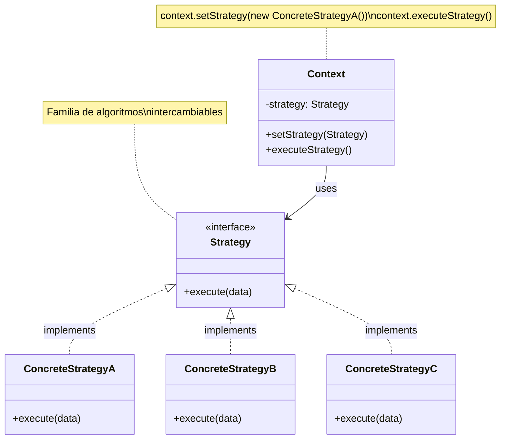
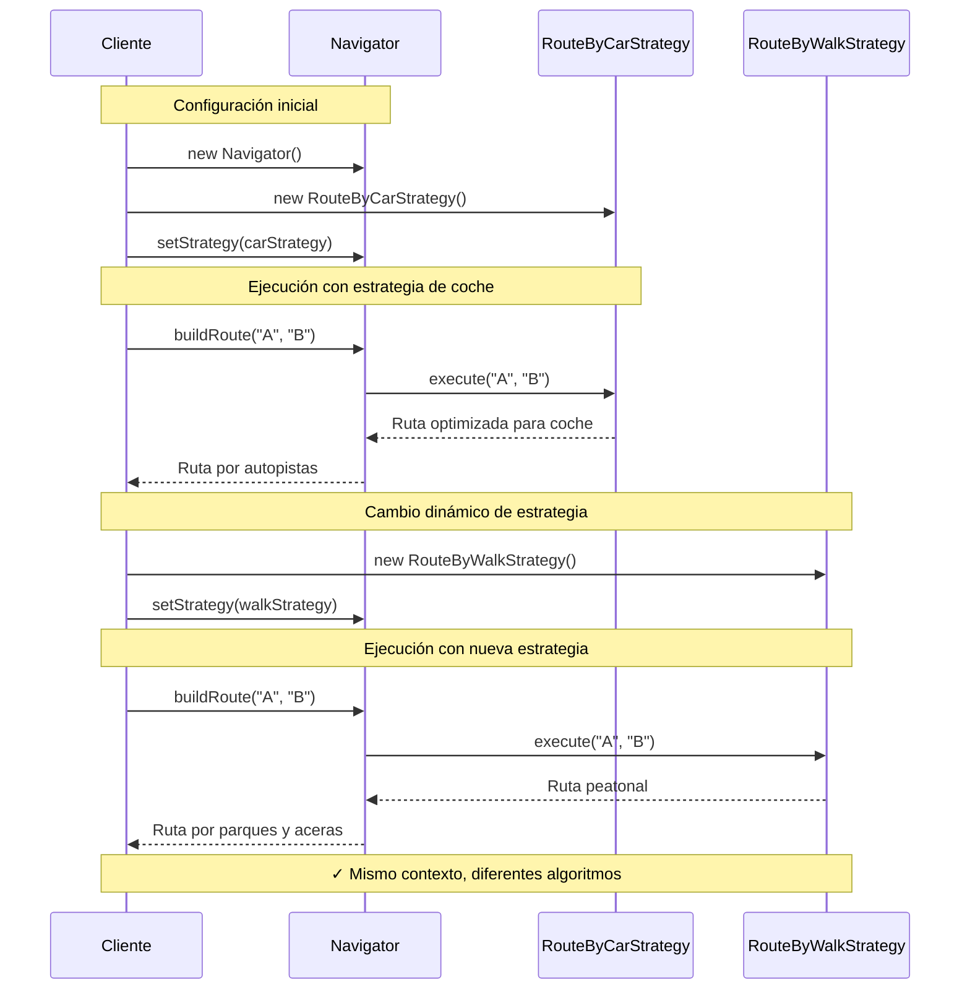

# Strategy (Estrategia)

## Categoría

**Patrón de Comportamiento**

---

## Propósito

Define una familia de algoritmos, encapsula cada uno de ellos y los hace intercambiables. Strategy permite que el algoritmo varíe independientemente de los clientes que lo utilizan.

---

## Problema

Imagina que estás desarrollando una aplicación de navegación. Inicialmente solo soporta navegación en coche, pero luego necesitas agregar a pie, en bicicleta, transporte público, etc.

**Sin Strategy**:

```java
class Navigator {
    public void buildRoute(String from, String to, String mode) {
        if (mode.equals("car")) {
            // Lógica de ruta en coche
        } else if (mode.equals("walk")) {
            // Lógica de ruta a pie
        } else if (mode.equals("bike")) {
            // Lógica de ruta en bicicleta
        } else if (mode.equals("transit")) {
            // Lógica de transporte público
        }
        // ❌ Código difícil de mantener y extender
    }
}
```

**Problemas**:

1. Clase Navigator sobrecargada con múltiples responsabilidades
2. Difícil añadir nuevos modos de transporte
3. No se puede cambiar el algoritmo en tiempo de ejecución fácilmente
4. Viola el principio Open/Closed

---

## Solución

El patrón Strategy sugiere extraer cada algoritmo a una clase separada llamada **estrategia**. La clase original (contexto) almacena una referencia a una de las estrategias y le delega el trabajo.

**Características**:
- Encapsula algoritmos en clases separadas
- Permite intercambiar algoritmos en tiempo de ejecución
- Elimina condicionales complejos
- Facilita la adición de nuevas estrategias

---

## Estructura UML

### Diagrama de Clases



**Visualización en Mermaid**: [Ver en Mermaid Live](https://mermaid.live/)

---

## Componentes

1. **Strategy (Estrategia)**: Interfaz común para todos los algoritmos
2. **ConcreteStrategy**: Implementaciones específicas de algoritmos
3. **Context (Contexto)**: Mantiene referencia a una estrategia y la usa
4. **Client**: Selecciona y configura la estrategia apropiada

---

## Implementaciones por Lenguaje

Este patrón ha sido implementado en múltiples lenguajes. A continuación encontrarás ejemplos de código en carpetas organizadas por lenguaje:

### 📁 Ejemplos Disponibles

- **[Java](./java/)** - Implementación con interfaces funcionales y lambdas
- **[C#](./csharp/)** - Implementación .NET con delegates y LINQ
- **[TypeScript](./typescript/)** - Implementación type-safe con tipos genéricos

Cada carpeta contiene:

- ✅ Múltiples estrategias concretas
- ✅ Ejemplos de intercambio en tiempo de ejecución
- ✅ Comparación con if/else tradicional
- ✅ Referencias a repositorios reconocidos
- ✅ Integración con dependency injection

---

## Diagrama de Secuencia

**Escenario**: Cliente cambia la estrategia de navegación dinámicamente



---

## Ventajas ✅

1. **Intercambio de algoritmos** en tiempo de ejecución
2. **Aislamiento** de la implementación de algoritmos
3. **Elimina condicionales** complejos (if/else, switch)
4. **Open/Closed Principle**: Fácil añadir nuevas estrategias
5. **Testeable**: Cada estrategia se puede testear independientemente
6. **Composición sobre herencia**

---

## Desventajas ❌

1. **Complejidad aumentada**: Más clases en el sistema
2. **Cliente debe conocer** las diferencias entre estrategias
3. **Sobrecarga**: Para algoritmos simples puede ser excesivo
4. **Comunicación**: Cliente y estrategia deben ponerse de acuerdo en el formato de datos

---

## Cuándo Usar

✅ **Usa Strategy cuando:**

- Tienes múltiples variantes de un algoritmo
- Quieres cambiar algoritmos en tiempo de ejecución
- Tienes muchos condicionales relacionados con diferentes comportamientos
- Diferentes clases solo difieren en su comportamiento
- Quieres ocultar detalles de implementación de algoritmos

❌ **Evita Strategy cuando:**

- Solo tienes un par de algoritmos que rara vez cambian
- Las diferencias entre algoritmos son triviales
- Los clientes no necesitan conocer las estrategias disponibles

---

## Casos de Uso Reales

### 1. **Sistemas de Pago**

```
Contexto: PaymentProcessor
Estrategias: CreditCardPayment, PayPalPayment, CryptoPayment
```

### 2. **Compresión de Archivos**

```
Contexto: FileCompressor
Estrategias: ZipCompression, RarCompression, GzipCompression
```

### 3. **Validación de Datos**

```
Contexto: DataValidator
Estrategias: EmailValidation, PhoneValidation, ZipCodeValidation
```

### 4. **Ordenamiento**

```
Contexto: Sorter
Estrategias: QuickSort, MergeSort, BubbleSort
```

### 5. **Pricing / Descuentos**

```
Contexto: PriceCalculator
Estrategias: NoDiscount, SeasonalDiscount, LoyaltyDiscount
```

---

## Relación con Otros Patrones

- **State**: Similar pero las estrategias no conocen unas de otras; State las transiciones son automáticas
- **Command**: Encapsula una operación; Strategy encapsula un algoritmo
- **Template Method**: Usa herencia; Strategy usa composición
- **Decorator**: Cambia la "piel"; Strategy cambia las "entrañas"

---

## Relación con Principios SOLID

| Principio | Cómo lo cumple |
|-----------|----------------|
| **SRP** | Cada estrategia tiene una sola responsabilidad |
| **OCP** | Abierto a extensión (nuevas estrategias), cerrado a modificación |
| **LSP** | Las estrategias son intercambiables |
| **ISP** | Interfaces específicas por tipo de estrategia |
| **DIP** | El contexto depende de abstracción (Strategy interface) |

---

## Diferencia con State

| Aspecto | Strategy | State |
|---------|----------|-------|
| **Propósito** | Intercambiar algoritmos | Cambiar comportamiento según estado |
| **Conocimiento** | Estrategias no se conocen entre sí | Estados conocen transiciones |
| **Control** | Cliente elige estrategia | Contexto cambia estado automáticamente |
| **Número** | Múltiples estrategias coexisten | Un estado a la vez |

---

## Ejemplo Conceptual

```java
// Strategy Interface
interface RouteStrategy {
    Route buildRoute(String from, String to);
}

// Concrete Strategies
class RouteByCarStrategy implements RouteStrategy {
    public Route buildRoute(String from, String to) {
        return new Route("Car route: highways preferred");
    }
}

class RouteByWalkStrategy implements RouteStrategy {
    public Route buildRoute(String from, String to) {
        return new Route("Walk route: parks and sidewalks");
    }
}

// Context
class Navigator {
    private RouteStrategy strategy;
    
    public void setStrategy(RouteStrategy strategy) {
        this.strategy = strategy;
    }
    
    public Route buildRoute(String from, String to) {
        return strategy.buildRoute(from, to);
    }
}

// Client
Navigator nav = new Navigator();
nav.setStrategy(new RouteByCarStrategy());
Route route1 = nav.buildRoute("A", "B"); // Ruta en coche

nav.setStrategy(new RouteByWalkStrategy());
Route route2 = nav.buildRoute("A", "B"); // Ruta a pie
```

---

## Ejercicios Prácticos

### Ejercicio 1: Sistema de Descuentos

Crea un sistema de cálculo de precios con diferentes estrategias de descuento (estudiante, senior, empleado).

### Ejercicio 2: Exportador de Reportes

Implementa un exportador que pueda generar reportes en PDF, Excel o CSV.

### Ejercicio 3: Sistema de Notificaciones

Diseña un notificador que pueda enviar mensajes por Email, SMS o Push notifications.

---

## Referencias

- **Gang of Four** - "Design Patterns" (Capítulo sobre Strategy)
- [Refactoring Guru - Strategy](https://refactoring.guru/design-patterns/strategy)
- [SourceMaking - Strategy](https://sourcemaking.com/design_patterns/strategy)

---

## Recursos Adicionales

### Libros

- **"Head First Design Patterns"** - Freeman & Freeman (Capítulo 1)
- **"Design Patterns Explained"** - Alan Shalloway

### Artículos

- [Martin Fowler - Replacing Conditional with Polymorphism](https://refactoring.com/catalog/replaceConditionalWithPolymorphism.html)
- [Strategy Pattern in Modern Applications](https://www.baeldung.com/java-strategy-pattern)

---

[📂 Ver todos los patrones de comportamiento](../) | [🏠 Volver a inicio](../../README.md)


