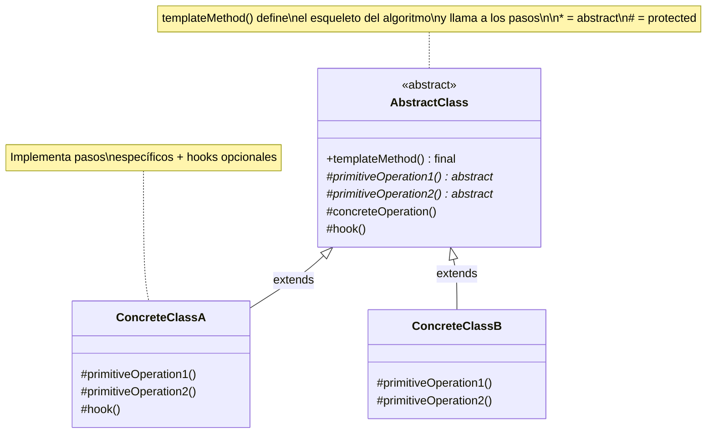
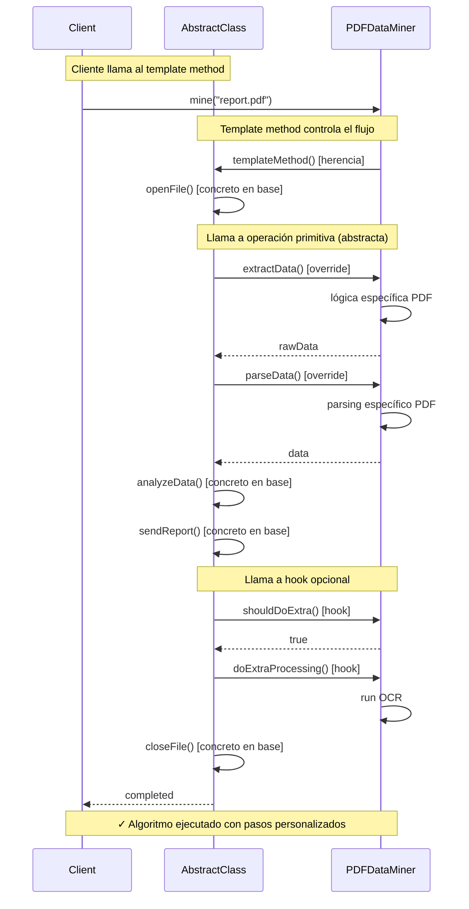

# Template Method (Método Plantilla)

## Categoría
**Patrón de Comportamiento**

---

## Propósito

Define el esqueleto de un algoritmo en una operación, delegando algunos pasos a las subclases. Template Method permite que las subclases redefinan ciertos pasos de un algoritmo sin cambiar su estructura.

---

## Definición Formal

**Template Method** es un patrón de diseño de comportamiento que define el esqueleto de un algoritmo en la clase base pero permite que las subclases sobrescriban pasos específicos del algoritmo sin cambiar su estructura general.

### Intención del GoF

> "Define el esqueleto de un algoritmo en una operación, delegando algunos pasos a las subclases. Template Method permite que las subclases redefinan ciertos pasos de un algoritmo sin cambiar la estructura del algoritmo."

---

## Explicación Detallada

Template Method es uno de los patrones más simples y ampliamente utilizados en programación orientada a objetos. Se basa completamente en **herencia** y **polimorfismo**.

### Conceptos Clave

1. **Algoritmo Esqueleto**: La clase base define la estructura completa del algoritmo
2. **Pasos Abstractos**: Algunos pasos se declaran abstractos para que las subclases los implementen
3. **Pasos Concretos**: Algunos pasos tienen implementación por defecto en la clase base
4. **Hooks (Ganchos)**: Métodos vacíos o con implementación mínima que las subclases pueden sobrescribir opcionalmente
5. **Método Final**: El template method suele ser `final` para prevenir que se sobrescriba

### Metáfora: Receta de Cocina

```
Receta Base (Template Method):
1. Preparar ingredientes  ← Común
2. Cocinar                ← Específico (hornear vs. freír)
3. Empl

atar                ← Específico (plato vs. bowl)
4. Servir                 ← Común

La estructura es fija, pero ciertos pasos varían.
```

### Principio de Hollywood

> "No nos llames, nosotros te llamamos"

Las subclases NO llaman a la clase base para el algoritmo. La clase base (template) llama a los métodos de las subclases cuando los necesita.

---

## Problema Detallado

### Escenario: Aplicación de Minería de Datos

Necesitas analizar documentos corporativos en múltiples formatos (PDF, DOC, CSV). El proceso general es el mismo, pero algunos pasos varían según el formato.

**Algoritmo común**:
1. Abrir archivo
2. Extraer datos (varía según formato)
3. Parsear datos (varía según formato)
4. Analizar datos
5. Enviar reporte
6. Cerrar archivo

### Enfoque Ingenuo: Sin Template Method

```java
// ❌ Clase para PDF
class PDFAnalyzer {
    public void analyze(String path) {
        File file = openFile(path);        // Duplicado
        byte[] rawData = extractPDF(file); // Específico PDF
        Data data = parsePDF(rawData);     // Específico PDF
        analyzeData(data);                 // Duplicado
        sendReport(data);                  // Duplicado
        closeFile(file);                   // Duplicado
    }
    
    private File openFile(String path) { /* ... */ }      // Duplicado
    private void closeFile(File file) { /* ... */ }       // Duplicado
    private void analyzeData(Data data) { /* ... */ }     // Duplicado
    private void sendReport(Data data) { /* ... */ }      // Duplicado
}

// ❌ Clase para Word (código casi idéntico)
class WordAnalyzer {
    public void analyze(String path) {
        File file = openFile(path);         // Duplicado
        byte[] rawData = extractWord(file); // Específico Word
        Data data = parseWord(rawData);     // Específico Word
        analyzeData(data);                  // Duplicado
        sendReport(data);                   // Duplicado
        closeFile(file);                    // Duplicado
    }
    
    // ❌ Métodos duplicados...
}

// ❌ Clase para CSV (más duplicación)
class CSVAnalyzer {
    // ❌ Misma estructura, más duplicación...
}
```

**Problemas críticos**:
1. **Violación masiva de DRY**: Código duplicado en openFile, closeFile, analyzeData, sendReport
2. **Mantenimiento**: Cambio en el algoritmo requiere modificar todas las clases
3. **Sincronización**: Fácil que las clases se desincronicen
4. **Errores**: Bug en openFile requiere fix en 3 lugares
5. **Escalabilidad**: Cada nuevo formato = duplicar todo el código común

---

## Solución con Template Method

### Arquitectura

```
AbstractClass (clase base)
    ↓
templateMethod() [final]  ← Define estructura completa
    ↓
├── step1() [concreto]     ← Implementado en base
├── primitiveOp1() [abstract] ← Implementado en subclases
├── step2() [concreto]
├── primitiveOp2() [abstract]
├── hook() [hook opcional]
└── step3() [concreto]

ConcreteClassA, ConcreteClassB
    ↓
Implementan solo los pasos abstractos
```

### Implementación Completa

```java
// Abstract Class con Template Method
abstract class DataMiner {
    
    // ========================================
    // TEMPLATE METHOD: Define el algoritmo completo
    // final = las subclases NO pueden sobrescribirlo
    // ========================================
    public final void mine(String path) {
        System.out.println("=== Starting data mining process ===");
        
        // Paso 1: Común
        File file = openFile(path);
        
        // Paso 2: Específico (implementado por subclase)
        byte[] rawData = extractData(file);
        
        // Paso 3: Específico (implementado por subclase)
        Data data = parseData(rawData);
        
        // Paso 4: Común
        Data analyzed = analyzeData(data);
        
        // Paso 5: Común
        sendReport(analyzed);
        
        // Hook opcional
        if (shouldDoExtraProcessing()) {
            doExtraProcessing(analyzed);
        }
        
        // Paso 6: Común
        closeFile(file);
        
        System.out.println("=== Mining process completed ===");
    }
    
    // ========================================
    // PASOS COMUNES (implementados en clase base)
    // ========================================
    protected File openFile(String path) {
        System.out.println("Opening file: " + path);
        return new File(path);
    }
    
    protected Data analyzeData(Data data) {
        System.out.println("Analyzing data using common algorithm");
        // Algoritmo de análisis común
        return data;
    }
    
    protected void sendReport(Data data) {
        System.out.println("Sending report via email");
        // Lógica de envío común
    }
    
    protected void closeFile(File file) {
        System.out.println("Closing file");
        // Cerrar archivo
    }
    
    // ========================================
    // PASOS ABSTRACTOS (implementados por subclases)
    // ========================================
    
    /**
     * Extrae datos raw del archivo.
     * Implementación específica según el formato.
     */
    protected abstract byte[] extractData(File file);
    
    /**
     * Parsea datos raw a estructura Data.
     * Implementación específica según el formato.
     */
    protected abstract Data parseData(byte[] rawData);
    
    // ========================================
    // HOOKS (opcionales - con implementación por defecto)
    // ========================================
    
    /**
     * Hook: Las subclases pueden sobrescribir para controlar
     * si se ejecuta procesamiento adicional.
     */
    protected boolean shouldDoExtraProcessing() {
        return true;  // Por defecto sí
    }
    
    /**
     * Hook: Procesamiento extra opcional
     */
    protected void doExtraProcessing(Data data) {
        // Implementación por defecto vacía
    }
}

// ========================================
// CONCRETE CLASS: PDF
// ========================================
class PDFDataMiner extends DataMiner {
    @Override
    protected byte[] extractData(File file) {
        System.out.println("Extracting data from PDF file");
        // Usar biblioteca PDF (Apache PDFBox, iText, etc.)
        return new byte[]{/* datos PDF */};
    }
    
    @Override
    protected Data parseData(byte[] rawData) {
        System.out.println("Parsing PDF data format");
        // Parsear estructura específica de PDF
        return new Data();
    }
    
    // Sobrescribe hook para añadir OCR
    @Override
    protected void doExtraProcessing(Data data) {
        System.out.println("Running OCR on PDF images");
        // OCR específico para PDFs
    }
}

// ========================================
// CONCRETE CLASS: CSV
// ========================================
class CSVDataMiner extends DataMiner {
    @Override
    protected byte[] extractData(File file) {
        System.out.println("Extracting data from CSV file");
        // Leer CSV (OpenCSV, Apache Commons CSV)
        return new byte[]{/* datos CSV */};
    }
    
    @Override
    protected Data parseData(byte[] rawData) {
        System.out.println("Parsing CSV format (comma-separated)");
        // Parsear CSV
        return new Data();
    }
    
    // CSV no necesita procesamiento extra
    @Override
    protected boolean shouldDoExtraProcessing() {
        return false;  // Skip extra processing
    }
}

// ========================================
// CONCRETE CLASS: Word
// ========================================
class WordDataMiner extends DataMiner {
    @Override
    protected byte[] extractData(File file) {
        System.out.println("Extracting data from Word document");
        // Usar Apache POI
        return new byte[]{};
    }
    
    @Override
    protected Data parseData(byte[] rawData) {
        System.out.println("Parsing Word document structure");
        return new Data();
    }
}

// ========================================
// CLIENTE
// ========================================
public class Client {
    public static void main(String[] args) {
        DataMiner pdfMiner = new PDFDataMiner();
        pdfMiner.mine("report.pdf");
        // Output:
        // === Starting data mining process ===
        // Opening file: report.pdf
        // Extracting data from PDF file
        // Parsing PDF data format
        // Analyzing data using common algorithm
        // Sending report via email
        // Running OCR on PDF images
        // Closing file
        // === Mining process completed ===
        
        DataMiner csvMiner = new CSVDataMiner();
        csvMiner.mine("data.csv");
        // Output similar pero sin OCR (hook retorna false)
    }
}
```

---

## Estructura UML

### Diagrama de Clases



**Visualización**: [Ver en Mermaid Live](https://mermaid.live/)

---

## Componentes

1. **AbstractClass**: Define el template method y los pasos del algoritmo
2. **Template Method**: Método final que define la estructura del algoritmo
3. **Primitive Operations**: Operaciones abstractas que las subclases deben implementar
4. **Concrete Operations**: Operaciones con implementación común en la clase base
5. **Hooks**: Operaciones con implementación por defecto que las subclases pueden sobrescribir

---

## Tipos de Operaciones

### 1. **Template Method** (final)
```java
public final void templateMethod() {
    // Define el algoritmo completo
}
```

### 2. **Primitive Operations** (abstract)
```java
protected abstract void primitiveOperation();
```

### 3. **Concrete Operations** (implementadas)
```java
protected void concreteOperation() {
    // Implementación común
}
```

### 4. **Hooks** (opcionales)
```java
protected void hook() {
    // Implementación por defecto (puede estar vacía)
}

protected boolean hookBoolean() {
    return true;  // Valor por defecto
}
```

---

## Implementaciones por Lenguaje

### 📁 Ejemplos Disponibles

- **[Java](./java/)** - Implementación con métodos final y abstract
- **[C#](./csharp/)** - Implementación .NET con sealed y virtual/abstract
- **[TypeScript](./typescript/)** - Implementación con clases abstractas

Cada carpeta contiene:
- ✅ Template method con múltiples pasos
- ✅ Ejemplos de hooks opcionales
- ✅ Múltiples subclases concretas
- ✅ Referencias a repositorios reconocidos
- ✅ Comparación detallada con Strategy

---

## Diagrama de Secuencia

**Escenario**: Cliente ejecuta algoritmo de minería de datos con template method



---

## Ventajas ✅

1. **Reutilización de código**: Pasos comunes se escriben una sola vez
2. **Control del flujo**: Clase base controla la estructura del algoritmo
3. **Extensibilidad**: Fácil añadir nuevas variantes (nuevas subclases)
4. **Principio DRY**: No repites código común
5. **Open/Closed Principle**: Extensible sin modificar la clase base
6. **Estructura explícita**: El algoritmo está claramente definido
7. **Hollywood Principle**: Inversión de control clara

---

## Desventajas ❌

1. **Violación potencial de LSP**: Subclases deben cumplir contrato estricto
2. **Flexibilidad limitada**: La estructura del algoritmo es fija
3. **Acoplamiento por herencia**: Subclases fuertemente acopladas a la clase base
4. **Complejidad con muchos pasos**: Difícil seguir el flujo si hay demasiados pasos
5. **Mantenimiento**: Cambios en la clase base afectan a todas las subclases
6. **No se puede cambiar en runtime**: Decisión en tiempo de compilación
7. **Herencia simple**: Java/C# solo permiten herencia simple

---

## Cuándo Usar

✅ **Usa Template Method cuando:**

- Múltiples clases tienen algoritmos similares con pasos comunes
- Quieres controlar exactamente en qué puntos las subclases pueden extender
- Necesitas evitar duplicación de código en algoritmos similares
- El algoritmo tiene una estructura fija pero algunos pasos varían
- Quieres implementar la parte invariante del algoritmo una sola vez

❌ **Evita Template Method cuando:**

- Prefieres composición sobre herencia (usa **Strategy**)
- El algoritmo no tiene pasos comunes significativos
- Necesitas cambiar el algoritmo en runtime
- Tienes múltiples dimensiones de variación (usa **Strategy** + **Bridge**)
- La estructura del algoritmo debe ser flexible

---

## Casos de Uso Reales

### 1. **Frameworks de Testing (JUnit, NUnit)**
```java
@Test
public void testExample() {
    // JUnit Template Method:
    // setUp()           ← Hook
    // runTest()         ← Tu código
    // tearDown()        ← Hook
}
```

### 2. **Servlets y HTTP Handlers**
```java
public abstract class HttpServlet {
    // Template Method
    public final void service(Request req, Response res) {
        if (req.getMethod().equals("GET")) {
            doGet(req, res);  // Abstract
        } else if (req.getMethod().equals("POST")) {
            doPost(req, res); // Abstract
        }
    }
    
    protected abstract void doGet(Request req, Response res);
    protected abstract void doPost(Request req, Response res);
}
```

### 3. **Algoritmos de Ordenamiento**
```java
abstract class Sorter<T> {
    public final void sort(List<T> list) {
        for (int i = 0; i < list.size(); i++) {
            for (int j = i + 1; j < list.size(); j++) {
                if (compare(list.get(i), list.get(j)) > 0) {
                    swap(list, i, j);
                }
            }
        }
    }
    
    protected abstract int compare(T a, T b);  // Implementado por subclases
    
    private void swap(List<T> list, int i, int j) {
        T temp = list.get(i);
        list.set(i, list.get(j));
        list.set(j, temp);
    }
}
```

### 4. **Procesamiento de Datos ETL**
```
Template Method: processData()
Pasos:
  - extract() [abstract]
  - transform() [common]
  - validate() [hook]
  - load() [abstract]
```

### 5. **Ciclo de Vida de Componentes**
```
React/Angular Component:
  - constructor()
  - componentDidMount() [hook]
  - render() [abstract]
  - componentWillUnmount() [hook]
```

---

## Errores Comunes

### ❌ Error 1: Template Method no es final

```java
// ❌ INCORRECTO
public void templateMethod() {  // No es final
    step1();
    step2();
}

// Subclase puede romper el algoritmo
class BadSubclass extends AbstractClass {
    @Override
    public void templateMethod() {
        step2();  // ❌ Cambió el orden
        step1();
    }
}

// ✅ CORRECTO
public final void templateMethod() {  // Final previene override
    step1();
    step2();
}
```

### ❌ Error 2: Hacer métodos públicos en lugar de protegidos

```java
// ❌ INCORRECTO
public abstract byte[] extractData(File file);  // Público

// Cliente puede llamar directamente
miner.extractData(file);  // ❌ Rompe el algoritmo

// ✅ CORRECTO
protected abstract byte[] extractData(File file);  // Protegido

// Solo accesible dentro del template method
```

### ❌ Error 3: No usar hooks cuando son apropiados

```java
// ❌ INCORRECTO: Obligar a implementar algo que puede no necesitarse
protected abstract void doExtraProcessing();

// Subclase forzada a implementar algo vacío
class SimpleAnalyzer extends DataMiner {
    protected void doExtraProcessing() {
        // ❌ Método vacío porque no necesito esto
    }
}

// ✅ CORRECTO: Usar hook con implementación por defecto
protected void doExtraProcessing() {
    // Implementación por defecto vacía
}

// Subclase solo sobrescribe si lo necesita
class AdvancedAnalyzer extends DataMiner {
    @Override
    protected void doExtraProcessing() {
        // Solo implemento si lo necesito
    }
}
```

### ❌ Error 4: Demasiados pasos abstractos

```java
// ❌ ANTI-PATRÓN: Template Method con todos los pasos abstractos
public final void templateMethod() {
    step1();  // abstract
    step2();  // abstract
    step3();  // abstract
    step4();  // abstract
    step5();  // abstract
}

// ❌ No hay reutilización de código, mejor usar Strategy
```

**Regla**: Si más del 50% de los pasos son abstractos, considera usar **Strategy** en su lugar.

---

## Anti-Patrones

### 1. **Template Method God Class**

```java
// ❌ ANTI-PATRÓN
public final void megaTemplate() {
    step1();
    step2();
    step3();
    // ... 20 pasos más
    step23();
}
```

**Problema**: Demasiados pasos hacen el algoritmo incomprensible.
**Solución**: Dividir en templates más pequeños o usar Composite de templates.

### 2. **Protected API Pollution**

```java
// ❌ ANTI-PATRÓN: Exponer demasiado como protected
protected File file;
protected Data data;
protected Config config;
// ... 20 campos protected más
```

**Problema**: Las subclases tienen acceso a demasiados detalles internos.
**Solución**: Mantener campos privados, solo métodos protegidos específicos.

---

## Diferencia con Strategy

| Aspecto | Template Method | Strategy |
|---------|-----------------|----------|
| **Mecanismo** | Herencia | Composición |
| **Granularidad** | Pasos de un algoritmo | Algoritmo completo |
| **Cambio runtime** | No (estático) | Sí (dinámico) |
| **Acoplamiento** | Fuerte (herencia) | Débil (interface) |
| **Cuándo usar** | Variaciones pequeñas en algoritmo | Algoritmos completamente diferentes |
| **Reutilización** | Código común en clase base | Estrategias independientes |
| **Flexibilidad** | Baja (herencia fija) | Alta (cambio dinámico) |

**Regla práctica**:
- **Template Method**: Cuando el 70%+ del algoritmo es común
- **Strategy**: Cuando el 70%+ del algoritmo varía

---

## Relación con Otros Patrones

- **Factory Method**: Es una especialización de Template Method
- **Strategy**: Template Method usa herencia; Strategy usa composición
- **Command**: Puede usar Template Method para definir flujo de ejecución
- **Iterator**: Puede implementarse con Template Method

---

## Relación con Principios SOLID

| Principio | Cómo lo cumple / viola |
|-----------|------------------------|
| **SRP** | ✅ Cada paso tiene una responsabilidad clara |
| **OCP** | ✅ Abierto a extensión (nuevas subclases), cerrado a modificación |
| **LSP** | ⚠️ Subclases deben cumplir precondiciones y postcondiciones estrictas |
| **ISP** | ✅ Interfaz mínima para cada paso |
| **DIP** | ⚠️ Depende de herencia concreta, no de abstracciones |

---

## Hooks: Puntos de Extensión Opcionales

Los **hooks** son puntos de extensión que las subclases **pueden** sobrescribir pero no están obligadas.

### Tipos de Hooks

#### 1. Hook Booleano (Decisión)
```java
protected boolean shouldValidate() {
    return true;  // Por defecto sí
}

public final void process() {
    readData();
    if (shouldValidate()) {
        validate();  // Solo si el hook retorna true
    }
    save();
}
```

#### 2. Hook de Acción (Comportamiento Opcional)
```java
protected void beforeSave() {
    // Vacío por defecto, subclases pueden sobrescribir
}

public final void save() {
    beforeSave();  // Hook
    doSave();
    afterSave();   // Hook
}
```

#### 3. Hook de Configuración
```java
protected int getMaxRetries() {
    return 3;  // Valor por defecto
}

public final void connect() {
    int retries = getMaxRetries();  // Hook para configuración
    // ... lógica de conexión
}
```

---

## Ejemplo Completo: CaffeineBeverage

```java
// Template Method clásico: Preparar bebidas con cafeína
abstract class CaffeineBeverage {
    
    // TEMPLATE METHOD
    public final void prepareRecipe() {
        boilWater();
        brew();
        pourInCup();
        
        // Hook condicional
        if (customerWantsCondiments()) {
            addCondiments();
        }
    }
    
    // Pasos comunes
    private void boilWater() {
        System.out.println("Boiling water");
    }
    
    private void pourInCup() {
        System.out.println("Pouring into cup");
    }
    
    // Pasos abstractos (específicos por bebida)
    protected abstract void brew();
    protected abstract void addCondiments();
    
    // Hook (las subclases pueden sobrescribir)
    protected boolean customerWantsCondiments() {
        return true;  // Por defecto sí
    }
}

// Concrete Class: Tea
class Tea extends CaffeineBeverage {
    @Override
    protected void brew() {
        System.out.println("Steeping the tea");
    }
    
    @Override
    protected void addCondiments() {
        System.out.println("Adding lemon");
    }
}

// Concrete Class: Coffee
class Coffee extends CaffeineBeverage {
    @Override
    protected void brew() {
        System.out.println("Dripping coffee through filter");
    }
    
    @Override
    protected void addCondiments() {
        System.out.println("Adding sugar and milk");
    }
    
    // Sobrescribe hook para preguntar al usuario
    @Override
    protected boolean customerWantsCondiments() {
        String answer = getUserInput();
        return answer.toLowerCase().startsWith("y");
    }
    
    private String getUserInput() {
        // Leer input del usuario
        return "yes";
    }
}

// Uso
CaffeineBeverage tea = new Tea();
tea.prepareRecipe();
// Output:
// Boiling water
// Steeping the tea
// Pouring into cup
// Adding lemon

CaffeineBeverage coffee = new Coffee();
coffee.prepareRecipe();
// Output:
// Boiling water
// Dripping coffee through filter
// Pouring into cup
// Adding sugar and milk (si usuario dice yes)
```

---

## Ejercicios Prácticos

### Ejercicio 1: Juego de Mesa
Template Method: `play()`
- Pasos: initializeGame(), makePlay(), endOfGame()
- Subclases: Chess, Checkers, Monopoly

### Ejercicio 2: Generador de Reportes
Template Method: `generateReport()`
- Pasos: gatherData(), formatData(), createHeader(), createBody(), createFooter()
- Subclases: PDFReport, ExcelReport, HTMLReport

### Ejercicio 3: Framework de Testing
Template Method: `runTest()`
- Pasos: setUp(), runTestCase(), tearDown()
- Hook: beforeEach(), afterEach()

---

## Referencias

- **Gang of Four** - "Design Patterns" (Capítulo sobre Template Method)
- [Refactoring Guru - Template Method](https://refactoring.guru/design-patterns/template-method)
- [SourceMaking - Template Method](https://sourcemaking.com/design_patterns/template_method)

---

## Recursos Adicionales

### Libros
- **"Head First Design Patterns"** - Freeman & Freeman (Capítulo 8)
- **"Design Patterns Explained"** - Alan Shalloway

### Artículos
- [Martin Fowler - Template Method](https://martinfowler.com/bliki/TemplateMethod.html)
- [Effective Java - Item 20: Prefer class hierarchies to tagged classes](https://www.amazon.com/Effective-Java-Joshua-Bloch/dp/0134685997)

---

[📂 Ver todos los patrones de comportamiento](../Comportamiento.md) | [🏠 Volver a inicio](../../README.md)

---

*Última actualización: Octubre 2025*