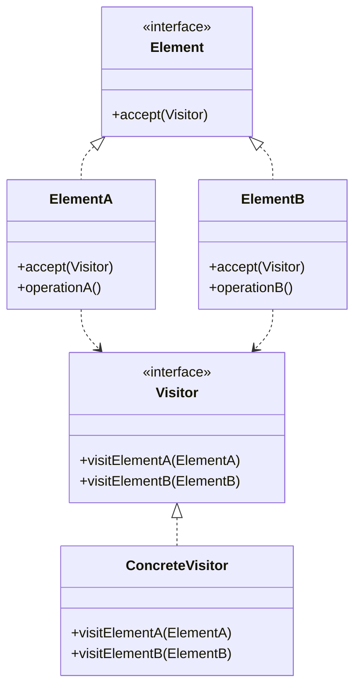

# Visitor (Visitante)

## Categoría
**Patrón de Comportamiento**

---

## Propósito

Permite definir una nueva operación sin cambiar las clases de los elementos sobre los que opera.

---

## Definición Formal

**Visitor** es un patrón de diseño de comportamiento que permite separar algoritmos de los objetos sobre los que operan.

### Intención del GoF

> "Representa una operación a ser realizada sobre los elementos de una estructura de objetos. Visitor permite definir una nueva operación sin cambiar las clases de los elementos sobre los que opera."

---

## Explicación Detallada

El patrón Visitor permite separar algoritmos de la estructura de objetos sobre la que operan. Es especialmente útil cuando tienes una estructura estable pero necesitas añadir nuevas operaciones frecuentemente.

### Conceptos Clave

1. **Double Dispatch**: Dos niveles de polimorfismo (elemento + visitor)
2. **Separación de responsabilidades**: Operaciones fuera de los elementos
3. **Open/Closed**: Añade operaciones sin modificar elementos
4. **Estructura estable**: Funciona mejor cuando los elementos no cambian frecuentemente
5. **Visitor Interface**: Un método `visit()` por cada tipo de elemento
6. **Element Interface**: Método `accept(Visitor)` en cada elemento

### Metáfora: Inspector de Salud en Restaurantes

```
Restaurantes (Elements)
  - Restaurant Italiano
  - Restaurant Chino
  - Restaurant Mexicano
       ↓
Inspector de Salud (Visitor)
  - Visita cada tipo de restaurante
  - Inspecciona según reglas específicas del tipo
  - Sin modificar los restaurantes
       ↓
Otros Visitors:
  - Inspector de Impuestos
  - Auditor de Menú
  - Evaluador de Calidad

Cada visitor realiza operación diferente
SIN modificar las clases de restaurantes.
```

### Principio: Double Dispatch

```
element.accept(visitor)  ← Primera dispatch (polimorfismo de elemento)
  ↓
visitor.visit(element)   ← Segunda dispatch (polimorfismo de visitor)

Dos llamadas polimórficas determinan qué método ejecutar.
```

### ¿Cómo funciona?

```
1. Cliente crea Visitor (ej: AreaCalculatorVisitor)

2. Cliente recorre estructura de elementos
   for (Shape shape : shapes)

3. Cada elemento acepta al visitor
   shape.accept(areaCalculator)

4. Elemento llama al método específico del visitor
   visitor.visitCircle(this)  // Si es Circle
   visitor.visitRectangle(this)  // Si es Rectangle

5. Visitor ejecuta operación específica para ese tipo
   area += PI * circle.radius * circle.radius
```

---

## Problema Detallado

### Escenario: Sistema de Exportación de Documentos

Tienes un sistema con diferentes tipos de documentos (PDF, Word, HTML) y necesitas exportarlos a múltiples formatos (XML, JSON, Plain Text). Además, necesitas calcular estadísticas y validar contenido.

**Operaciones necesarias**:
- Exportar a XML
- Exportar a JSON
- Calcular tamaño total
- Validar formato
- Generar reporte

**Sin Visitor (Añadiendo métodos a cada clase)**:

```java
// ❌ Mezclando operaciones con estructura
class PDFDocument {
    private String content;
    
    // ❌ Operación 1: Exportar
    public String exportToXML() {
        return "<pdf>" + content + "</pdf>";
    }
    
    public String exportToJSON() {
        return "{\"type\":\"pdf\",\"content\":\"" + content + "\"}";
    }
    
    // ❌ Operación 2: Calcular
    public int calculateSize() {
        return content.length() * 2;  // PDFs son grandes
    }
    
    // ❌ Operación 3: Validar
    public boolean validate() {
        return content.endsWith(".pdf");
    }
    
    // ❌ Operación 4: Generar reporte
    public String generateReport() {
        return "PDF Document Report...";
    }
    
    // ❌ Para añadir "exportToCSV" → modificar TODAS las clases
    // ❌ PDFDocument hace demasiado (violación SRP)
}

class WordDocument {
    // ❌ Duplicar TODOS los métodos de exportación
    public String exportToXML() { /* ... */ }
    public String exportToJSON() { /* ... */ }
    public int calculateSize() { /* ... */ }
    public boolean validate() { /* ... */ }
    public String generateReport() { /* ... */ }
}

class HTMLDocument {
    // ❌ Duplicar TODOS los métodos de exportación OTRA VEZ
    public String exportToXML() { /* ... */ }
    public String exportToJSON() { /* ... */ }
    // ...
}
```

**Problemas críticos**:
1. **Violación masiva de SRP**: Cada documento tiene múltiples responsabilidades
2. **Violación de OCP**: Añadir nueva operación requiere modificar TODAS las clases
3. **Código duplicado**: Lógica de exportación esparcida
4. **Acoplamiento**: Documentos acoplados a formatos de exportación
5. **Escalabilidad**: 5 tipos × 10 operaciones = 50 métodos
6. **Mantenimiento**: Bug en exportToXML requiere fix en 5 lugares

---

## Solución con Visitor

```java
// Visitor Interface
interface Visitor {
    void visitCircle(Circle circle);
    void visitRectangle(Rectangle rectangle);
}

// Element Interface
interface Shape {
    void accept(Visitor visitor);
}

// Concrete Elements
class Circle implements Shape {
    private int radius;
    
    public void accept(Visitor visitor) {
        visitor.visitCircle(this);  // Double dispatch
    }
    
    public int getRadius() { return radius; }
}

// Concrete Visitors
class AreaCalculator implements Visitor {
    private double totalArea = 0;
    
    public void visitCircle(Circle c) {
        totalArea += Math.PI * c.getRadius() * c.getRadius();
    }
    
    public void visitRectangle(Rectangle r) {
        totalArea += r.getWidth() * r.getHeight();
    }
    
    public double getTotalArea() { return totalArea; }
}

// Uso
List<Shape> shapes = Arrays.asList(new Circle(5), new Rectangle(3, 4));
AreaCalculator calculator = new AreaCalculator();

for (Shape shape : shapes) {
    shape.accept(calculator);
}

System.out.println("Total area: " + calculator.getTotalArea());
```

**Ventajas de esta solución**:
- ✅ Nueva operación = nueva clase Visitor
- ✅ No modificas Circle ni Rectangle
- ✅ Operaciones agrupadas en Visitor
- ✅ Fácil añadir XMLExporter, JSONExporter, etc.

---

## Componentes

1. **Visitor**: Interfaz que declara método `visit()` por cada tipo de elemento
2. **ConcreteVisitor**: Implementa operación específica para cada tipo
3. **Element**: Interfaz con método `accept(Visitor)`
4. **ConcreteElement**: Implementa `accept()` llamando a `visitor.visit(this)`
5. **ObjectStructure**: Colección de elementos que se puede recorrer

---

## Estructura UML



**Diagrama basado en**: Resultados de búsqueda web

---

## Implementaciones por Lenguaje

### 📁 Ejemplos Disponibles

- **[Java](./java/)** - Visitor para AST, exporters
- **[C#](./csharp/)** - Visitor con pattern matching
- **[TypeScript](./typescript/)** - Visitor para DOM trees

Cada carpeta contiene:
- ✅ Implementación de Double Dispatch
- ✅ Múltiples visitors para diferentes operaciones
- ✅ Estructura de elementos completa
- ✅ Combinación con Composite
- ✅ Referencias a repositorios reconocidos

---

## Diagrama de Secuencia

**Escenario**: Cliente exporta estructura de documentos a XML usando Visitor

```mermaid
sequenceDiagram
    participant Client
    participant Visitor as XMLExportVisitor
    participant Circle as CircleElement
    participant Rect as RectangleElement
    
    Note over Client,Visitor: Cliente crea visitor
    Client->>Visitor: new XMLExportVisitor()
    
    Note over Client,Rect: Cliente itera elementos
    loop Para cada elemento
        Client->>Circle: accept(xmlVisitor)
        
        Note over Circle,Visitor: Double Dispatch
        Circle->>Visitor: visitCircle(this)
        Visitor->>Circle: getRadius()
        Circle-->>Visitor: radius
        Visitor->>Visitor: buildXML("<circle r='" + radius + "'/>")
        Visitor-->>Circle: done
        Circle-->>Client: done
        
        Client->>Rect: accept(xmlVisitor)
        Rect->>Visitor: visitRectangle(this)
        Visitor->>Rect: getWidth(), getHeight()
        Rect-->>Visitor: width, height
        Visitor->>Visitor: buildXML("<rect w='" + w + "' h='" + h + "'/>")
        Visitor-->>Rect: done
        Rect-->>Client: done
    end
    
    Client->>Visitor: getResult()
    Visitor-->>Client: XML string
    
    Note over Client,Rect: ✓ Operación añadida sin modificar elementos
```

---

## Ventajas ✅

1. **Open/Closed Principle**: Añade operaciones sin modificar elementos
2. **Single Responsibility**: Operaciones relacionadas agrupadas en un Visitor
3. **Código limpio**: Operaciones en un lugar, no esparcidas
4. **Fácil añadir operaciones**: Nueva operación = nuevo Visitor
5. **Recopilación de información**: Visitor puede acumular datos
6. **Trabajo con múltiples clases**: Opera sobre jerarquía de elementos

---

## Desventajas ❌

1. **Añadir elemento nuevo es costoso**: Requiere modificar TODOS los visitors
2. **Rompe encapsulación**: Visitors necesitan acceso a internals de elementos
3. **Acoplamiento**: Visitor acoplado a estructura de elementos
4. **Complejidad**: Double dispatch no es intuitivo
5. **No apto para estructuras inestables**: Si elementos cambian frecuentemente

---

## Cuándo Usar

✅ **Usa Visitor cuando:**

- Necesitas realizar múltiples operaciones no relacionadas sobre objetos
- La estructura de objetos es estable (pocos cambios en tipos)
- Quieres mantener operaciones relacionadas juntas
- Necesitas acumular información al recorrer estructura
- Tienes una estructura Composite que necesita operaciones variadas

❌ **Evita Visitor cuando:**

- La estructura de elementos cambia frecuentemente
- Solo tienes una o dos operaciones simples
- Los elementos tienen lógica de negocio compleja
- Prefieres que cada clase sea auto-contenida
- Double dispatch añade complejidad innecesaria

---

## Casos de Uso Reales

### 1. **Compiladores - AST Traversal**
```java
// Visitor recorre Abstract Syntax Tree
CodeGeneratorVisitor codeGen = new CodeGeneratorVisitor();
ast.accept(codeGen);
String code = codeGen.getGeneratedCode();
```

### 2. **Exportación de Datos a Múltiples Formatos**
```java
XMLExportVisitor xmlExporter = new XMLExportVisitor();
JSONExportVisitor jsonExporter = new JSONExportVisitor();

for (Document doc : documents) {
    doc.accept(xmlExporter);
    doc.accept(jsonExporter);
}
```

### 3. **Sistemas de Reporting**
```java
SalesReportVisitor salesReport = new SalesReportVisitor();
InventoryReportVisitor inventoryReport = new InventoryReportVisitor();

organization.accept(salesReport);
organization.accept(inventoryReport);
```

### 4. **Validación de Estructuras**
```java
ValidationVisitor validator = new ValidationVisitor();
document.accept(validator);
if (!validator.isValid()) {
    System.out.println("Errors: " + validator.getErrors());
}
```

### 5. **Análisis de Código**
```java
ComplexityAnalyzerVisitor complexity = new ComplexityAnalyzerVisitor();
SecurityAnalyzerVisitor security = new SecurityAnalyzerVisitor();

codebase.accept(complexity);
codebase.accept(security);
```

---

## Errores Comunes

### ❌ Error 1: Element que conoce implementación de Visitor

```java
// ❌ INCORRECTO: Element conoce detalles del Visitor
class BadCircle implements Shape {
    public void accept(Visitor visitor) {
        if (visitor instanceof XMLExporter) {
            ((XMLExporter) visitor).export(this);  // ❌ Conoce tipo concreto
        } else if (visitor instanceof JSONExporter) {
            ((JSONExporter) visitor).export(this);
        }
    }
}

// ✅ CORRECTO: Double dispatch puro
class GoodCircle implements Shape {
    public void accept(Visitor visitor) {
        visitor.visitCircle(this);  // ✅ Polimorfismo puro
    }
}
```

### ❌ Error 2: Visitor que modifica estructura

```java
// ❌ INCORRECTO: Visitor modifica elementos
class BadVisitor implements Visitor {
    public void visitCircle(Circle circle) {
        circle.setRadius(100);  // ❌ Modifica el elemento
        circle.setColor("red");  // ❌ Cambia estado
    }
}

// ✅ CORRECTO: Visitor solo lee y acumula
class GoodVisitor implements Visitor {
    private double totalArea = 0;
    
    public void visitCircle(Circle circle) {
        totalArea += Math.PI * circle.getRadius() * circle.getRadius();
        // ✅ Solo lee, no modifica
    }
    
    public double getTotalArea() {
        return totalArea;
    }
}
```

### ❌ Error 3: No manejar nuevos tipos de elementos

```java
// ❌ INCORRECTO: Visitor sin método para nuevo elemento
interface Visitor {
    void visitCircle(Circle c);
    void visitRectangle(Rectangle r);
    // ❌ Añadiste Triangle pero olvidaste añadir visitTriangle()
}

// Cliente añade Triangle
class Triangle implements Shape {
    public void accept(Visitor visitor) {
        // ❌ No hay visitTriangle() → error de compilación
        visitor.visitTriangle(this);  // ❌ No existe
    }
}

// ✅ CORRECTO: Actualizar TODOS los visitors
interface Visitor {
    void visitCircle(Circle c);
    void visitRectangle(Rectangle r);
    void visitTriangle(Triangle t);  // ✅ Añadido
}

// Todas las implementaciones de Visitor deben actualizarse
```

### ❌ Error 4: Visitor con estado compartido entre visitas

```java
// ❌ INCORRECTO: Estado compartido no reiniciado
class BadCountVisitor implements Visitor {
    private static int totalCount = 0;  // ❌ Estático
    
    public void visitCircle(Circle c) {
        totalCount++;  // ❌ Acumula entre TODAS las visitas
    }
}

// Primera visita: count = 5
// Segunda visita: count = 10 (debería ser 5) ❌

// ✅ CORRECTO: Estado por instancia
class GoodCountVisitor implements Visitor {
    private int count = 0;  // ✅ Por instancia
    
    public void visitCircle(Circle c) {
        count++;
    }
    
    public int getCount() {
        return count;
    }
}

// Uso
CountVisitor visitor1 = new CountVisitor();  // count = 0
structure.accept(visitor1);  // count = 5

CountVisitor visitor2 = new CountVisitor();  // count = 0 ✅
structure.accept(visitor2);  // count = 5 ✅
```

### ❌ Error 5: Romper encapsulación excesivamente

```java
// ❌ INCORRECTO: Exponer todo por el Visitor
class BadCircle implements Shape {
    public List<Point> internalPoints;      // ❌ Público para visitor
    public Map<String, Object> metadata;    // ❌ Expone internals
    
    public void accept(Visitor visitor) {
        visitor.visitCircle(this);
    }
}

// ✅ CORRECTO: Métodos específicos de acceso
class GoodCircle implements Shape {
    private List<Point> internalPoints;     // ✅ Privado
    private Map<String, Object> metadata;   // ✅ Privado
    
    // Métodos específicos para lo que Visitor necesita
    public double getRadius() { /* ... */ }
    public Point getCenter() { /* ... */ }
    
    public void accept(Visitor visitor) {
        visitor.visitCircle(this);
    }
}
```

---

## Anti-Patrones

### 1. **God Visitor (Visitor Omnipotente)**

```java
// ❌ ANTI-PATRÓN: Un visitor que hace demasiado
class MegaVisitor implements Visitor {
    public void visitCircle(Circle c) {
        // ❌ Hace de todo
        exportToXML(c);
        exportToJSON(c);
        calculateArea(c);
        validateCircle(c);
        generateReport(c);
        sendNotification(c);
        updateDatabase(c);
        // ❌ Violación masiva de SRP
    }
}
```

**Problema**: Visitor debe tener una responsabilidad clara.  
**Solución**: Separar en múltiples visitors especializados.

```java
// ✅ CORRECTO: Visitors especializados
class XMLExportVisitor implements Visitor { }
class AreaCalculatorVisitor implements Visitor { }
class ValidationVisitor implements Visitor { }
```

### 2. **Visitor que Depende del Orden**

```java
// ❌ ANTI-PATRÓN: Visitor que asume orden específico
class BadSequentialVisitor implements Visitor {
    private Shape previousShape;  // ❌ Depende del orden
    
    public void visitCircle(Circle c) {
        if (previousShape instanceof Rectangle) {
            // ❌ Lógica que depende del elemento anterior
            doSomethingSpecial();
        }
        previousShape = c;
    }
}
```

**Problema**: Visitor debe ser independiente del orden de visita.  
**Solución**: Si necesitas orden, usa Iterator explícito o recorre dos veces.

---

## Relación con Otros Patrones

- **Composite**: Visitor se usa frecuentemente con estructuras Composite
- **Iterator**: Visitor puede usar Iterator para recorrer elementos
- **Interpreter**: Visitor puede procesar nodos del AST de Interpreter
- **Strategy**: Visitor es como Strategy para elementos en una estructura

---

## Relación con Principios SOLID

| Principio | Cómo lo cumple |
|-----------|----------------|
| **SRP** | Cada Visitor tiene una responsabilidad (una operación) |
| **OCP** | Abierto a nuevas operaciones (visitors), cerrado a modificación de elementos |
| **LSP** | Visitors son intercambiables a través de interfaz |
| **ISP** | Interfaz Visitor específica pero no sobrecargada |
| **DIP** | Cliente depende de interfaces Visitor y Element |

---

## Diagrama de Secuencia Completo

**Escenario**: Cliente exporta estructura de shapes a XML y JSON

```mermaid
sequenceDiagram
    participant Client
    participant Shapes as List~Shape~
    participant Circle
    participant Rect as Rectangle
    participant XMLVis as XMLExportVisitor
    participant JSONVis as JSONExportVisitor
    
    Note over Client,XMLVis: Fase 1: Exportar a XML
    Client->>XMLVis: new XMLExportVisitor()
    
    loop Para cada shape
        Client->>Circle: accept(xmlVisitor)
        Circle->>XMLVis: visitCircle(this)
        XMLVis->>Circle: getRadius()
        Circle-->>XMLVis: 5
        XMLVis->>XMLVis: xml += "<circle r='5'/>"
        XMLVis-->>Circle: done
        Circle-->>Client: done
        
        Client->>Rect: accept(xmlVisitor)
        Rect->>XMLVis: visitRectangle(this)
        XMLVis->>Rect: getWidth(), getHeight()
        Rect-->>XMLVis: 10, 20
        XMLVis->>XMLVis: xml += "<rect w='10' h='20'/>"
        XMLVis-->>Rect: done
        Rect-->>Client: done
    end
    
    Client->>XMLVis: getResult()
    XMLVis-->>Client: "<shapes>...</shapes>"
    
    Note over Client,JSONVis: Fase 2: Exportar a JSON (mismos elementos)
    Client->>JSONVis: new JSONExportVisitor()
    
    loop Para cada shape
        Client->>Circle: accept(jsonVisitor)
        Circle->>JSONVis: visitCircle(this)
        JSONVis->>Circle: getRadius()
        Circle-->>JSONVis: 5
        JSONVis->>JSONVis: json += '{"type":"circle","r":5}'
        JSONVis-->>Circle: done
    end
    
    Client->>JSONVis: getResult()
    JSONVis-->>Client: JSON string
    
    Note over Client,JSONVis: ✓ Dos operaciones sin modificar Circle/Rectangle
```

---

## Ventajas Detalladas ✅

1. **Open/Closed Principle**: Nueva operación = nuevo Visitor (no modificas elementos)
2. **Single Responsibility**: Operaciones relacionadas en una clase
3. **Separa algoritmos de estructura**: Algoritmos en Visitors, estructura en Elements
4. **Acumulación de estado**: Visitor puede recopilar información
5. **Operaciones complejas centralizadas**: Lógica compleja fuera de elementos
6. **Trabajo sobre jerarquías**: Funciona bien con estructuras Composite

---

## Desventajas Detalladas ❌

1. **Difícil añadir elementos**: Nuevo elemento requiere modificar TODOS los visitors
2. **Rompe encapsulación**: Visitors necesitan acceso a internals de elementos
3. **Double dispatch complejo**: No es intuitivo para todos los desarrolladores
4. **Acoplamiento bidireccional**: Elements conocen Visitor, Visitor conoce Elements
5. **No apto para estructuras volátiles**: Problema si añades elementos frecuentemente
6. **Puede ser overkill**: Para operaciones simples es excesivo

---

## Cuándo Usar (Detallado)

✅ **Usa Visitor cuando:**

- Necesitas realizar muchas operaciones diferentes sobre elementos
- La estructura de elementos es estable (pocos cambios en tipos)
- Quieres agrupar operaciones relacionadas en una clase
- Las operaciones no están relacionadas con la responsabilidad de los elementos
- Necesitas operar sobre estructuras Composite complejas
- Requieres acumular información al recorrer la estructura

❌ **Evita Visitor cuando:**

- Añades elementos nuevos frecuentemente
- Solo tienes 1-2 operaciones simples
- Las operaciones son responsabilidad natural de los elementos
- La estructura es simple (mejor usar polimorfismo directo)
- Prefieres encapsulación estricta
- El equipo no está familiarizado con double dispatch

---

## Casos de Uso Reales Expandidos

### 1. **Compiladores - AST Traversal**
```java
// Diferentes visitors para diferentes fases de compilación
TypeCheckerVisitor typeChecker = new TypeCheckerVisitor();
CodeGeneratorVisitor codeGen = new CodeGeneratorVisitor();
OptimizerVisitor optimizer = new OptimizerVisitor();

ast.accept(typeChecker);   // Fase 1: Type checking
ast.accept(optimizer);     // Fase 2: Optimización
ast.accept(codeGen);       // Fase 3: Generación de código
```

### 2. **Exportación de Documentos**
```java
List<Document> docs = getDocuments();

XMLExporterVisitor xml = new XMLExporterVisitor();
JSONExporterVisitor json = new JSONExporterVisitor();
PDFExporterVisitor pdf = new PDFExporterVisitor();

for (Document doc : docs) {
    doc.accept(xml);
    doc.accept(json);
    doc.accept(pdf);
}
```

### 3. **Cálculo de Métricas de Software**
```java
ComplexityVisitor complexity = new ComplexityVisitor();
CouplingVisitor coupling = new CouplingVisitor();
CohesionVisitor cohesion = new CohesionVisitor();

codebase.accept(complexity);
codebase.accept(coupling);
codebase.accept(cohesion);

System.out.println("Complexity: " + complexity.getScore());
```

### 4. **Sistemas de Facturación**
```java
TaxCalculatorVisitor taxCalc = new TaxCalculatorVisitor();
DiscountCalculatorVisitor discountCalc = new DiscountCalculatorVisitor();

invoice.accept(taxCalc);
invoice.accept(discountCalc);
```

### 5. **Análisis de Estructuras de Datos**
```java
SizeCalculatorVisitor sizeCalc = new SizeCalculatorVisitor();
PrintVisitor printer = new PrintVisitor();

fileSystem.accept(sizeCalc);
fileSystem.accept(printer);
```

---

## Variantes del Patrón

### 1. Visitor con Valor de Retorno

```java
// Visitor que retorna valores
interface Visitor<R> {
    R visitCircle(Circle c);
    R visitRectangle(Rectangle r);
}

class AreaCalculatorVisitor implements Visitor<Double> {
    public Double visitCircle(Circle c) {
        return Math.PI * c.getRadius() * c.getRadius();
    }
    
    public Double visitRectangle(Rectangle r) {
        return r.getWidth() * r.getHeight();
    }
}

// Element
interface Shape {
    <R> R accept(Visitor<R> visitor);
}

class Circle implements Shape {
    public <R> R accept(Visitor<R> visitor) {
        return visitor.visitCircle(this);
    }
}

// Uso
AreaCalculatorVisitor areaCalc = new AreaCalculatorVisitor();
double area = circle.accept(areaCalc);  // Retorna Double
```

### 2. Visitor con Parámetros

```java
interface ParameterizedVisitor {
    void visitCircle(Circle c, Context context);
    void visitRectangle(Rectangle r, Context context);
}

class RenderVisitor implements ParameterizedVisitor {
    public void visitCircle(Circle c, Context ctx) {
        Graphics g = ctx.getGraphics();
        g.drawCircle(c.getX(), c.getY(), c.getRadius());
    }
}
```

---

## Ejercicios Prácticos

### Ejercicio 1: Exportador de Formas Geométricas

Implementa un sistema que exporte formas a múltiples formatos.

**Requisitos**:
- **Elements**: Circle, Rectangle, Triangle
- **Visitors**: XMLExporter, JSONExporter, SVGExporter
- Cada visitor debe generar formato apropiado
- El cliente debe poder exportar una lista de formas a cualquier formato

### Ejercicio 2: Analizador de Expresiones Matemáticas

Crea visitors para analizar un AST de expresiones.

**Requisitos**:
- **Elements**: Number, Add, Subtract, Multiply, Divide
- **Visitors**:
  - EvaluatorVisitor (calcula resultado)
  - PrinterVisitor (imprime expresión en texto)
  - ComplexityVisitor (cuenta operaciones)
- Estructura: `(5 + 3) * (10 - 2)`

### Ejercicio 3: Sistema de Reportes Organizacionales

Diseña un sistema que genere reportes sobre una estructura organizacional.

**Requisitos**:
- **Elements**: Employee, Manager, Department
- **Visitors**:
  - SalaryCalculatorVisitor (suma salarios)
  - HeadcountVisitor (cuenta empleados)
  - OrgChartPrinterVisitor (imprime organigrama)
- Estructura jerárquica con Composite

---

## Diferencia con Strategy

| Aspecto | Visitor | Strategy |
|---------|---------|----------|
| **Propósito** | Operaciones sobre estructura de objetos | Algoritmo intercambiable |
| **Polimorfismo** | Doble (elemento + visitor) | Simple (estrategia) |
| **Estructura** | Múltiples tipos de elementos | Un contexto |
| **Cambio** | Fácil añadir operaciones | Fácil cambiar algoritmo |
| **Complejidad** | Double dispatch | Single dispatch |

---

## Relación Detallada con Composite

Visitor trabaja perfectamente con Composite:

```java
// Composite
class CompositeShape implements Shape {
    private List<Shape> children;
    
    public void accept(Visitor visitor) {
        visitor.visitComposite(this);
        
        // Visitor procesa recursivamente
        for (Shape child : children) {
            child.accept(visitor);
        }
    }
}

// Visitor recorre toda la estructura
SizeCalculatorVisitor sizeCalc = new SizeCalculatorVisitor();
compositeShape.accept(sizeCalc);  // Procesa toda la jerarquía
```

---

## Referencias

- **Gang of Four** - "Design Patterns" (Capítulo sobre Visitor)
- [Refactoring Guru - Visitor](https://refactoring.guru/design-patterns/visitor)
- [SourceMaking - Visitor](https://sourcemaking.com/design_patterns/visitor)

---

## Recursos Adicionales

### Libros
- **"Design Patterns Explained"** - Alan Shalloway
- **"Refactoring to Patterns"** - Joshua Kerievsky

### Artículos
- [Double Dispatch in Java](https://www.baeldung.com/java-visitor-pattern)
- [Visitor Pattern Considered Harmful?](https://wiki.c2.com/?VisitorPattern)

---

[📂 Ver patrones de comportamiento](../Comportamiento.md) | [🏠 Volver a inicio](../../README.md)

---

*Última actualización: Octubre 2025*
