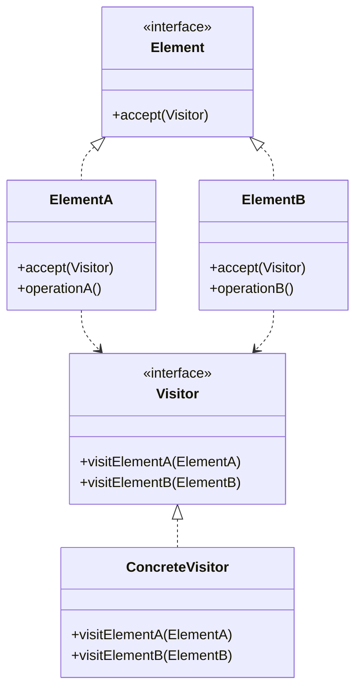

# Visitor (Visitante)

## Categoría
**Patrón de Comportamiento**

---

## Propósito

Permite definir una nueva operación sin cambiar las clases de los elementos sobre los que opera.

---

## Definición Formal

**Visitor** es un patrón de diseño de comportamiento que permite separar algoritmos de los objetos sobre los que operan.

### Intención del GoF

> "Representa una operación a ser realizada sobre los elementos de una estructura de objetos. Visitor permite definir una nueva operación sin cambiar las clases de los elementos sobre los que opera."

---

## Explicación

Visitor es útil cuando tienes una estructura de objetos compleja (como un árbol) y quieres realizar diferentes operaciones sobre ella sin modificar las clases de los elementos.

### Principio: Double Dispatch

```
element.accept(visitor)
  ↓
visitor.visit(element)

Dos llamadas polimórficas para determinar qué método ejecutar.
```

---

## Solución

```java
// Visitor Interface
interface Visitor {
    void visitCircle(Circle circle);
    void visitRectangle(Rectangle rectangle);
}

// Element Interface
interface Shape {
    void accept(Visitor visitor);
}

// Concrete Elements
class Circle implements Shape {
    private int radius;
    
    public void accept(Visitor visitor) {
        visitor.visitCircle(this);  // Double dispatch
    }
    
    public int getRadius() { return radius; }
}

// Concrete Visitors
class AreaCalculator implements Visitor {
    private double totalArea = 0;
    
    public void visitCircle(Circle c) {
        totalArea += Math.PI * c.getRadius() * c.getRadius();
    }
    
    public void visitRectangle(Rectangle r) {
        totalArea += r.getWidth() * r.getHeight();
    }
    
    public double getTotalArea() { return totalArea; }
}

// Uso
List<Shape> shapes = Arrays.asList(new Circle(5), new Rectangle(3, 4));
AreaCalculator calculator = new AreaCalculator();

for (Shape shape : shapes) {
    shape.accept(calculator);
}

System.out.println("Total area: " + calculator.getTotalArea());
```

---

## Estructura UML



**Diagrama basado en**: Resultados de búsqueda web

---

## Implementaciones por Lenguaje

### 📁 Ejemplos Disponibles

- **[Java](./java/)** - Visitor para AST, exporters
- **[C#](./csharp/)** - Visitor con pattern matching
- **[TypeScript](./typescript/)** - Visitor para DOM trees

---

## Casos de Uso

### 1. **Compiladores**
Visitor recorre AST (Abstract Syntax Tree)

### 2. **Exportación de Datos**
XMLExporter, JSONExporter, PDFExporter

### 3. **Validación**
ValidationVisitor recorre estructura

---

## Referencias

- [Refactoring Guru - Visitor](https://refactoring.guru/design-patterns/visitor)

---

[📂 Ver patrones de comportamiento](../Comportamiento.md)
