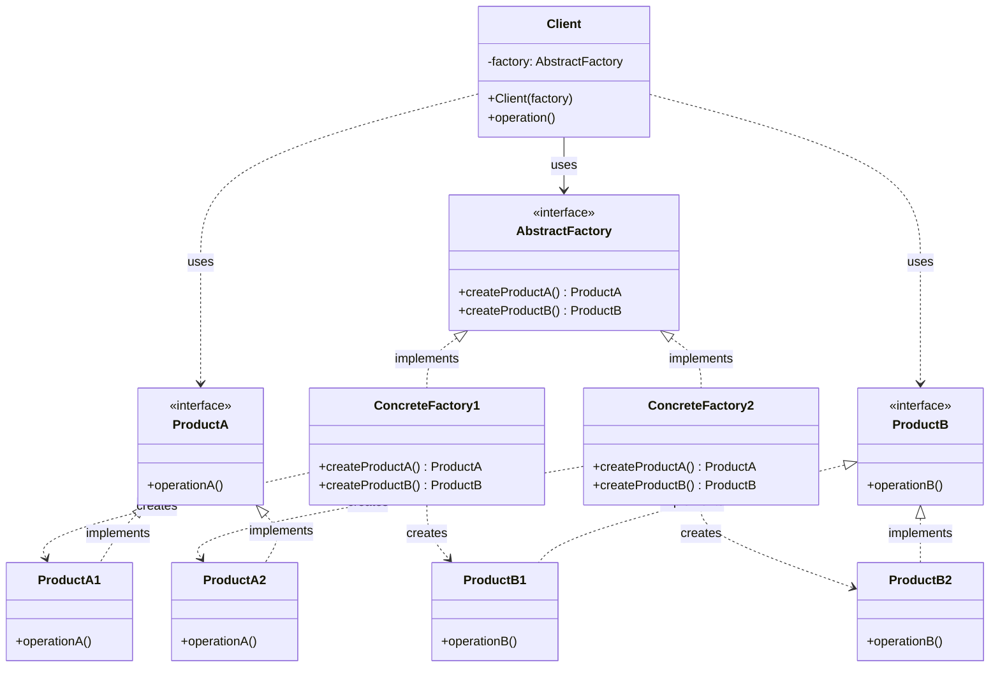
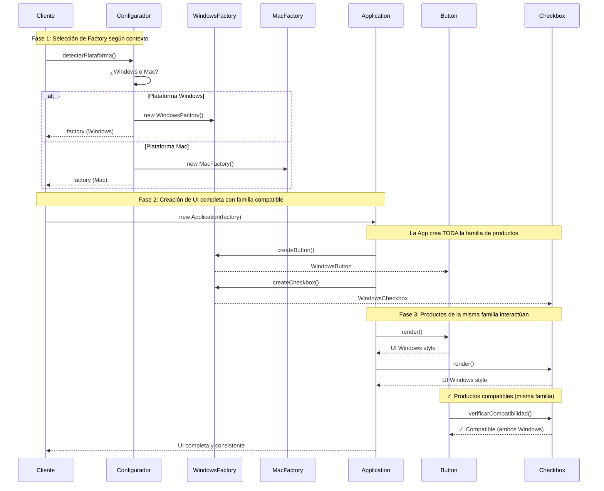

# Abstract Factory (Fábrica Abstracta)

## Categoría

**Patrón Creacional**

---

## Propósito

Proporciona una interfaz para crear familias de objetos relacionados o dependientes sin especificar sus clases concretas.

---

## Problema

Imagina que estás desarrollando una aplicación con interfaz de usuario que debe funcionar en múltiples plataformas (Windows, macOS, Linux). Cada plataforma tiene sus propios componentes: botones, checkboxes, menús, etc.

Necesitas crear objetos de UI que:

1. Sean específicos de cada plataforma
2. Sean compatibles entre sí (todos de Windows o todos de macOS)
3. No acoplen tu código a clases concretas

Si creas los objetos directamente (`new WindowsButton()`, `new MacButton()`), tu código quedará fuertemente acoplado y difícil de mantener.

---

## Solución

El patrón Abstract Factory sugiere:

1. Declarar interfaces explícitas para cada producto distinto (Button, Checkbox, Menu)
2. Hacer que todas las variantes de productos sigan esas interfaces
3. Declarar una Abstract Factory con métodos de creación para todos los productos
4. Crear una factory concreta por cada variante (WindowsFactory, MacFactory)

---

## Estructura UML

### Diagrama de Clases



**Nota sobre el diagrama**: Este diagrama Mermaid se renderiza automáticamente en GitHub, GitLab, y muchas otras plataformas. Si no se visualiza correctamente en tu editor, cópialo a [Mermaid Live Editor](https://mermaid.live/) para verlo.

**Diagrama de referencia alternativo**: Para una visualización más tradicional del patrón, puedes consultar [este diagrama UML clásico de Abstract Factory](https://refactoring.guru/design-patterns/abstract-factory).

---

## Componentes

1. **AbstractFactory**: Interfaz que declara métodos para crear productos abstractos
2. **ConcreteFactory**: Implementa operaciones para crear productos concretos
3. **AbstractProduct**: Interfaz para un tipo de producto
4. **ConcreteProduct**: Implementaciones específicas de productos
5. **Client**: Usa solo interfaces declaradas por AbstractFactory y AbstractProduct

---

## Implementaciones por Lenguaje

Este patrón ha sido implementado en múltiples lenguajes. A continuación encontrarás ejemplos de código en carpetas organizadas por lenguaje:

### 📁 Ejemplos Disponibles

- **[Java](./java/)** - Implementación con familias de productos relacionados
- **[C#](./csharp/)** - Implementación .NET con dependency injection
- **[TypeScript](./typescript/)** - Implementación type-safe con familias de tipos

Cada carpeta contiene:

- ✅ Código fuente completo con múltiples productos
- ✅ Ejemplos de familias de objetos compatibles
- ✅ Instrucciones de compilación/ejecución
- ✅ Referencias a repositorios reconocidos
- ✅ Tests de compatibilidad entre productos

---

## Diagrama de Secuencia

**Escenario**: Aplicación crea una UI completa usando una familia de productos compatible



**Diferencia clave con Factory Method**: 
- **Factory Method**: Crea UN producto a la vez (un botón, un checkbox)
- **Abstract Factory**: Crea FAMILIAS completas de productos relacionados que deben trabajar juntos (todos los componentes Windows o todos Mac)

**Ejemplo visual de familias**:
```
Familia Windows:          Familia Mac:
- WindowsButton          - MacButton
- WindowsCheckbox        - MacCheckbox  
- WindowsInput           - MacInput
- WindowsMenu            - MacMenu
  ↓                        ↓
Todos compatibles       Todos compatibles
entre sí                entre sí
```

---

## Ventajas ✅

1. **Garantiza compatibilidad** entre productos creados
2. **Evita acoplamiento fuerte** entre productos concretos y código cliente
3. **Single Responsibility Principle**: Extrae código de creación a un lugar
4. **Open/Closed Principle**: Puedes introducir nuevas variantes sin romper código existente
5. **Consistencia**: Los productos de una familia siempre son compatibles

---

## Desventajas ❌

1. **Complejidad**: Introduce muchas interfaces y clases nuevas
2. **Rigidez**: Agregar nuevos productos requiere extender todas las factories
3. **Puede ser excesivo**: Para casos simples puede complicar innecesariamente

---

## Cuándo Usar

✅ **Usa Abstract Factory cuando:**

- Tu código necesita trabajar con varias familias de productos relacionados
- Quieres asegurar que los productos de una familia sean compatibles
- Quieres proporcionar una biblioteca de productos ocultando implementaciones
- La familia de productos puede cambiar en tiempo de ejecución

❌ **Evita Abstract Factory cuando:**

- Solo tienes una familia de productos
- Los productos no necesitan ser compatibles entre sí
- La creación de objetos es simple y no necesita abstracción

---

## Casos de Uso Reales

### 1. **Frameworks de UI Multiplataforma**

```python
# Widgets de UI para diferentes plataformas
class UIFactory(ABC):
    def create_button(self): pass
    def create_menu(self): pass
    def create_scrollbar(self): pass
```

### 2. **Temas de Aplicación**

```python
# Temas claro/oscuro con componentes compatibles
class ThemeFactory(ABC):
    def create_background(self): pass
    def create_text_color(self): pass
    def create_button_style(self): pass
```

### 3. **Bases de Datos Multiplataforma**

```python
# Componentes de BD para diferentes proveedores
class DatabaseFactory(ABC):
    def create_connection(self): pass
    def create_command(self): pass
    def create_transaction(self): pass
```

---

## Diferencia con Factory Method

| Aspecto | Factory Method | Abstract Factory |
|---------|----------------|------------------|
| **Enfoque** | Crea UN tipo de objeto | Crea FAMILIAS de objetos |
| **Método** | Un solo método factory | Múltiples métodos factory |
| **Implementación** | Usa herencia | Usa composición |
| **Complejidad** | Más simple | Más complejo |
| **Productos** | Un producto | Varios productos relacionados |

---

## Relación con Otros Patrones

- **Factory Method**: Abstract Factory usa múltiples Factory Methods
- **Singleton**: Las factories concretas suelen implementarse como Singletons
- **Prototype**: Las factories pueden usar prototipos para crear productos

---

## Relación con Principios SOLID

| Principio | Cómo lo cumple |
|-----------|----------------|
| **SRP** | Separa la creación de familias de objetos del código cliente |
| **OCP** | Permite añadir nuevas familias sin modificar código existente |
| **LSP** | Las factories concretas pueden sustituirse entre sí |
| **ISP** | Las interfaces de factory son específicas para familias de productos |
| **DIP** | El cliente depende de abstracciones, no de factories concretas |

---

## Ejercicios Prácticos

### Ejercicio 1: Muebles Modernos vs Victorianos

Crea una factory que produzca sillas, sofás y mesas en estilo moderno o victoriano.

### Ejercicio 2: Vehículos Eléctricos vs Combustión

Diseña factories que creen motores, baterías/tanques y sistemas de transmisión compatibles.

### Ejercicio 3: Restaurantes de Comida

Implementa factories para diferentes tipos de restaurantes (italiano, chino, mexicano) que creen entrantes, platos principales y postres compatibles.

---

## Referencias

- [Refactoring Guru - Abstract Factory](https://refactoring.guru/design-patterns/abstract-factory)
- Gang of Four - Design Patterns
- [SourceMaking - Abstract Factory](https://sourcemaking.com/design_patterns/abstract_factory)

---

[← Volver a Patrones Creacionales](../Creacionales.md)
