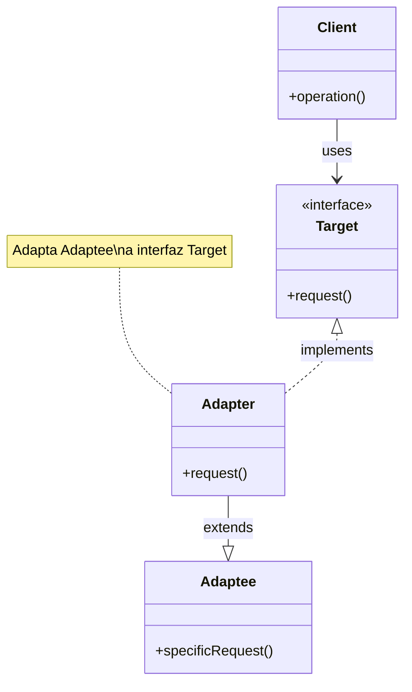
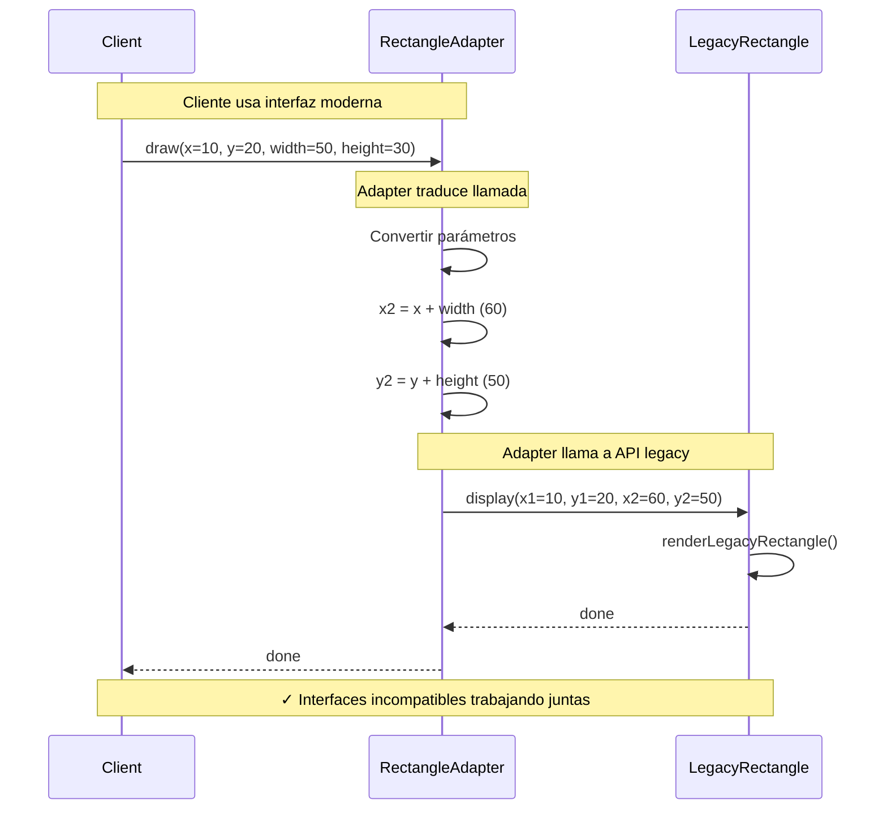
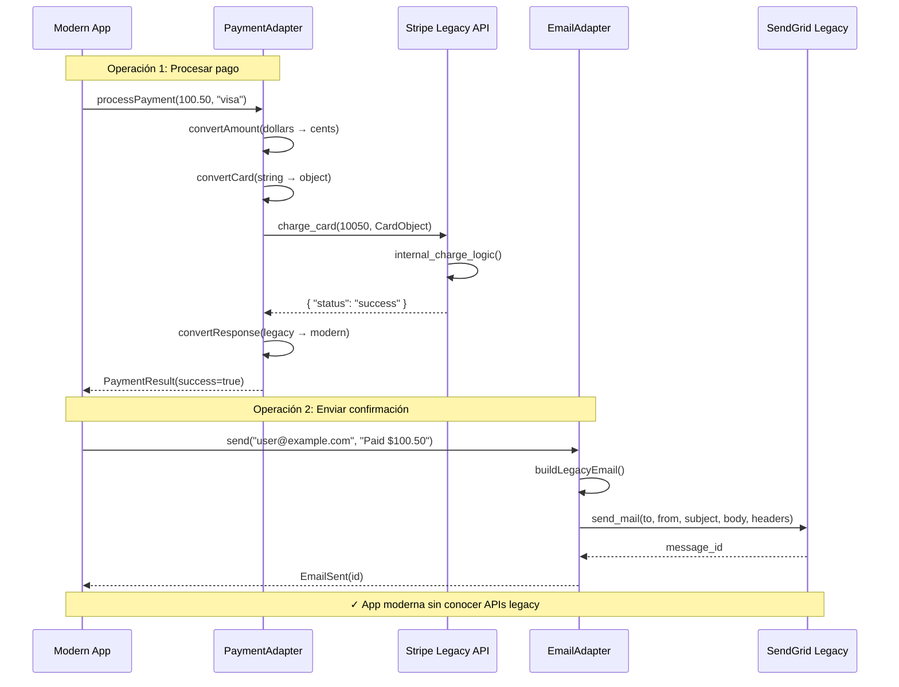

# Adapter (Adaptador)

## Categoría
**Patrón Estructural**

---

## Propósito

Permite que interfaces incompatibles trabajen juntas. Adapter actúa como un envoltorio entre dos objetos, capturando llamadas de uno y transformándolas en formato que el otro pueda entender.

---

## Definición Formal

**Adapter** (también conocido como **Wrapper**) es un patrón de diseño estructural que permite la colaboración entre objetos con interfaces incompatibles.

### Intención del GoF

> "Convierte la interfaz de una clase en otra interfaz que los clientes esperan. Adapter permite que clases trabajen juntas que de otra manera no podrían debido a interfaces incompatibles."

---

## Explicación Detallada

El patrón Adapter es como un adaptador de enchufe: permite que un dispositivo con un tipo de enchufe funcione en una toma de corriente de otro tipo.

### Metáfora: Adaptador de Corriente

```
Dispositivo US (110V, enchufe tipo A)
         ↓
  Adaptador de Viaje
         ↓
Toma EU (220V, enchufe tipo C)

El adaptador traduce entre interfaces incompatibles.
```

---

## Problema

```java
// Tienes una clase existente
class LegacyRectangle {
    public void display(int x1, int y1, int x2, int y2) {
        System.out.println("Rectangle: (" + x1 + "," + y1 + ") to (" + x2 + "," + y2 + ")");
    }
}

// Pero tu sistema usa esta interfaz
interface Shape {
    void draw(int x, int y, int width, int height);
}

// ❌ Incompatibles: diferentes parámetros
```

---

## Solución

```java
// ADAPTER
class RectangleAdapter implements Shape {
    private LegacyRectangle rectangle = new LegacyRectangle();
    
    @Override
    public void draw(int x, int y, int width, int height) {
        // Adaptar interfaz: convertir parámetros
        int x2 = x + width;
        int y2 = y + height;
        rectangle.display(x, y, x2, y2);  // ✅ Traduce llamada
    }
}

// Cliente usa interfaz uniforme
Shape shape = new RectangleAdapter();
shape.draw(10, 20, 50, 30);  // ✅ Funciona
```

---

## Estructura UML (Class Adapter)



---

## Implementaciones por Lenguaje

### 📁 Ejemplos Disponibles

- **[Java](./java/)** - Class adapter, Object adapter
- **[C#](./csharp/)** - Adapter para bibliotecas externas
- **[TypeScript](./typescript/)** - Adapter para APIs

Cada carpeta contiene:
- ✅ Class Adapter (herencia)
- ✅ Object Adapter (composición)
- ✅ Two-way Adapter
- ✅ Ejemplos de integración de APIs externas
- ✅ Referencias a repositorios reconocidos

---

## Diagrama de Secuencia

**Escenario**: Cliente usa API moderna para controlar sistema legacy



---

## Variantes del Patrón

### 1. Class Adapter (Herencia)

```java
// Adapter usa herencia múltiple (solo en C++, no en Java/C#)
class Adapter extends Adaptee implements Target {
    @Override
    public void request() {
        specificRequest();  // Hereda de Adaptee
    }
}
```

### 2. Object Adapter (Composición - Recomendado)

```java
// Adapter usa composición (funciona en todos los lenguajes)
class Adapter implements Target {
    private Adaptee adaptee;
    
    public Adapter(Adaptee adaptee) {
        this.adaptee = adaptee;
    }
    
    @Override
    public void request() {
        adaptee.specificRequest();  // Delega
    }
}
```

**Recomendación**: Prefiere Object Adapter (composición sobre herencia).

---

## Ventajas ✅

1. **Single Responsibility Principle**: Separa conversión de lógica de negocio
2. **Open/Closed Principle**: Introduces adaptadores sin modificar código existente
3. **Reutilización de código existente**: No necesitas reescribir código legacy
4. **Flexibilidad**: Puedes adaptar múltiples adaptees
5. **Desacoplamiento**: Cliente no conoce Adaptee directamente
6. **Testing**: Puedes mockear el Adaptee fácilmente

---

## Desventajas ❌

1. **Complejidad aumentada**: Capa adicional de abstracción
2. **Overhead**: Llamadas indirectas son ligeramente más lentas
3. **Puede ocultar problemas**: A veces mejor refactorizar que adaptar
4. **Mantenimiento**: Una capa más que mantener

---

## Cuándo Usar

✅ **Usa Adapter cuando:**

- Necesitas usar clase existente con interfaz incompatible
- Quieres crear clase reutilizable que coopere con clases no relacionadas
- Necesitas usar varias subclases pero no es práctico adaptar su interfaz mediante subclases
- Integras bibliotecas de terceros
- Trabajas con código legacy que no puedes modificar

❌ **Evita Adapter cuando:**

- Puedes modificar la clase original
- La conversión es trivial (mejor inline)
- Solo necesitas adaptar en un lugar (puede ser overkill)
- Prefieres refactorizar que adaptar

---

## Casos de Uso Reales

### 1. **Integración de Bibliotecas de Terceros**
```java
// Tu interfaz
interface PaymentProcessor {
    boolean processPayment(double amount, String card);
}

// Biblioteca externa: Stripe
class StripeClient {
    public PaymentIntent charge(int cents, CreditCard card) { /* ... */ }
}

// Adapter
class StripeAdapter implements PaymentProcessor {
    private StripeClient stripe;
    
    @Override
    public boolean processPayment(double amount, String cardNumber) {
        // Convertir dollars a cents
        int cents = (int)(amount * 100);
        
        // Convertir string a CreditCard
        CreditCard card = CreditCard.parse(cardNumber);
        
        // Llamar API de Stripe
        PaymentIntent intent = stripe.charge(cents, card);
        
        return intent.isSuccessful();
    }
}
```

### 2. **Sistema de Logging Multiplataforma**
```java
// Tu interfaz estándar
interface Logger {
    void log(String message);
}

// Adaptadores para diferentes sistemas
class Log4jAdapter implements Logger {
    private org.apache.log4j.Logger logger;
    
    public void log(String message) {
        logger.info(message);  // Adapta a Log4j
    }
}

class SLF4JAdapter implements Logger {
    private org.slf4j.Logger logger;
    
    public void log(String message) {
        logger.info(message);  // Adapta a SLF4J
    }
}
```

### 3. **Adaptadores de Base de Datos**
```java
// Tu interfaz
interface Database {
    ResultSet query(String sql);
}

// Adaptadores para diferentes BDs
class MySQLAdapter implements Database {
    private MySQLConnection mysql;
    
    public ResultSet query(String sql) {
        return mysql.executeQuery(sql);
    }
}

class MongoDBAdapter implements Database {
    private MongoClient mongo;
    
    public ResultSet query(String sql) {
        // Convertir SQL a MongoDB query
        Document query = SQLToMongoConverter.convert(sql);
        return mongo.find(query);
    }
}
```

---

## Errores Comunes

### ❌ Error 1: Adapter que expone métodos del Adaptee

```java
// ❌ INCORRECTO: Expone implementación del Adaptee
class BadAdapter implements Target {
    private Adaptee adaptee;
    
    @Override
    public void request() {
        adaptee.specificRequest();
    }
    
    // ❌ Expone métodos específicos del Adaptee
    public void specificRequest() {
        adaptee.specificRequest();
    }
    
    public Adaptee getAdaptee() {  // ❌ Expone Adaptee
        return adaptee;
    }
}

// Cliente puede hacer:
BadAdapter adapter = new BadAdapter();
adapter.getAdaptee().specificRequest();  // ❌ Bypasea adapter

// ✅ CORRECTO: Solo expone interfaz Target
class GoodAdapter implements Target {
    private Adaptee adaptee;  // ✅ Privado
    
    @Override
    public void request() {
        adaptee.specificRequest();
    }
    // ✅ No expone nada más
}
```

### ❌ Error 2: Adapter que hace más que adaptar

```java
// ❌ INCORRECTO: Adapter con lógica de negocio
class BadAdapter implements Target {
    private Adaptee adaptee;
    
    @Override
    public void request() {
        // ❌ Validación de negocio
        if (validateBusinessRules()) {
            // ❌ Transformación compleja
            Data data = transformData();
            // ❌ Logging
            log("Request processed");
            // ❌ Caching
            cache.put(data);
            
            adaptee.specificRequest();
        }
    }
}

// ✅ CORRECTO: Adapter solo adapta
class GoodAdapter implements Target {
    private Adaptee adaptee;
    
    @Override
    public void request() {
        // ✅ Solo conversión de interfaz
        adaptee.specificRequest();
    }
}

// Lógica de negocio va en otro lugar (Decorator, Service, etc.)
```

### ❌ Error 3: Two-Way Adapter mal implementado

```java
// ❌ INCORRECTO: Dependencia circular
interface InterfaceA {
    void methodA();
}

interface InterfaceB {
    void methodB();
}

class BadTwoWayAdapter implements InterfaceA, InterfaceB {
    private InterfaceA a;  // ❌ Circular
    private InterfaceB b;  // ❌ Circular
    
    public void methodA() {
        b.methodB();  // ❌ Puede causar loop infinito
    }
    
    public void methodB() {
        a.methodA();  // ❌ Puede causar loop infinito
    }
}

// ✅ CORRECTO: Two-way adapter con delegación clara
class GoodTwoWayAdapter implements InterfaceA, InterfaceB {
    private ConcreteA a;  // Implementación concreta
    private ConcreteB b;  // Implementación concreta
    
    public void methodA() {
        // Lógica de adaptación sin ciclos
        b.internalMethod();
    }
    
    public void methodB() {
        a.internalMethod();
    }
}
```

### ❌ Error 4: No validar conversiones

```java
// ❌ INCORRECTO: Asumir que conversión siempre funciona
class BadAdapter implements Target {
    private Adaptee adaptee;
    
    @Override
    public int getValue() {
        // ❌ Conversión sin validar
        return Integer.parseInt(adaptee.getStringValue());  // Puede fallar
    }
}

// ✅ CORRECTO: Validar y manejar errores
class GoodAdapter implements Target {
    private Adaptee adaptee;
    
    @Override
    public int getValue() {
        String value = adaptee.getStringValue();
        
        // ✅ Validar antes de convertir
        if (value == null || value.isEmpty()) {
            return 0;  // Valor por defecto
        }
        
        try {
            return Integer.parseInt(value);
        } catch (NumberFormatException e) {
            // ✅ Manejar error de conversión
            throw new AdapterException("Cannot convert value: " + value, e);
        }
    }
}
```

---

## Anti-Patrones

### 1. **Adapter como God Object**

```java
// ❌ ANTI-PATRÓN: Adapter que adapta demasiadas cosas
class MegaAdapter implements Target {
    private LegacySystem1 legacy1;
    private LegacySystem2 legacy2;
    private ThirdPartyAPI api1;
    private AnotherAPI api2;
    // ... 10 dependencias más
    
    @Override
    public void request() {
        // ❌ Coordina múltiples sistemas
        legacy1.doSomething();
        legacy2.doSomethingElse();
        api1.call();
        api2.execute();
        // ❌ Esto es un Facade, no un Adapter
    }
}
```

**Problema**: Confunde Adapter con Facade.  
**Solución**: Un Adapter para una interfaz incompatible. Si coordinas múltiples sistemas, usa Facade.

### 2. **Adapter Leaky (Con Fugas)**

```java
// ❌ ANTI-PATRÓN: Adapter que expone detalles del Adaptee
interface Target {
    void request();
}

class LeakyAdapter implements Target {
    public LegacySystem legacy;  // ❌ Público - expone Adaptee
    
    @Override
    public void request() {
        legacy.specificRequest();
    }
    
    // ❌ Métodos específicos del Adaptee
    public void legacySpecificMethod() {
        legacy.internalMethod();
    }
}

// Cliente puede hacer:
LeakyAdapter adapter = new LeakyAdapter();
adapter.legacy.internalMethod();  // ❌ Accede directamente al Adaptee
```

**Problema**: Cliente se acopla al Adaptee.  
**Solución**: Encapsular completamente el Adaptee.

---

## Ejercicios Prácticos

### Ejercicio 1: Adapter para API de Pagos

Crea adaptadores para múltiples pasarelas de pago.

**Requisitos**:
- Interfaz común: `PaymentGateway` con `charge(amount, card)`
- Adaptees: StripeAPI, PayPalAPI, SquareAPI (cada una con interfaz diferente)
- Implementar adaptadores para cada pasarela
- Cliente debe poder cambiar pasarela sin modificar código

### Ejercicio 2: Adapter de Formatos de Datos

Implementa adaptadores para convertir entre formatos.

**Requisitos**:
- Interfaz: `DataFormat` con `serialize(Object)` y `deserialize(String)`
- Adaptees: XMLLibrary, JSONLibrary (con diferentes interfaces)
- Adaptadores que unifican la interfaz
- Pruebas de conversión bidireccional

### Ejercicio 3: Adapter para Sistema Legacy de Inventario

Diseña adapter para integrar sistema viejo con nuevo.

**Requisitos**:
- Sistema moderno usa: `Product getProduct(String id)`
- Sistema legacy usa: `Item findItem(int code)` (con estructura diferente)
- Adapter debe convertir entre Product ↔ Item
- Mapear diferentes tipos de datos (String/int, nombres diferentes)

---

## Diagrama de Secuencia Completo

**Escenario**: Aplicación moderna usa múltiples APIs legacy a través de adapters



---

## Ventajas ✅

1. **Single Responsibility Principle**: Separa conversión de lógica de negocio
2. **Open/Closed Principle**: Añade adaptadores sin modificar código existente
3. **Reutilización**: Aprovecha código existente sin modificarlo
4. **Desacoplamiento**: Cliente independiente de clases incompatibles
5. **Flexibilidad**: Múltiples adaptadores para diferentes adaptees
6. **Testing mejorado**: Fácil mockear adaptees

---

## Desventajas ❌

1. **Complejidad**: Más clases en el sistema
2. **Indirección**: Llamadas adicionales afectan rendimiento ligeramente
3. **Puede enmascarar mal diseño**: A veces mejor refactorizar
4. **Mantenimiento**: Cambios en Adaptee pueden requerir actualizar Adapter

---

## Cuándo Usar Detallado

✅ **Usa Adapter cuando:**

- Necesitas integrar biblioteca externa con interfaz incompatible
- Tienes código legacy que no puedes/quieres modificar
- Quieres usar clase existente pero su interfaz no coincide
- Necesitas interfaz común para múltiples implementaciones diferentes
- Estás migrando gradualmente de un sistema viejo a uno nuevo
- Quieres aislar tu código de dependencias externas

❌ **Evita Adapter cuando:**

- Puedes modificar la interfaz original
- La diferencia de interfaces es trivial
- Solo usas el adapter en un lugar (inline la conversión)
- Estás construyendo desde cero (diseña bien desde el inicio)

---

## Casos de Uso Reales Expandidos

### 1. **Integración de APIs de Pago**
```java
// Múltiples pasarelas con interfaces diferentes
interface PaymentGateway {
    PaymentResult charge(BigDecimal amount, CreditCard card);
}

class StripeAdapter implements PaymentGateway {
    private StripeAPI stripe;
    
    public PaymentResult charge(BigDecimal amount, CreditCard card) {
        // Stripe usa cents
        long cents = amount.multiply(BigDecimal.valueOf(100)).longValue();
        com.stripe.model.Charge charge = stripe.charges().create(cents, card.getToken());
        return new PaymentResult(charge.getId(), charge.getStatus());
    }
}

class PayPalAdapter implements PaymentGateway {
    private PayPalSDK paypal;
    
    public PaymentResult charge(BigDecimal amount, CreditCard card) {
        // PayPal usa estructura diferente
        Payment payment = new Payment()
            .setAmount(amount.toString())
            .setCurrency("USD")
            .setCard(card.getNumber());
        
        PaymentResponse response = paypal.execute(payment);
        return new PaymentResult(response.getId(), response.getState());
    }
}
```

### 2. **Adaptadores de Formatos de Archivo**
```java
interface DocumentReader {
    Document read(File file);
}

class PDFReaderAdapter implements DocumentReader {
    private PDFBox pdfBox;  // Biblioteca Apache PDFBox
    
    public Document read(File file) {
        PDDocument pdf = pdfBox.load(file);
        return convertPDFToDocument(pdf);
    }
}

class WordReaderAdapter implements DocumentReader {
    private ApachePOI poi;  // Biblioteca Apache POI
    
    public Document read(File file) {
        XWPFDocument doc = poi.load(file);
        return convertWordToDocument(doc);
    }
}
```

### 3. **Arrays como Stacks (Java)**
```java
// Java Collections Framework
Stack<String> stack = new Stack<>();  // Adapter para Vector
stack.push("item");
stack.pop();

// Internamente, Stack adapta la interfaz de Vector
```

---

## Relación con Otros Patrones

- **Bridge**: Diseñado upfront; Adapter retrofit de código existente
- **Decorator**: Añade funcionalidad; Adapter cambia interfaz
- **Proxy**: Misma interfaz; Adapter interfaz diferente
- **Facade**: Simplifica múltiples interfaces; Adapter convierte una interfaz

---

## Relación con Principios SOLID

| Principio | Cómo lo cumple |
|-----------|----------------|
| **SRP** | Adapter tiene una responsabilidad: convertir interfaces |
| **OCP** | Puedes añadir adaptadores sin modificar código existente |
| **LSP** | Adapter puede sustituir a Target |
| **ISP** | Adapta solo los métodos necesarios |
| **DIP** | Cliente depende de interfaz Target, no de Adaptee |

---

## Diferencia con Facade

| Aspecto | Adapter | Facade |
|---------|---------|--------|
| **Propósito** | Convertir interfaz | Simplificar interfaz |
| **Número** | Adapta UNA clase | Simplifica VARIAS clases |
| **Interfaz** | Interfaz diferente | Interfaz nueva y simple |
| **Intención** | Hacer compatible | Hacer fácil de usar |
| **Momento** | Retrofit (después) | Diseño inicial |

---

## Referencias

- **Gang of Four** - "Design Patterns" (Capítulo sobre Adapter)
- [Refactoring Guru - Adapter](https://refactoring.guru/design-patterns/adapter)
- [SourceMaking - Adapter](https://sourcemaking.com/design_patterns/adapter)

---

## Recursos Adicionales

### Libros
- **"Head First Design Patterns"** - Freeman & Freeman
- **"Design Patterns Explained"** - Alan Shalloway

### Artículos
- [Adapter vs Decorator vs Facade](https://www.baeldung.com/java-adapter-pattern)
- [Object Adapter vs Class Adapter](https://stackoverflow.com/questions/9978477/difference-between-object-adapter-pattern-and-class-adapter-pattern)

---

[📂 Ver patrones estructurales](../Estructurales.md) | [🏠 Volver a inicio](../../README.md)

---

*Última actualización: Octubre 2025*
