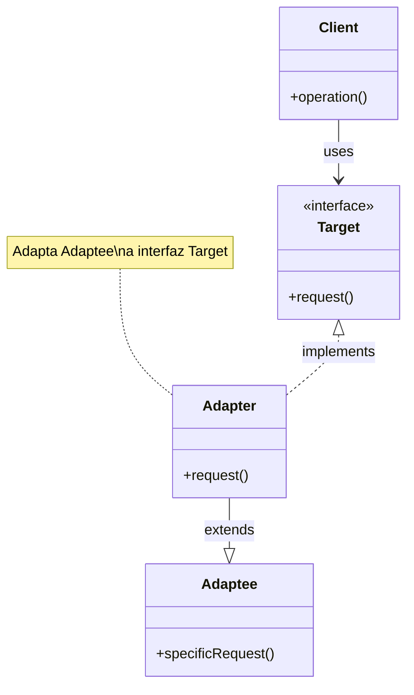

# Adapter (Adaptador)

## Categoría
**Patrón Estructural**

---

## Propósito

Permite que interfaces incompatibles trabajen juntas. Adapter actúa como un envoltorio entre dos objetos, capturando llamadas de uno y transformándolas en formato que el otro pueda entender.

---

## Definición Formal

**Adapter** (también conocido como **Wrapper**) es un patrón de diseño estructural que permite la colaboración entre objetos con interfaces incompatibles.

### Intención del GoF

> "Convierte la interfaz de una clase en otra interfaz que los clientes esperan. Adapter permite que clases trabajen juntas que de otra manera no podrían debido a interfaces incompatibles."

---

## Explicación Detallada

El patrón Adapter es como un adaptador de enchufe: permite que un dispositivo con un tipo de enchufe funcione en una toma de corriente de otro tipo.

### Metáfora: Adaptador de Corriente

```
Dispositivo US (110V, enchufe tipo A)
         ↓
  Adaptador de Viaje
         ↓
Toma EU (220V, enchufe tipo C)

El adaptador traduce entre interfaces incompatibles.
```

---

## Problema

```java
// Tienes una clase existente
class LegacyRectangle {
    public void display(int x1, int y1, int x2, int y2) {
        System.out.println("Rectangle: (" + x1 + "," + y1 + ") to (" + x2 + "," + y2 + ")");
    }
}

// Pero tu sistema usa esta interfaz
interface Shape {
    void draw(int x, int y, int width, int height);
}

// ❌ Incompatibles: diferentes parámetros
```

---

## Solución

```java
// ADAPTER
class RectangleAdapter implements Shape {
    private LegacyRectangle rectangle = new LegacyRectangle();
    
    @Override
    public void draw(int x, int y, int width, int height) {
        // Adaptar interfaz: convertir parámetros
        int x2 = x + width;
        int y2 = y + height;
        rectangle.display(x, y, x2, y2);  // ✅ Traduce llamada
    }
}

// Cliente usa interfaz uniforme
Shape shape = new RectangleAdapter();
shape.draw(10, 20, 50, 30);  // ✅ Funciona
```

---

## Estructura UML (Class Adapter)



---

## Implementaciones por Lenguaje

### 📁 Ejemplos Disponibles

- **[Java](./java/)** - Class adapter, Object adapter
- **[C#](./csharp/)** - Adapter para bibliotecas externas
- **[TypeScript](./typescript/)** - Adapter para APIs

---

## Casos de Uso

### 1. **Integración de Bibliotecas**
Adaptar API externa a tu interfaz

### 2. **Legacy Code**
Adaptar código antiguo a nuevo sistema

### 3. **Múltiples Proveedores**
Adaptar diferentes APIs a interfaz común

---

## Referencias

- [Refactoring Guru - Adapter](https://refactoring.guru/design-patterns/adapter)

---

[📂 Ver patrones estructurales](../Estructurales.md)
