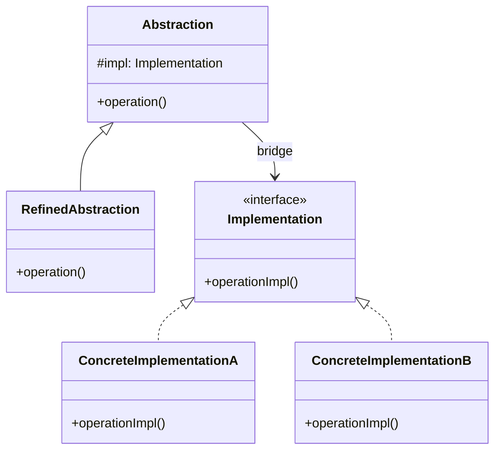
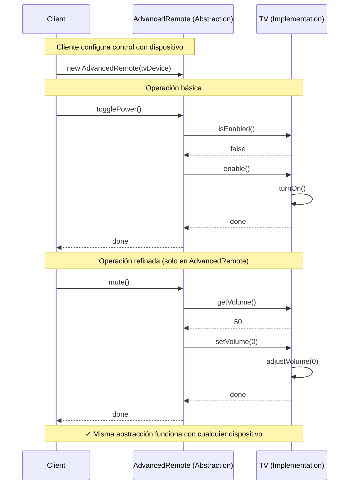
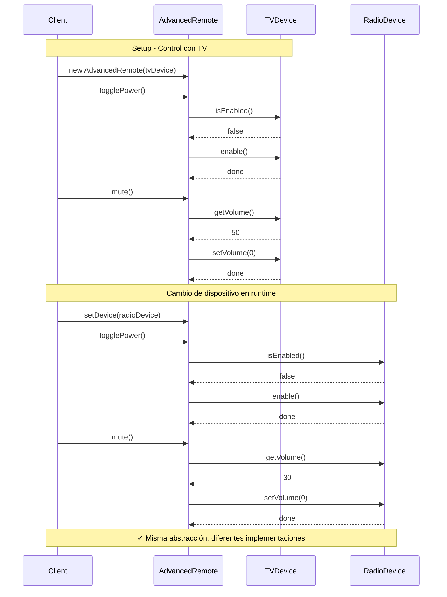

# Bridge (Puente)

## Categoría
**Patrón Estructural**

---

## Propósito

Desacopla una abstracción de su implementación para que ambas puedan variar independientemente.

---

## Definición Formal

**Bridge** es un patrón de diseño estructural que divide una clase grande o un conjunto de clases estrechamente relacionadas en dos jerarquías separadas (abstracción e implementación) que pueden desarrollarse independientemente.

### Intención del GoF

> "Desacopla una abstracción de su implementación de modo que ambas puedan variar independientemente."

---

## Explicación Detallada

El patrón Bridge separa una abstracción de su implementación para que ambas puedan evolucionar independientemente. Previene la "explosión combinatoria de clases" cuando tienes múltiples dimensiones de variación.

### Conceptos Clave

1. **Dos jerarquías separadas**: Abstracción e Implementación
2. **Composición sobre herencia**: Usa composición para conectarlas
3. **Variación independiente**: Cada jerarquía puede cambiar sin afectar la otra
4. **Bridge (puente)**: Referencia de Abstracción a Implementación
5. **Desacoplamiento**: Abstracción no conoce implementación concreta
6. **Flexibilidad**: Cambia implementación en runtime

### Metáfora: Control Remoto y Dispositivos

```
Sin Bridge (Explosión de clases):
Control Remoto
├── ControlRemotoTV
├── ControlRemotoRadio
├── ControlRemotoAC
├── ControlRemotoTVAvanzado
├── ControlRemotoRadioAvanzado
└── ControlRemotoACAvanzado

3 dispositivos × 2 tipos = 6 clases
10 dispositivos × 5 tipos = 50 clases ❌

Con Bridge:
Abstracción (Control Remoto)    Implementación (Dispositivo)
├── BasicRemote        +        ├── TV
└── AdvancedRemote              ├── Radio
                                └── AC

2 controles + 3 dispositivos = 5 clases ✅
Cualquier control puede manejar cualquier dispositivo
```

### Ejemplo del Mundo Real: Sistemas Gráficos

```
Sin Bridge:
Shape
├── CircleOpenGL
├── CircleDirectX
├── CircleVulkan
├── SquareOpenGL
├── SquareDirectX
├── SquareVulkan
├── TriangleOpenGL
├── TriangleDirectX
└── TriangleVulkan

9 clases, difícil mantener

Con Bridge:
Abstracción (Shape)           Implementación (Renderer)
├── Circle                    ├── OpenGLRenderer
├── Square        +           ├── DirectXRenderer
└── Triangle                  └── VulkanRenderer

6 clases, fácil extender
```

### Problema: Explosión de Subclases

```
Sin Bridge:
Shape
├── Circle
│   ├── RedCircle
│   ├── BlueCircle
│   └── GreenCircle
├── Square
│   ├── RedSquare
│   ├── BlueSquare
│   └── GreenSquare
└── Triangle
    ├── RedTriangle
    ├── BlueTriangle
    └── GreenTriangle

3 formas × 3 colores = 9 clases
10 formas × 10 colores = 100 clases ❌
```

---

## Solución

```java
// Separar en dos jerarquías

// Implementation (Color)
interface Color {
    String fill();
}

class Red implements Color {
    public String fill() { return "red"; }
}

class Blue implements Color {
    public String fill() { return "blue"; }
}

// Abstraction (Shape)
abstract class Shape {
    protected Color color;  // Bridge: referencia a implementación
    
    protected Shape(Color color) {
        this.color = color;
    }
    
    abstract void draw();
}

class Circle extends Shape {
    public Circle(Color color) {
        super(color);
    }
    
    public void draw() {
        System.out.println("Circle filled with " + color.fill());
    }
}

// Uso
Shape redCircle = new Circle(new Red());
Shape blueSquare = new Square(new Blue());

// ✅ 2 jerarquías independientes
// ✅ n formas + m colores = n + m clases (no n × m)
```

---

## Estructura UML



---

## Implementaciones por Lenguaje

### 📁 Ejemplos Disponibles

- **[Java](./java/)** - Shapes + Colors example
- **[C#](./csharp/)** - Remotes + Devices
- **[TypeScript](./typescript/)** - Platforms + Renderers

Cada carpeta contiene:
- ✅ Separación clara de Abstracción e Implementación
- ✅ Cambio de implementación en runtime
- ✅ Ejemplos de múltiples dimensiones de variación
- ✅ Comparación con/sin Bridge
- ✅ Referencias a repositorios reconocidos

---

## Componentes

1. **Abstraction**: Define interfaz de alto nivel y mantiene referencia a Implementación
2. **RefinedAbstraction**: Extiende Abstraction con variantes
3. **Implementation**: Interfaz para implementaciones concretas
4. **ConcreteImplementation**: Implementaciones específicas de la interfaz

---

## Diagrama de Secuencia

**Escenario**: Cliente usa diferentes controles remotos con diferentes dispositivos



---

## Ventajas ✅

1. **Evita explosión de clases**: n + m clases en lugar de n × m
2. **Abstracción e Implementación independientes**: Cambian sin afectarse
3. **Open/Closed Principle**: Puedes extender ambas jerarquías
4. **Single Responsibility**: Abstracción e Implementación tienen responsabilidades claras
5. **Runtime flexibility**: Puedes cambiar implementación en tiempo de ejecución
6. **Plataforma independiente**: Abstracción funciona con cualquier implementación

---

## Desventajas ❌

1. **Complejidad inicial**: Más clases e interfaces
2. **Indirección**: Llamadas a través del bridge
3. **Puede ser overkill**: Para una sola dimensión de variación (usa herencia simple)
4. **Difícil de entender**: No es intuitivo al principio

---

## Cuándo Usar

✅ **Usa Bridge cuando:**

- Tienes dos o más dimensiones de variación
- Quieres evitar enlace permanente entre abstracción e implementación
- Necesitas cambiar implementación en runtime
- Cambios en implementación no deben afectar a cliente
- Quieres compartir implementación entre múltiples abstracciones
- Tienes explosión de subclases (muchas combinaciones)

❌ **Evita Bridge cuando:**

- Solo tienes una dimensión de variación (usa herencia)
- La abstracción e implementación no cambian independientemente
- No necesitas runtime flexibility
- La complejidad no se justifica

---

## Casos de Uso Reales

### 1. **Drivers de Base de Datos**
```java
// Abstracción
interface Database {
    void connect();
    ResultSet query(String sql);
}

// Implementación
interface DatabaseDriver {
    Connection createConnection();
    void executeQuery(String sql);
}

// Abstracción concreta
class SQLDatabase implements Database {
    private DatabaseDriver driver;  // Bridge
    
    public SQLDatabase(DatabaseDriver driver) {
        this.driver = driver;
    }
    
    public void query(String sql) {
        driver.executeQuery(sql);
    }
}

// Implementaciones concretas
class MySQLDriver implements DatabaseDriver { }
class PostgreSQLDriver implements DatabaseDriver { }
class OracleDriver implements DatabaseDriver { }

// Uso
Database db = new SQLDatabase(new MySQLDriver());
// Mismo código funciona con PostgreSQL
db = new SQLDatabase(new PostgreSQLDriver());
```

### 2. **UI Toolkit Multiplataforma**
```java
// Abstracción: Componentes UI
abstract class Window {
    protected WindowImpl impl;  // Bridge
    
    protected Window(WindowImpl impl) {
        this.impl = impl;
    }
    
    public void drawWindow() {
        impl.drawWindow();
    }
}

// Implementación: Plataformas
interface WindowImpl {
    void drawWindow();
}

class WindowsWindowImpl implements WindowImpl { }
class LinuxWindowImpl implements WindowImpl { }
class MacWindowImpl implements WindowImpl { }

// Uso
Window window = new ApplicationWindow(new WindowsWindowImpl());
// Cambia plataforma
window = new ApplicationWindow(new MacWindowImpl());
```

### 3. **Sistemas de Mensajería**
```java
// Abstracción: Tipos de mensajes
abstract class Message {
    protected MessageSender sender;  // Bridge
    
    public void send(String content) {
        sender.sendMessage(content);
    }
}

// Implementación: Canales
interface MessageSender {
    void sendMessage(String content);
}

class EmailSender implements MessageSender { }
class SMSSender implements MessageSender { }
class PushSender implements MessageSender { }

// Refinamiento
class UrgentMessage extends Message {
    public void send(String content) {
        sender.sendMessage("[URGENT] " + content);
    }
}
```

---

## Errores Comunes

### ❌ Error 1: Confundir Bridge con Adapter

```java
// ❌ INCORRECTO: Usando Bridge cuando necesitas Adapter
// Bridge: Diseñado desde el inicio para separar abstracción/implementación
// Adapter: Retrofit para hacer compatibles interfaces existentes

// No uses Bridge si:
class BadBridge {
    // Solo adaptas una clase existente incompatible
    // → Usa Adapter en su lugar
}

// ✅ CORRECTO: Bridge para diseño flexible
class GoodBridge {
    // Diseñas dos jerarquías independientes desde el inicio
    // Ambas pueden crecer sin afectarse
}
```

**Diferencia clave**:
- **Bridge**: Planificado, diseño proactivo, dos dimensiones
- **Adapter**: Reactivo, arregla incompatibilidad, una interfaz

### ❌ Error 2: Bridge innecesario para una sola dimensión

```java
// ❌ INCORRECTO: Bridge con una sola dimensión
class BadShape {
    private Renderer renderer;  // ❌ Overkill si solo varía el shape
    
    // Si solo tienes Circle, Square (una dimensión)
    // → Usa herencia simple
}

// ✅ CORRECTO: Bridge cuando tienes DOS+ dimensiones
class GoodShape {
    private Renderer renderer;  // ✅ OK si tienes:
    // Dimensión 1: Circle, Square, Triangle
    // Dimensión 2: OpenGL, DirectX, Vulkan
}
```

**Regla**: Solo usa Bridge si tienes 2+ dimensiones de variación independientes.

### ❌ Error 3: Abstracción que conoce implementación concreta

```java
// ❌ INCORRECTO: Abstracción acoplada a implementación concreta
class BadRemoteControl {
    private TVDevice tv;  // ❌ Conoce TVDevice específico
    
    public void volumeUp() {
        if (tv instanceof SmartTV) {  // ❌ Conoce tipo concreto
            ((SmartTV) tv).smartVolumeUp();
        } else {
            tv.volumeUp();
        }
    }
}

// ✅ CORRECTO: Abstracción solo conoce interfaz
class GoodRemoteControl {
    protected Device device;  // ✅ Solo interfaz
    
    public void volumeUp() {
        int volume = device.getVolume();
        device.setVolume(volume + 10);
        // ✅ Polimorfismo puro, no conoce tipo concreto
    }
}
```

### ❌ Error 4: No usar composición correctamente

```java
// ❌ INCORRECTO: Herencia en lugar de composición para implementación
class BadCircle extends OpenGLRenderer {  // ❌ Herencia
    public void draw() {
        renderCircle();  // Acoplado a OpenGL
    }
}

// ✅ CORRECTO: Composición a través del bridge
class GoodCircle {
    private Renderer renderer;  // ✅ Composición (bridge)
    
    public GoodCircle(Renderer renderer) {
        this.renderer = renderer;
    }
    
    public void draw() {
        renderer.renderCircle();  // ✅ Cualquier renderer
    }
}
```

---

## Anti-Patrones

### 1. **Premature Bridge**

```java
// ❌ ANTI-PATRÓN: Bridge cuando no hay variación
class PrematureBridge {
    // Solo tienes Circle y OpenGL
    // Solo una combinación posible
    // → Bridge es overkill, usa clase simple
}
```

**Problema**: Añade complejidad innecesaria.  
**Regla YAGNI**: No uses Bridge hasta que tengas al menos 2×2 combinaciones.

### 2. **Bridge como Adapter Disfrazado**

```java
// ❌ ANTI-PATRÓN: Usando Bridge para adaptar código legacy
class FakeBridge {
    private LegacySystem legacy;  // ❌ Esto es Adapter
    
    // No hay dos dimensiones de variación
    // Solo estás adaptando legacy code
    // → Usa Adapter
}
```

**Problema**: Confunde propósitos.  
**Solución**: Bridge = diseño proactivo; Adapter = fix reactivo.

---

## Ejercicios Prácticos

### Ejercicio 1: Sistema de Notificaciones Multicanal

Implementa sistema que envíe diferentes tipos de mensajes por diferentes canales.

**Requisitos**:
- **Abstracción**: Message, UrgentMessage, ReminderMessage
- **Implementación**: EmailSender, SMSSender, SlackSender
- Cualquier mensaje puede enviarse por cualquier canal
- 3 tipos × 3 canales = 6 clases (no 9)

### Ejercicio 2: Reproductor de Medios Multiplataforma

Crea reproductor que funcione en múltiples sistemas operativos.

**Requisitos**:
- **Abstracción**: AudioPlayer, VideoPlayer
- **Implementación**: WindowsMediaAPI, LinuxMediaAPI, MacMediaAPI
- Reproductores deben funcionar en cualquier plataforma
- Poder cambiar plataforma en runtime

### Ejercicio 3: Sistema de Pagos con Múltiples Proveedores

Diseña sistema que procese diferentes tipos de pago con diferentes gateways.

**Requisitos**:
- **Abstracción**: CreditCardPayment, DebitCardPayment, CryptoPayment
- **Implementación**: StripeGateway, PayPalGateway, SquareGateway
- Cualquier tipo de pago puede usar cualquier gateway
- Cálculo de fees según combinación tipo + gateway

---

## Diagrama de Secuencia Completo

**Escenario**: Cliente usa control remoto avanzado con diferentes dispositivos



---

## Ventajas Detalladas ✅

1. **Evita explosión combinatoria**: n + m clases vs n × m
2. **Variación independiente**: Abstracción e Implementación cambian sin acoplarse
3. **Open/Closed**: Puedes extender ambas jerarquías sin modificar código
4. **Single Responsibility**: Separación clara de responsabilidades
5. **Runtime binding**: Cambia implementación dinámicamente
6. **Platform independence**: Código de abstracción portable
7. **Reusabilidad**: Implementaciones pueden compartirse entre abstracciones

---

## Desventajas Detalladas ❌

1. **Complejidad inicial**: Dos jerarquías vs una
2. **Indirección**: Llamada extra a través del bridge
3. **Puede ser excesivo**: Overkill para casos simples
4. **Curva de aprendizaje**: No es intuitivo para principiantes
5. **Overhead**: Más objetos en memoria

---

## Cuándo Usar Detallado

✅ **Usa Bridge cuando:**

- Tienes **dos o más dimensiones** de variación ortogonales
- Quieres evitar enlace permanente entre abstracción e implementación
- Necesitas **cambiar implementación en runtime**
- Abstracción e implementación deben extenderse mediante subclases
- Quieres **ocultar detalles** de implementación del cliente
- Necesitas compartir implementación entre múltiples objetos
- Tienes o prevés **explosión combinatoria** de subclases

**Criterio numérico**: Si tienes n abstracciones y m implementaciones, y n × m > n + m + overhead, usa Bridge.

❌ **Evita Bridge cuando:**

- Solo tienes **una dimensión** de variación (usa herencia simple)
- Abstracción e implementación **no varían independientemente**
- No necesitas runtime flexibility
- La complejidad adicional no se justifica
- Estás en fase inicial y no sabes si habrá variación

---

## Casos de Uso Reales Expandidos

### 1. **JDBC (Java Database Connectivity)**
```java
// Abstracción: Connection, Statement, ResultSet
Connection conn = DriverManager.getConnection(url);
Statement stmt = conn.createStatement();

// Implementación: MySQL, PostgreSQL, Oracle drivers
// Bridge permite que el código funcione con cualquier BD
```

### 2. **Gráficos Multiplataforma**
```java
// Abstracción
abstract class Shape {
    protected Renderer renderer;  // Bridge
    
    protected Shape(Renderer renderer) {
        this.renderer = renderer;
    }
    
    public abstract void draw();
}

// Implementación
interface Renderer {
    void renderCircle(float radius);
    void renderSquare(float side);
}

// Uso
Shape circle = new Circle(new OpenGLRenderer());
// Cambia renderer
circle = new Circle(new DirectXRenderer());
```

### 3. **Frameworks de Logging**
```java
// Abstracción: Logger levels
abstract class Logger {
    protected LogHandler handler;  // Bridge
    
    public void info(String msg) {
        handler.log("INFO: " + msg);
    }
}

// Implementación: Destinos
interface LogHandler {
    void log(String message);
}

class ConsoleHandler implements LogHandler { }
class FileHandler implements LogHandler { }
class DatabaseHandler implements LogHandler { }
```

---

## Relación con Otros Patrones

- **Abstract Factory**: Puede crear y configurar bridges específicos
- **Adapter**: Bridge diseñado upfront; Adapter retrofitted
- **Strategy**: Bridge estructura clases; Strategy comportamiento
- **Decorator**: Cambia piel; Bridge cambia implementación

---

## Relación con Principios SOLID

| Principio | Cómo lo cumple |
|-----------|----------------|
| **SRP** | Abstracción e Implementación tienen responsabilidades separadas |
| **OCP** | Puedes extender ambas jerarquías sin modificar código existente |
| **LSP** | Implementaciones son intercambiables |
| **ISP** | Interfaz Implementation es específica |
| **DIP** | Abstracción depende de interfaz Implementation, no de concretas |

---

## Diferencia con Strategy

| Aspecto | Bridge | Strategy |
|---------|--------|----------|
| **Propósito** | Separar abstracción/implementación | Intercambiar algoritmos |
| **Estructura** | Dos jerarquías completas | Una interfaz de estrategias |
| **Enfoque** | Estructura de clases | Comportamiento |
| **Variación** | Dos dimensiones | Una dimensión |
| **Momento** | Diseño inicial | Puede añadirse después |

**Mnemotecnia**:
- **Bridge**: "Separa lo QUÉ del CÓMO"
- **Strategy**: "Cambia el algoritmo CÓMO se hace"

---

## Diferencia con Adapter

| Aspecto | Bridge | Adapter |
|---------|--------|---------|
| **Intención** | Diseñado desde el inicio | Retrofit/fix |
| **Propósito** | Separar variaciones | Hacer compatible |
| **Jerarquías** | Dos diseñadas juntas | Una existente, una nueva |
| **Momento** | Upfront design | Después del hecho |
| **Flexibilidad** | Ambas jerarquías crecen | Adapta interfaz existente |

---

## Ejemplo Completo: Control Remoto

```java
// ===========================================
// IMPLEMENTATION (Dispositivos)
// ===========================================
interface Device {
    boolean isEnabled();
    void enable();
    void disable();
    int getVolume();
    void setVolume(int percent);
    int getChannel();
    void setChannel(int channel);
}

class TVDevice implements Device {
    private boolean on = false;
    private int volume = 50;
    private int channel = 1;
    
    public boolean isEnabled() { return on; }
    public void enable() { on = true; System.out.println("TV ON"); }
    public void disable() { on = false; System.out.println("TV OFF"); }
    public int getVolume() { return volume; }
    public void setVolume(int percent) { volume = percent; }
    public int getChannel() { return channel; }
    public void setChannel(int channel) { this.channel = channel; }
}

// ===========================================
// ABSTRACTION (Controles Remotos)
// ===========================================
class RemoteControl {
    protected Device device;
    
    public RemoteControl(Device device) {
        this.device = device;
    }
    
    public void togglePower() {
        if (device.isEnabled()) {
            device.disable();
        } else {
            device.enable();
        }
    }
    
    public void volumeDown() {
        device.setVolume(device.getVolume() - 10);
    }
    
    public void volumeUp() {
        device.setVolume(device.getVolume() + 10);
    }
    
    public void channelDown() {
        device.setChannel(device.getChannel() - 1);
    }
    
    public void channelUp() {
        device.setChannel(device.getChannel() + 1);
    }
}

// Refined Abstraction
class AdvancedRemoteControl extends RemoteControl {
    public AdvancedRemoteControl(Device device) {
        super(device);
    }
    
    public void mute() {
        System.out.println("Muting");
        device.setVolume(0);
    }
}

// ===========================================
// CLIENTE
// ===========================================
Device tv = new TVDevice();
Device radio = new RadioDevice();

RemoteControl basic = new RemoteControl(tv);
basic.togglePower();
basic.volumeUp();

AdvancedRemoteControl advanced = new AdvancedRemoteControl(radio);
advanced.togglePower();
advanced.mute();

// ✅ Cualquier control funciona con cualquier dispositivo
```

---

## Ejercicios Adicionales

### Ejercicio 4: Sistema de Reportes

**Requisitos**:
- **Abstracción**: ShortReport, DetailedReport
- **Implementación**: PDFRenderer, HTMLRenderer, ExcelRenderer
- Generar diferentes tipos de reportes en diferentes formatos

### Ejercicio 5: Vehículos y Motores

**Requisitos**:
- **Abstracción**: Car, Truck, Motorcycle
- **Implementación**: ElectricEngine, GasEngine, HybridEngine
- Cualquier vehículo puede usar cualquier motor

---

## Referencias

- **Gang of Four** - "Design Patterns" (Capítulo sobre Bridge)
- [Refactoring Guru - Bridge](https://refactoring.guru/design-patterns/bridge)
- [SourceMaking - Bridge](https://sourcemaking.com/design_patterns/bridge)

---

## Recursos Adicionales

### Libros
- **"Head First Design Patterns"** - Freeman & Freeman
- **"Design Patterns Explained"** - Alan Shalloway

### Artículos
- [Bridge vs Adapter](https://www.baeldung.com/java-bridge-pattern)
- [Bridge vs Strategy](https://stackoverflow.com/questions/319728/bridge-pattern-vs-strategy-pattern)

---

[📂 Ver patrones estructurales](../Estructurales.md) | [🏠 Volver a inicio](../../README.md)

---

*Última actualización: Octubre 2025*
