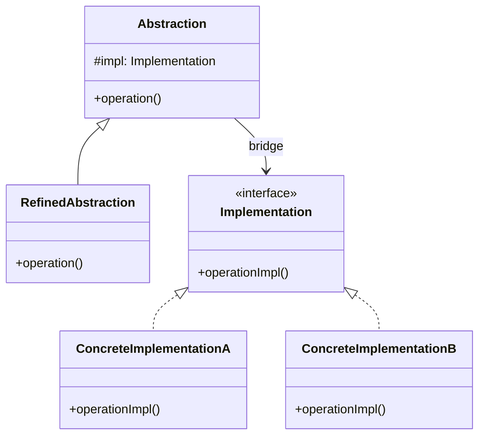

# Bridge (Puente)

## Categoría
**Patrón Estructural**

---

## Propósito

Desacopla una abstracción de su implementación para que ambas puedan variar independientemente.

---

## Definición Formal

**Bridge** es un patrón de diseño estructural que divide una clase grande o un conjunto de clases estrechamente relacionadas en dos jerarquías separadas (abstracción e implementación) que pueden desarrollarse independientemente.

### Intención del GoF

> "Desacopla una abstracción de su implementación de modo que ambas puedan variar independientemente."

---

## Explicación

Bridge previene la "explosión de clases" cuando tienes dos dimensiones de variación.

### Problema: Explosión de Subclases

```
Sin Bridge:
Shape
├── Circle
│   ├── RedCircle
│   ├── BlueCircle
│   └── GreenCircle
├── Square
│   ├── RedSquare
│   ├── BlueSquare
│   └── GreenSquare
└── Triangle
    ├── RedTriangle
    ├── BlueTriangle
    └── GreenTriangle

3 formas × 3 colores = 9 clases
10 formas × 10 colores = 100 clases ❌
```

---

## Solución

```java
// Separar en dos jerarquías

// Implementation (Color)
interface Color {
    String fill();
}

class Red implements Color {
    public String fill() { return "red"; }
}

class Blue implements Color {
    public String fill() { return "blue"; }
}

// Abstraction (Shape)
abstract class Shape {
    protected Color color;  // Bridge: referencia a implementación
    
    protected Shape(Color color) {
        this.color = color;
    }
    
    abstract void draw();
}

class Circle extends Shape {
    public Circle(Color color) {
        super(color);
    }
    
    public void draw() {
        System.out.println("Circle filled with " + color.fill());
    }
}

// Uso
Shape redCircle = new Circle(new Red());
Shape blueSquare = new Square(new Blue());

// ✅ 2 jerarquías independientes
// ✅ n formas + m colores = n + m clases (no n × m)
```

---

## Estructura UML



---

## Implementaciones por Lenguaje

### 📁 Ejemplos Disponibles

- **[Java](./java/)** - Shapes + Colors example
- **[C#](./csharp/)** - Remotes + Devices
- **[TypeScript](./typescript/)** - Platforms + Renderers

---

## Referencias

- [Refactoring Guru - Bridge](https://refactoring.guru/design-patterns/bridge)

---

[📂 Ver patrones estructurales](../Estructurales.md)
