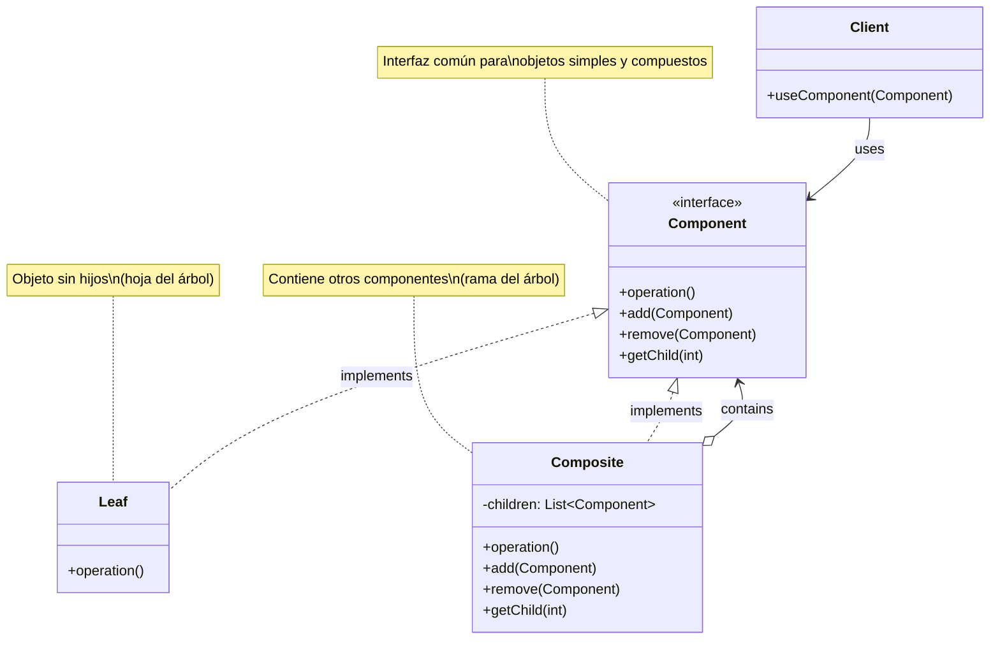
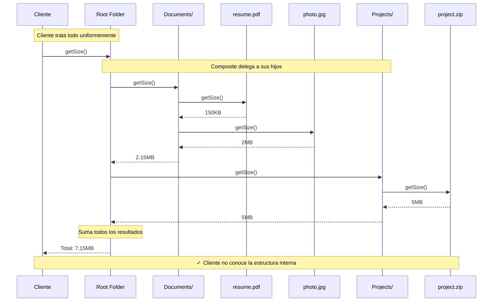

# Composite (Compuesto)

## Categoría

**Patrón Estructural**

---

## Propósito

Compone objetos en estructuras de árbol para representar jerarquías parte-todo. Composite permite a los clientes tratar objetos individuales y composiciones de objetos de manera uniforme.

---

## Problema

Imagina que necesitas modelar un sistema de archivos con archivos y carpetas, donde las carpetas pueden contener archivos y otras carpetas.

**Sin Composite**:

```java
class File {
    public long getSize() { /* ... */ }
}

class Folder {
    private List<File> files;
    private List<Folder> subfolders;
    
    public long getSize() {
        long size = 0;
        for (File file : files) {
            size += file.getSize();
        }
        for (Folder folder : subfolders) {
            size += folder.getSize();  // ❌ Código duplicado
        }
        return size;
    }
}
```

**Problemas**:

1. Cliente debe distinguir entre objetos simples y compuestos
2. Código duplicado para iterar ambos tipos
3. Difícil añadir nuevos tipos de componentes
4. La jerarquía se vuelve compleja rápidamente

---

## Solución

El patrón Composite sugiere usar una interfaz común para objetos simples y compuestos. Los objetos compuestos delegan el trabajo a sus hijos y "suman" el resultado.

**Características**:

- Trata objetos individuales y composiciones uniformemente
- Crea estructuras de árbol
- Simplifica el código cliente
- Facilita añadir nuevos tipos de componentes

---

## Estructura UML

### Diagrama de Clases



**Visualización en Mermaid**: [Ver en Mermaid Live](https://mermaid.live/)

---

## Ejemplo Visual: Sistema de Archivos

```
FileSystem (Composite)
├── Documents/ (Composite)
│   ├── resume.pdf (Leaf) - 150KB
│   ├── cover-letter.doc (Leaf) - 80KB
│   └── Projects/ (Composite)
│       ├── project1.zip (Leaf) - 5MB
│       └── project2.zip (Leaf) - 3MB
├── Photos/ (Composite)
│   ├── vacation.jpg (Leaf) - 2MB
│   └── family.jpg (Leaf) - 1.5MB
└── readme.txt (Leaf) - 5KB

// getSize() funciona igual para hojas y composites
fileSystem.getSize() → Suma total recursiva
```

---

## Componentes

1. **Component**: Interfaz común para objetos simples y compuestos
2. **Leaf (Hoja)**: Objeto sin hijos, implementa comportamiento básico
3. **Composite (Compuesto)**: Contiene hijos, delega operaciones a ellos
4. **Client**: Trabaja con objetos a través de la interfaz Component

---

## Implementaciones por Lenguaje

Este patrón ha sido implementado en múltiples lenguajes. A continuación encontrarás ejemplos de código en carpetas organizadas por lenguaje:

### 📁 Ejemplos Disponibles

- **[Java](./java/)** - Implementación con colecciones y streams
- **[C#](./csharp/)** - Implementación .NET con LINQ
- **[TypeScript](./typescript/)** - Implementación type-safe con recursión

Cada carpeta contiene:

- ✅ Estructura de árbol completa
- ✅ Operaciones recursivas
- ✅ Ejemplos de sistemas de archivos y menús
- ✅ Referencias a repositorios reconocidos
- ✅ Manejo de referencias circulares

---

## Diagrama de Secuencia

**Escenario**: Cliente calcula el tamaño total de una estructura de carpetas



---

## Ventajas ✅

1. **Simplifica el código cliente**: Trata objetos simples y compuestos igual
2. **Facilita añadir nuevos tipos** de componentes
3. **Operaciones recursivas** naturales
4. **Open/Closed Principle**: Abierto a extensión
5. **Estructura de árbol flexible**

---

## Desventajas ❌

1. **Dificulta restricciones** sobre componentes
2. **Puede hacer el diseño demasiado general**
3. **Complejidad** en la gestión de referencias
4. **Posibles ciclos** si no se maneja correctamente

---

## Cuándo Usar

✅ **Usa Composite cuando:**

- Necesitas representar jerarquías parte-todo
- Quieres que los clientes ignoren la diferencia entre objetos simples y compuestos
- La estructura puede representarse como un árbol
- Necesitas aplicar operaciones uniformemente a todos los elementos

❌ **Evita Composite cuando:**

- La jerarquía es muy simple (1-2 niveles)
- Los objetos simples y compuestos tienen comportamientos muy diferentes
- No necesitas tratar objetos uniformemente

---

## Casos de Uso Reales

### 1. **Sistema de Archivos**

```
Component: FileSystemItem
Leaf: File
Composite: Folder
Operaciones: getSize(), delete(), search()
```

### 2. **Interfaz Gráfica (UI)**

```
Component: UIComponent
Leaf: Button, Label, TextField
Composite: Panel, Window, Form
Operaciones: render(), handleEvent(), setEnabled()
```

### 3. **Estructura Organizacional**

```
Component: Employee
Leaf: Developer, Designer
Composite: Manager, Director
Operaciones: getSalary(), printOrg(), countEmployees()
```

### 4. **Expresiones Matemáticas**

```
Component: Expression
Leaf: Number, Variable
Composite: Add, Multiply, Subtract
Operaciones: evaluate(), toString()
```

### 5. **Menús y Submenús**

```
Component: MenuItem
Leaf: MenuOption
Composite: Menu, Submenu
Operaciones: click(), render(), isEnabled()
```

---

## Relación con Otros Patrones

- **Iterator**: Recorre estructuras Composite
- **Visitor**: Aplica operaciones sobre estructuras Composite
- **Decorator**: Similar estructura pero diferente intención
- **Chain of Responsibility**: Puede usar Composite para la cadena
- **Flyweight**: Puede compartir hojas en Composite

---

## Relación con Principios SOLID

| Principio | Cómo lo cumple |
|-----------|----------------|
| **SRP** | Cada componente tiene una responsabilidad clara |
| **OCP** | Abierto a nuevos tipos de componentes |
| **LSP** | Hojas y composites son intercambiables |
| **ISP** | Interfaz Component específica pero no sobrecargada |
| **DIP** | Cliente depende de abstracción (Component) |

---

## Variantes del Patrón

### 1. Composite Transparente

```java
// Component declara métodos de gestión de hijos
interface Component {
    void operation();
    void add(Component c);     // ⚠️ Hojas deben lanzar excepción
    void remove(Component c);
}
```

### 2. Composite Seguro

```java
// Solo Composite tiene métodos de gestión
interface Component {
    void operation();
}

class Composite implements Component {
    void add(Component c) { }      // ✓ Solo en Composite
    void remove(Component c) { }
}
```

---

## Ejemplo Conceptual

```java
// Component
interface Graphic {
    void draw();
    int getSize();
}

// Leaf
class Circle implements Graphic {
    public void draw() {
        System.out.println("Drawing circle");
    }
    
    public int getSize() {
        return 10; // pixels
    }
}

// Composite
class CompositeGraphic implements Graphic {
    private List<Graphic> children = new ArrayList<>();
    
    public void add(Graphic graphic) {
        children.add(graphic);
    }
    
    public void draw() {
        for (Graphic child : children) {
            child.draw();  // Delega a hijos
        }
    }
    
    public int getSize() {
        return children.stream()
            .mapToInt(Graphic::getSize)
            .sum();  // Suma recursiva
    }
}

// Client
CompositeGraphic canvas = new CompositeGraphic();
canvas.add(new Circle());
canvas.add(new Circle());

CompositeGraphic group = new CompositeGraphic();
group.add(new Circle());
canvas.add(group);  // Composite dentro de Composite

canvas.draw();  // Dibuja toda la jerarquía
System.out.println("Total size: " + canvas.getSize()); // 30
```

---

## Ejercicios Prácticos

### Ejercicio 1: Sistema de Menús

Crea un sistema de menús para restaurante con categorías (Composite) y platillos individuales (Leaf).

### Ejercicio 2: Calculadora de Expresiones

Implementa una calculadora que evalúe expresiones matemáticas complejas usando Composite.

### Ejercicio 3: Organigrama Empresarial

Diseña un organigrama donde puedas calcular salarios totales por departamento.

---

## Referencias

- **Gang of Four** - "Design Patterns" (Capítulo sobre Composite)
- [Refactoring Guru - Composite](https://refactoring.guru/design-patterns/composite)
- [SourceMaking - Composite](https://sourcemaking.com/design_patterns/composite)

---

## Recursos Adicionales

### Libros

- **"Head First Design Patterns"** - Freeman & Freeman
- **"Design Patterns Explained"** - Alan Shalloway

### Artículos

- [Martin Fowler - Composite](https://martinfowler.com/eaaCatalog/composite.html)
- [Composite Pattern in Practice](https://www.baeldung.com/java-composite-pattern)

---

[📂 Ver todos los patrones estructurales](../) | [🏠 Volver a inicio](../../README.md)

---

*Última actualización: Octubre 2025*
