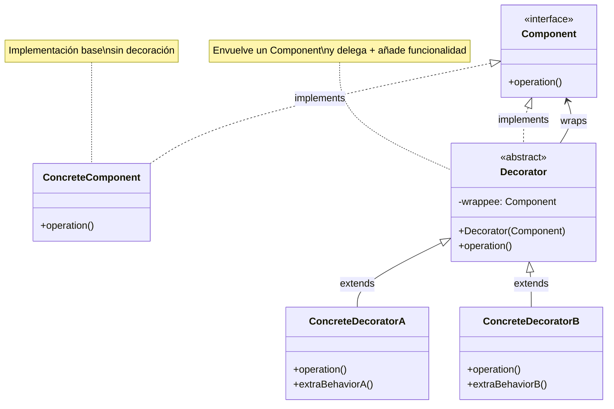
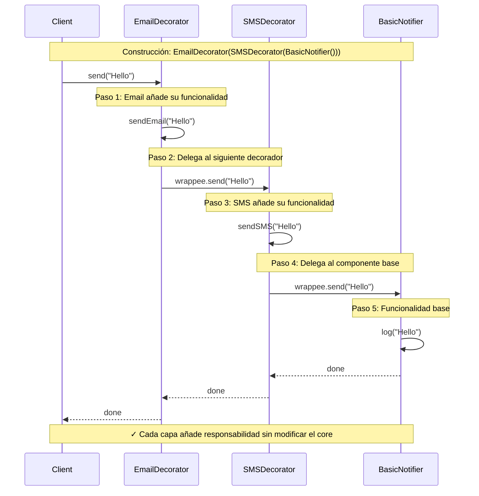

# Decorator (Decorador)

## Categoría
**Patrón Estructural**

---

## Propósito

Permite añadir responsabilidades adicionales a un objeto dinámicamente. Los decoradores proporcionan una alternativa flexible a la herencia para extender funcionalidad.

---

## Definición Formal

**Decorator** (también conocido como **Wrapper**) es un patrón de diseño estructural que permite añadir nuevos comportamientos a objetos colocándolos dentro de objetos envolventes especiales (wrappers) que contienen estos comportamientos.

### Intención del GoF

> "Adjunta responsabilidades adicionales a un objeto dinámicamente. Los decoradores proporcionan una alternativa flexible a la creación de subclases para extender funcionalidad."

---

## Explicación Detallada

El patrón Decorator se basa en el **principio de composición sobre herencia**. En lugar de crear múltiples subclases para cada combinación de características, creas pequeños objetos decoradores que envuelven al objeto base y añaden comportamiento adicional.

### Conceptos Clave

1. **Wrapping (Envoltorio)**: Cada decorador envuelve un componente
2. **Interfaz común**: Decorador y componente base implementan la misma interfaz
3. **Apilamiento (Stacking)**: Puedes apilar múltiples decoradores como capas de cebolla
4. **Delegación + Extensión**: El decorador delega al componente envuelto y añade comportamiento
5. **Transparencia**: El cliente trata decoradores y componentes base de la misma forma

### Metáfora: Vestirse

```
Persona (componente base)
  ↓
+ Camiseta (decorador 1)
  ↓
+ Suéter (decorador 2)
  ↓
+ Abrigo (decorador 3)

Cada capa añade funcionalidad (calor, protección)
sin cambiar la persona base.
```

### ¿Cómo funciona?

```
Cliente → DecoradorA → DecoradorB → ComponenteBase
           ↓             ↓              ↓
      añade log     añade cache    funcionalidad
                                       base
```

1. Cliente llama a `DecoradorA.operation()`
2. DecoradorA añade su comportamiento (ej: logging)
3. DecoradorA llama a `DecoradorB.operation()`
4. DecoradorB añade su comportamiento (ej: caching)
5. DecoradorB llama a `ComponenteBase.operation()`
6. ComponenteBase ejecuta la funcionalidad real
7. El resultado se devuelve a través de toda la cadena

---

## Problema Detallado

### Escenario: Sistema de Notificaciones

Inicialmente, tu aplicación solo envía notificaciones por email. Con el tiempo, los usuarios piden:
- SMS para alertas urgentes
- Slack para notificaciones de equipo
- Facebook para eventos sociales

**Peor aún**: Los usuarios quieren **combinar** canales:
- Email + SMS
- Email + Slack
- SMS + Slack
- Email + SMS + Slack
- Email + Facebook
- ... (y más combinaciones)

### Enfoque Ingenuo con Herencia

```java
class Notifier { 
    void send(String msg) { } 
}

// Implementaciones individuales
class EmailNotifier extends Notifier { 
    void send(String msg) { sendEmail(msg); }
}

class SMSNotifier extends Notifier { 
    void send(String msg) { sendSMS(msg); }
}

class SlackNotifier extends Notifier { 
    void send(String msg) { sendSlack(msg); }
}

// ❌ Ahora las combinaciones...
class EmailAndSMSNotifier extends Notifier { 
    void send(String msg) { 
        sendEmail(msg); 
        sendSMS(msg); 
    }
}

class EmailAndSlackNotifier extends Notifier { 
    void send(String msg) { 
        sendEmail(msg); 
        sendSlack(msg); 
    }
}

class SMSAndSlackNotifier extends Notifier { 
    void send(String msg) { 
        sendSMS(msg); 
        sendSlack(msg); 
    }
}

class EmailAndSMSAndSlackNotifier extends Notifier { 
    void send(String msg) { 
        sendEmail(msg); 
        sendSMS(msg); 
        sendSlack(msg); 
    }
}

// Con 3 canales: 2^3 = 8 clases
// Con 4 canales: 2^4 = 16 clases
// Con 10 canales: 2^10 = 1024 clases ❌❌❌
```

**Problemas críticos**:
1. **Explosión combinatoria**: Crece exponencialmente
2. **Código duplicado**: sendEmail() repetido en múltiples clases
3. **Rigidez**: No puedes cambiar combinación después de crear el objeto
4. **Mantenimiento**: Bug en sendEmail() requiere modificar múltiples clases
5. **Violación de OCP**: Añadir un canal requiere crear ~2^n clases nuevas

---

## Solución con Decorator

### Arquitectura

```
Component (Interface)
    ↓
    ├── ConcreteComponent (funcionalidad base)
    └── Decorator (clase base abstracta)
            ↓
            ├── ConcreteDecoratorA
            ├── ConcreteDecoratorB
            └── ConcreteDecoratorC
```

### Implementación

```java
// Component Interface
interface Notifier {
    void send(String message);
}

// Concrete Component (base)
class EmailNotifier implements Notifier {
    @Override
    public void send(String message) {
        System.out.println("📧 Email: " + message);
    }
}

// Base Decorator (opcional pero recomendado)
abstract class NotifierDecorator implements Notifier {
    protected Notifier wrappee;  // Componente envuelto
    
    public NotifierDecorator(Notifier wrappee) {
        this.wrappee = wrappee;
    }
    
    @Override
    public void send(String message) {
        wrappee.send(message);  // Delegar al envuelto
    }
}

// Concrete Decorators
class SMSDecorator extends NotifierDecorator {
    public SMSDecorator(Notifier wrappee) {
        super(wrappee);
    }
    
    @Override
    public void send(String message) {
        super.send(message);  // Delegar primero
        sendSMS(message);     // Añadir funcionalidad
    }
    
    private void sendSMS(String message) {
        System.out.println("📱 SMS: " + message);
    }
}

class SlackDecorator extends NotifierDecorator {
    public SlackDecorator(Notifier wrappee) {
        super(wrappee);
    }
    
    @Override
    public void send(String message) {
        super.send(message);
        sendSlack(message);
    }
    
    private void sendSlack(String message) {
        System.out.println("💬 Slack: " + message);
    }
}

class FacebookDecorator extends NotifierDecorator {
    public FacebookDecorator(Notifier wrappee) {
        super(wrappee);
    }
    
    @Override
    public void send(String message) {
        super.send(message);
        sendFacebook(message);
    }
    
    private void sendFacebook(String message) {
        System.out.println("📘 Facebook: " + message);
    }
}

// Cliente: Composición flexible
Notifier notifier = new EmailNotifier();
notifier = new SMSDecorator(notifier);
notifier = new SlackDecorator(notifier);
notifier = new FacebookDecorator(notifier);

notifier.send("Server down!");
// Salida:
// 📧 Email: Server down!
// 📱 SMS: Server down!
// 💬 Slack: Server down!
// 📘 Facebook: Server down!

// Diferente combinación en runtime
Notifier urgentOnly = new SMSDecorator(new EmailNotifier());
urgentOnly.send("Critical alert!");
// 📧 Email: Critical alert!
// 📱 SMS: Critical alert!
```

**Ventajas de esta solución**:
- ✅ Solo 4 clases para cualquier combinación (vs. 8 con herencia)
- ✅ Combinaciones infinitas sin crear nuevas clases
- ✅ Configuración en runtime
- ✅ Principio Open/Closed cumplido

---

## Estructura UML



**Visualización**: [Ver en Mermaid Live](https://mermaid.live/)

---

## Componentes

1. **Component**: Interfaz común para componentes base y decoradores
2. **ConcreteComponent**: Implementación base con funcionalidad principal
3. **Decorator**: Clase base abstracta que implementa Component y envuelve otro Component
4. **ConcreteDecorator**: Añade responsabilidades específicas

---

## Implementaciones por Lenguaje

### 📁 Ejemplos Disponibles

- **[Java](./java/)** - Implementación con I/O Streams (BufferedReader, etc.)
- **[C#](./csharp/)** - Implementación .NET con Streams y decoradores personalizados
- **[TypeScript](./typescript/)** - Implementación con HOC pattern y decoradores

Cada carpeta contiene:
- ✅ Decoradores apilables
- ✅ Ejemplos de I/O streams
- ✅ Decoradores de logging, caching, validación
- ✅ Referencias a repositorios reconocidos
- ✅ Comparación con Proxy y Adapter

---

## Diagrama de Secuencia

**Escenario**: Cliente envía notificación a través de múltiples decoradores apilados



---

## Ventajas ✅

1. **Más flexible que herencia**: Añade/quita responsabilidades en runtime
2. **Composición de comportamientos**: Combina múltiples decoradores
3. **Single Responsibility Principle**: Cada decorador tiene una responsabilidad
4. **Open/Closed Principle**: Extiendes funcionalidad sin modificar código existente
5. **Evita explosión de clases**: n decoradores vs. 2^n subclases
6. **Responsabilidades opcionales**: El cliente decide qué decoradores usar

---

## Desventajas ❌

1. **Difícil remover decoradores**: Una vez apilados, es complicado quitar capas específicas
2. **Orden importa**: El orden de los decoradores afecta el resultado
3. **Muchos objetos pequeños**: Puede crear muchas instancias en memoria
4. **Complejidad en debugging**: Stack traces largos y confusos
5. **Difícil configuración**: Apilar muchos decoradores puede ser verbose
6. **Identidad**: `decoratedObject instanceof OriginalClass` puede fallar

---

## Cuándo Usar

✅ **Usa Decorator cuando:**

- Necesitas añadir responsabilidades a objetos sin afectar a otros
- Quieres que las responsabilidades sean opcionales y removibles
- La extensión por herencia no es práctica (muchas combinaciones posibles)
- Necesitas añadir/quitar comportamiento en runtime
- Quieres combinar varios comportamientos de formas diferentes

❌ **Evita Decorator cuando:**

- Las responsabilidades no son opcionales (mejor usar herencia simple)
- El orden de los decoradores no importa (considera Composite)
- Solo tienes 1-2 decoradores posibles (puede ser overkill)
- Necesitas acceso a funcionalidad específica del decorador (rompe abstracción)

---

## Casos de Uso Reales

### 1. **Java I/O Streams (Ejemplo Clásico)**
```java
// Apilamiento de decoradores de I/O
InputStream inputStream = new BufferedInputStream(
    new GZIPInputStream(
        new FileInputStream("file.gz")
    )
);

// Desglose:
// FileInputStream     → Componente base (lee archivo)
// GZIPInputStream     → Decorador (descomprime)
// BufferedInputStream → Decorador (buffering para rendimiento)
```

### 2. **UI Components**
```
Component: Window
Decorators:
  - ScrollDecorator (añade scroll bars)
  - BorderDecorator (añade borde)
  - ShadowDecorator (añade sombra)

Window window = new BorderDecorator(
    new ScrollDecorator(
        new BaseWindow()
    )
);
```

### 3. **HTTP Middleware / Interceptors**
```
Request Pipeline:
Request → LoggingDecorator
        → AuthenticationDecorator
        → CompressionDecorator
        → CachingDecorator
        → ActualHandler
```

### 4. **Text Processing**
```
String text = "Hello World";
TextProcessor processor = new EncryptionDecorator(
    new CompressionDecorator(
        new Base64Decorator(
            new PlainTextProcessor()
        )
    )
);
// Base64 → Compress → Encrypt
```

### 5. **Coffee Shop (Ejemplo Didáctico)**
```
Beverage: Coffee ($5)
  + Milk (+$1)
  + Sugar (+$0.50)
  + Whip (+$1.50)
Total: $8
```

---

## Errores Comunes y Cómo Evitarlos

### ❌ Error 1: Decorador que no delega

```java
// ❌ INCORRECTO
class BadDecorator extends NotifierDecorator {
    public void send(String msg) {
        sendSMS(msg);  // No llama a super.send() = pierde funcionalidad base
    }
}

// ✅ CORRECTO
class GoodDecorator extends NotifierDecorator {
    public void send(String msg) {
        super.send(msg);  // Delegar primero
        sendSMS(msg);     // Luego añadir
    }
}
```

### ❌ Error 2: Decorador dependiente del orden

```java
// ❌ PROBLEMA: Orden importa demasiado
Notifier n1 = new EncryptDecorator(new CompressDecorator(base));
// Compress → Encrypt ✅ Correcto

Notifier n2 = new CompressDecorator(new EncryptDecorator(base));
// Encrypt → Compress ❌ No funciona (no puedes comprimir datos encriptados)
```

**Solución**: Documentar claramente el orden correcto o validar en constructor.

### ❌ Error 3: Romper la interfaz

```java
// ❌ INCORRECTO
class BadDecorator implements Notifier {
    private Notifier wrappee;
    
    public void send(String msg) {
        wrappee.send(msg);
    }
    
    // ❌ Método adicional que no está en la interfaz
    public void specialMethod() { }
}

// ❌ Cliente no puede acceder porque trata todo como Notifier
Notifier n = new BadDecorator(base);
n.specialMethod();  // ❌ Error de compilación
```

**Solución**: Si necesitas métodos adicionales, reconsidera si Decorator es el patrón correcto.

### ❌ Error 4: Confundir con Proxy

```java
// Decorator: AÑADE funcionalidad
class LoggingDecorator extends Decorator {
    public void operation() {
        log("antes");          // AÑADE logging
        super.operation();
        log("después");        // AÑADE logging
    }
}

// Proxy: CONTROLA acceso
class AccessProxy implements Component {
    public void operation() {
        if (checkPermissions()) {  // CONTROLA
            realObject.operation();
        }
    }
}
```

### ❌ Error 5: Decorador que modifica el resultado

```java
// ⚠️ CUIDADO: Modificar el resultado puede romper expectativas
class MultiplyDecorator extends MathDecorator {
    public int calculate() {
        return super.calculate() * 2;  // Cambia el resultado
    }
}

int result = base.calculate();      // 10
int decorated = decorator.calculate(); // 20 ← Cliente puede no esperarlo
```

**Solución**: Documentar claramente si el decorador modifica o solo extiende.

---

## Anti-Patrones

### 1. **Decoradores con Estado Compartido**

```java
// ❌ ANTI-PATRÓN
class StatefulDecorator extends Decorator {
    private static int callCount = 0;  // ❌ Estado compartido
    
    public void operation() {
        callCount++;  // Afecta a TODOS los decoradores
        super.operation();
    }
}
```

**Problema**: Los decoradores deben ser independientes.

### 2. **Decorador God Object**

```java
// ❌ ANTI-PATRÓN
class MegaDecorator extends Decorator {
    public void operation() {
        addLogging();
        addCaching();
        addValidation();
        addEncryption();
        addCompression();
        // ❌ Hace demasiado, viola SRP
        super.operation();
    }
}
```

**Solución**: Separar en múltiples decoradores pequeños.

---

## Variantes del Patrón

### 1. Decorator Transparente

El decorador puede usarse en lugar del componente base sin que el cliente note la diferencia.

```java
Component comp = new ConcreteComponent();
Component decorated = new Decorator(comp);

// Cliente usa ambos de la misma forma
comp.operation();
decorated.operation();
```

### 2. Decorator Semi-Transparente

El decorador añade métodos adicionales que el cliente puede usar opcionalmente.

```java
LineNumberReader reader = new LineNumberReader(new FileReader("file.txt"));
reader.readLine();      // Método de BufferedReader
reader.getLineNumber(); // ✅ Método adicional del decorador
```

---

## Diferencia con Patrones Similares

### Decorator vs Adapter

| Aspecto | Decorator | Adapter |
|---------|-----------|---------|
| **Propósito** | Añadir responsabilidades | Hacer compatibles interfaces |
| **Interfaz** | Misma interfaz | Interfaz diferente |
| **Cantidad** | Múltiples capas | Generalmente una sola |
| **Objetivo** | Extender funcionalidad | Adaptar interfaz existente |

### Decorator vs Proxy

| Aspecto | Decorator | Proxy |
|---------|-----------|-------|
| **Intención** | Añadir funcionalidad | Controlar acceso |
| **Conocimiento** | Cliente sabe que está decorado | Cliente idealmente no sabe del proxy |
| **Construcción** | Cliente construye la pila | Proxy se construye internamente |
| **Múltiples** | Múltiples decoradores apilados | Generalmente un proxy |

### Decorator vs Composite

| Aspecto | Decorator | Composite |
|---------|-----------|-----------|
| **Estructura** | Cadena lineal (envoltorio) | Estructura de árbol |
| **Propósito** | Añadir responsabilidades | Representar parte-todo |
| **Hijos** | Un hijo (el envuelto) | Múltiples hijos |

---

## Relación con Otros Patrones

- **Adapter**: Cambia la interfaz; Decorator la mantiene
- **Composite**: Decorator es Composite degenerado (un solo hijo)
- **Strategy**: Decorator cambia la "piel"; Strategy cambia las "entrañas"
- **Proxy**: Decorator añade; Proxy controla
- **Chain of Responsibility**: Similar estructura but diferente propósito

---

## Relación con Principios SOLID

| Principio | Cómo lo cumple |
|-----------|----------------|
| **SRP** | Cada decorador tiene una responsabilidad específica |
| **OCP** | Abierto a extensión (nuevos decoradores), cerrado a modificación |
| **LSP** | Decoradores son sustituibles por el componente base |
| **ISP** | Interfaz Component es simple y específica |
| **DIP** | Decoradores dependen de abstracción (Component interface) |

---

## Ejemplo Completo: Sistema de Streams

```java
// Component
interface DataSource {
    void writeData(String data);
    String readData();
}

// Concrete Component
class FileDataSource implements DataSource {
    private String filename;
    
    public FileDataSource(String filename) {
        this.filename = filename;
    }
    
    @Override
    public void writeData(String data) {
        System.out.println("Writing to file: " + data);
        // Escribir a archivo real
    }
    
    @Override
    public String readData() {
        System.out.println("Reading from file");
        return "file_data";
    }
}

// Base Decorator
abstract class DataSourceDecorator implements DataSource {
    protected DataSource wrappee;
    
    DataSourceDecorator(DataSource source) {
        this.wrappee = source;
    }
    
    @Override
    public void writeData(String data) {
        wrappee.writeData(data);
    }
    
    @Override
    public String readData() {
        return wrappee.readData();
    }
}

// Concrete Decorator: Encryption
class EncryptionDecorator extends DataSourceDecorator {
    EncryptionDecorator(DataSource source) {
        super(source);
    }
    
    @Override
    public void writeData(String data) {
        String encrypted = encrypt(data);
        super.writeData(encrypted);
    }
    
    @Override
    public String readData() {
        String data = super.readData();
        return decrypt(data);
    }
    
    private String encrypt(String data) {
        System.out.println("Encrypting data");
        return "encrypted(" + data + ")";
    }
    
    private String decrypt(String data) {
        System.out.println("Decrypting data");
        return data.replace("encrypted(", "").replace(")", "");
    }
}

// Concrete Decorator: Compression
class CompressionDecorator extends DataSourceDecorator {
    CompressionDecorator(DataSource source) {
        super(source);
    }
    
    @Override
    public void writeData(String data) {
        String compressed = compress(data);
        super.writeData(compressed);
    }
    
    @Override
    public String readData() {
        String data = super.readData();
        return decompress(data);
    }
    
    private String compress(String data) {
        System.out.println("Compressing data");
        return "compressed(" + data + ")";
    }
    
    private String decompress(String data) {
        System.out.println("Decompressing data");
        return data.replace("compressed(", "").replace(")", "");
    }
}

// Cliente
DataSource source = new FileDataSource("data.txt");

// Decorar con compresión y encriptación
source = new CompressionDecorator(source);
source = new EncryptionDecorator(source);

// Escribir
source.writeData("Hello World");
// Salida:
// Encrypting data
// Compressing data
// Writing to file: compressed(encrypted(Hello World))

// Leer (proceso inverso automático)
String data = source.readData();
// Salida:
// Reading from file
// Decompressing data
// Decrypting data
// Result: "Hello World"
```

---

## Ejercicios Prácticos

### Ejercicio 1: Coffee Shop (Clásico)
Crea un sistema donde:
- Base: Coffee ($2), Tea ($1.50)
- Decoradores: Milk (+$0.50), Sugar (+$0.20), Whip (+$0.70)
- Calcula precio y descripción dinámicamente

### Ejercicio 2: Text Processor
Implementa:
- Base: PlainText
- Decoradores: UpperCaseDecorator, TrimDecorator, HtmlEscapeDecorator
- Permite apilar en cualquier orden

### Ejercicio 3: Pizza Builder
Diseña:
- Base: MargheritaPizza
- Decoradores: CheeseDecorator, PepperoniDecorator, MushroomsDecorator
- Calcula precio total

---

## Referencias

- **Gang of Four** - "Design Patterns" (Capítulo sobre Decorator)
- [Refactoring Guru - Decorator](https://refactoring.guru/design-patterns/decorator)
- [SourceMaking - Decorator](https://sourcemaking.com/design_patterns/decorator)

---

## Recursos Adicionales

### Libros
- **"Head First Design Patterns"** - Freeman & Freeman (Capítulo 3: Starbuzz Coffee)
- **"Design Patterns Explained"** - Alan Shalloway

### Artículos
- [Java I/O Streams Architecture](https://www.baeldung.com/java-io)
- [C# Stream Decorators](https://learn.microsoft.com/en-us/dotnet/api/system.io.stream)
- [React Higher-Order Components](https://reactjs.org/docs/higher-order-components.html)

---

[📂 Ver todos los patrones estructurales](../Estructurales.md) | [🏠 Volver a inicio](../../README.md)

---

*Última actualización: Octubre 2025*