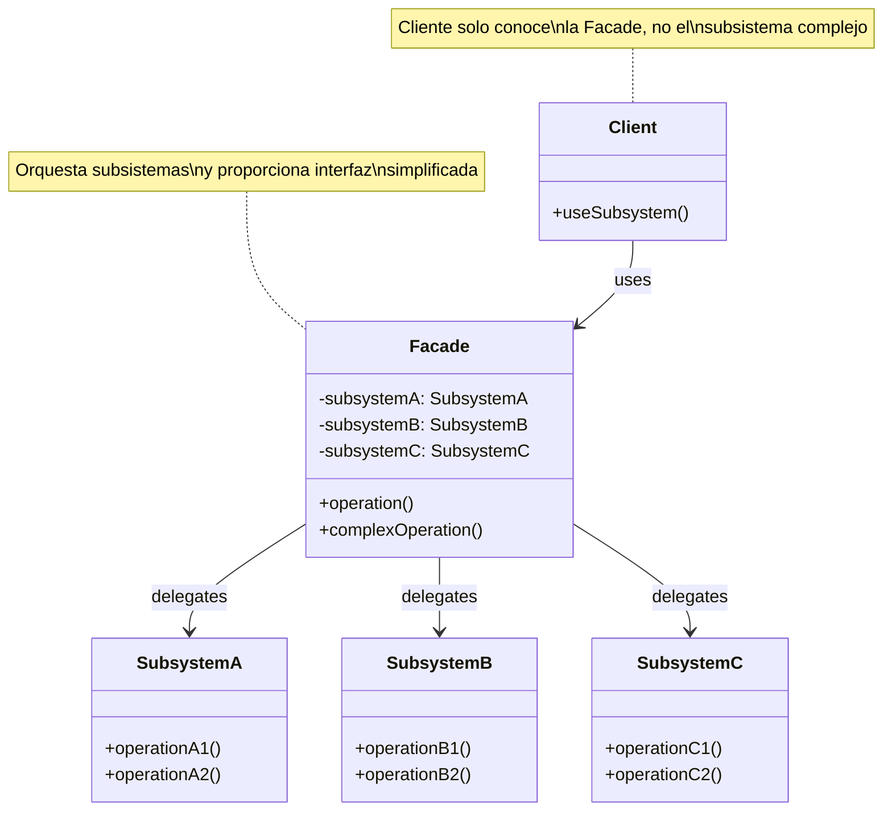
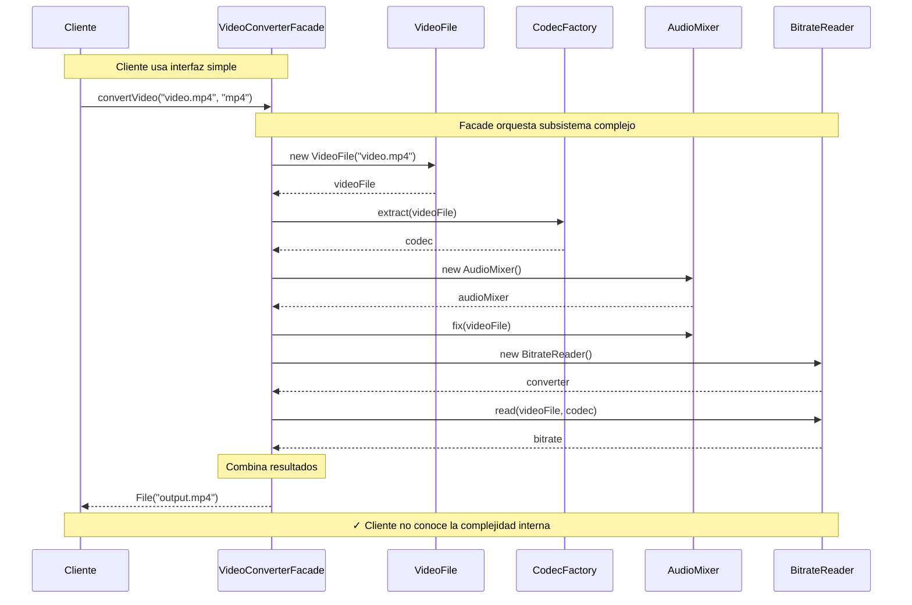

# Facade (Fachada)

## Categoría

**Patrón Estructural**

---

## Propósito

Proporciona una interfaz unificada y simplificada para un conjunto de interfaces en un subsistema. Facade define una interfaz de alto nivel que hace que el subsistema sea más fácil de usar.

---

## Problema

Imagina que tu aplicación necesita trabajar con un framework o biblioteca compleja que tiene docenas de clases con múltiples métodos y dependencias entre sí.

**Sin Facade**:
```java
// Cliente debe conocer todo el subsistema complejo
VideoFile video = new VideoFile("video.mp4");
Codec codec = CodecFactory.extract(video);
AudioMixer audio = new AudioMixer();
audio.fix(video);
VideoConverter converter = new VideoConverter();
converter.setCodec(codec);
converter.setAudio(audio);
converter.setBitrate(128);
converter.setResolution("1080p");
File result = converter.convert(video, "output.mp4");
// ❌ Cliente necesita conocer muchos detalles internos
```

**Problemas**:
1. Cliente acoplado a muchas clases del subsistema
2. Difícil de usar y mantener
3. Cambios en el subsistema afectan a todos los clientes
4. Curva de aprendizaje alta para usar la biblioteca

---

## Solución

El patrón Facade sugiere crear una clase que proporcione una interfaz simple para las funcionalidades más comunes del subsistema complejo.

**Con Facade**:
```java
// Cliente usa interfaz simple
VideoConverter facade = new VideoConverter();
File result = facade.convert("video.mp4", "mp4");
// ✅ Simple y fácil de usar
```

**Características**:

- Interfaz simplificada para sistemas complejos
- Oculta complejidad interna
- Punto de entrada único
- Reduce dependencias del cliente

---

## Estructura UML

### Diagrama de Clases



**Visualización**: [Ver en Mermaid Live](https://mermaid.live/)

---

## Componentes

1. **Facade**: Proporciona métodos convenientes para funcionalidad común del subsistema
2. **Subsystems**: Implementan funcionalidad real pero son complejos
3. **Client**: Usa la Facade en lugar de los subsistemas directamente

---

## Implementaciones por Lenguaje

Este patrón ha sido implementado en múltiples lenguajes. A continuación encontrarás ejemplos de código en carpetas organizadas por lenguaje:

### 📁 Ejemplos Disponibles

- **[Java](./java/)** - Implementación con múltiples subsistemas
- **[C#](./csharp/)** - Implementación .NET con APIs simplificadas
- **[TypeScript](./typescript/)** - Implementación type-safe con módulos

Cada carpeta contiene:

- ✅ Subsistemas complejos simulados
- ✅ Facade que simplifica el uso
- ✅ Comparación antes/después del patrón
- ✅ Referencias a repositorios reconocidos
- ✅ Ejemplos de APIs del mundo real

---

## Diagrama de Secuencia

**Escenario**: Cliente convierte un video usando la Facade



---

## Ventajas ✅

1. **Simplifica el código cliente**: Interfaz fácil de usar
2. **Desacopla el cliente** del subsistema
3. **Reduce dependencias**: Cliente depende solo de la Facade
4. **Facilita testing**: Mock de la Facade es más simple
5. **Punto de entrada único**: Centraliza el acceso al subsistema
6. **Oculta complejidad**: Cliente no necesita conocer detalles internos

---

## Desventajas ❌

1. **God Object**: Facade puede convertirse en un objeto que sabe/hace demasiado
2. **Acoplamiento**: Todos los clientes dependen de la Facade
3. **Limitación de funcionalidad**: Puede no exponer todas las características del subsistema
4. **Punto único de fallo**: Si la Facade falla, afecta a todos

---

## Cuándo Usar

✅ **Usa Facade cuando:**

- Necesitas una interfaz simple para un subsistema complejo
- Quieres desacoplar clientes de un subsistema
- Deseas estructurar un subsistema en capas
- Hay muchas dependencias entre clientes y clases de implementación

❌ **Evita Facade cuando:**

- El subsistema es simple y no necesita simplificación
- Los clientes necesitan acceso completo a todas las funcionalidades
- Estás tentado a hacer que Facade haga demasiado

---

## Casos de Uso Reales

### 1. **API de Biblioteca Compleja**

```
Subsistema: FFmpeg, ImageMagick, etc.
Facade: VideoConverter, ImageProcessor
Oculta: Detalles de codecs, formatos, configuración
```

### 2. **Acceso a Base de Datos**

```
Subsistema: Connection, Command, Transaction, DataReader
Facade: DatabaseService
Simplifica: CRUD operations
```

### 3. **Frameworks de Logging**

```
Subsistema: Appenders, Formatters, Filters
Facade: Logger
Expone: log(), debug(), error(), warn()
```

### 4. **Servicios Web**

```
Subsistema: HTTP Client, Authentication, Parsing, Caching
Facade: ApiService
Oculta: Headers, tokens, retry logic
```

### 5. **Sistema de Pagos**

```
Subsistema: Gateway, Validation, Encryption, Transaction
Facade: PaymentProcessor
Simplifica: processPayment()
```

---

## Ejemplo Conceptual

```java
// Subsistema complejo
class CPU {
    public void freeze() { }
    public void jump(long position) { }
    public void execute() { }
}

class Memory {
    public void load(long position, byte[] data) { }
}

class HardDrive {
    public byte[] read(long lba, int size) { }
}

// Facade simplifica el uso
class ComputerFacade {
    private CPU cpu;
    private Memory memory;
    private HardDrive hardDrive;
    
    public ComputerFacade() {
        this.cpu = new CPU();
        this.memory = new Memory();
        this.hardDrive = new HardDrive();
    }
    
    public void start() {
        cpu.freeze();
        memory.load(BOOT_ADDRESS, hardDrive.read(BOOT_SECTOR, SECTOR_SIZE));
        cpu.jump(BOOT_ADDRESS);
        cpu.execute();
    }
}

// Cliente usa interfaz simple
ComputerFacade computer = new ComputerFacade();
computer.start(); // ✅ Simple
```

---

## Relación con Otros Patrones

- **Abstract Factory**: Puede usarse con Facade para crear subsistemas
- **Singleton**: Facades suelen implementarse como Singleton
- **Mediator**: Similar pero bidireccional; Facade es unidireccional
- **Adapter**: Adapta interfaz; Facade simplifica interfaz
- **Proxy**: Controla acceso; Facade simplifica uso

---

## Relación con Principios SOLID

| Principio | Cómo lo cumple |
|-----------|----------------|
| **SRP** | Facade tiene una responsabilidad: simplificar el subsistema |
| **OCP** | Cerrado a modificación, pero el subsistema puede extenderse |
| **LSP** | No aplica directamente |
| **ISP** | Facade proporciona interfaz específica para caso de uso |
| **DIP** | Cliente depende de Facade, no de subsistemas concretos |

---

## Diferencia con Adapter

| Aspecto | Facade | Adapter |
|---------|--------|---------|
| **Propósito** | Simplificar subsistema complejo | Hacer compatibles interfaces incompatibles |
| **Interfaces** | Crea nueva interfaz simplificada | Adapta interfaz existente |
| **Dirección** | Trabaja con múltiples clases | Generalmente con una clase |
| **Complejidad** | Reduce complejidad | Resuelve incompatibilidad |

---

## Diferencia con Mediator

| Aspecto | Facade | Mediator |
|---------|--------|----------|
| **Comunicación** | Unidireccional (cliente → subsistema) | Bidireccional (objetos ↔ mediator) |
| **Conocimiento** | Subsistemas no conocen la Facade | Objetos conocen al Mediator |
| **Propósito** | Simplificar uso | Reducir acoplamiento entre objetos |

---

## Variante: Additional Facade

A veces necesitas múltiples facades para diferentes casos de uso:

```java
// Facade para usuarios básicos
class SimpleFacade {
    public void doBasicOperation() { }
}

// Facade para usuarios avanzados
class AdvancedFacade {
    public void doBasicOperation() { }
    public void doAdvancedOperation() { }
    public void configureSubsystem() { }
}
```

---

## Ejercicios Prácticos

### Ejercicio 1: Home Theater System

Crea una Facade para un sistema de cine en casa (DVD, Proyector, Luces, Sonido).

### Ejercicio 2: Banking System

Diseña una Facade para operaciones bancarias (crear cuenta, transferir, consultar saldo).

### Ejercicio 3: E-commerce Checkout

Implementa una Facade que coordine inventario, pago, envío y notificación.

---

## Referencias

- **Gang of Four** - "Design Patterns" (Capítulo sobre Facade)
- [Refactoring Guru - Facade](https://refactoring.guru/design-patterns/facade)
- [SourceMaking - Facade](https://sourcemaking.com/design_patterns/facade)

---

## Recursos Adicionales

### Libros

- **"Head First Design Patterns"** - Freeman & Freeman
- **"Design Patterns Explained"** - Alan Shalloway

### Artículos

- [Martin Fowler - Gateway](https://martinfowler.com/eaaCatalog/gateway.html)
- [Baeldung - Facade Pattern](https://www.baeldung.com/java-facade-pattern)

---

[📂 Ver todos los patrones estructurales](../Estructurales.md) | [🏠 Volver a inicio](../../README.md)

---

*Última actualización: Octubre 2025*
