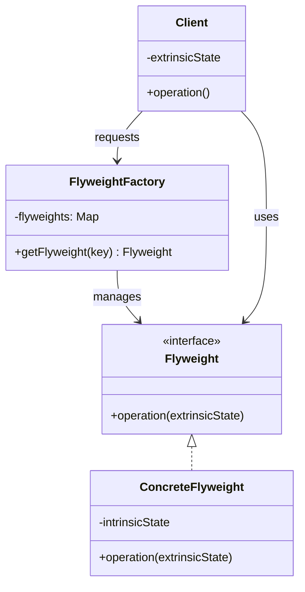

# Flyweight (Peso Ligero)

## Categoría
**Patrón Estructural**

---

## Propósito

Usa compartición para soportar eficientemente grandes cantidades de objetos de grano fino.

---

## Definición Formal

**Flyweight** es un patrón de diseño estructural que permite mantener más objetos en la memoria RAM disponible compartiendo partes comunes del estado entre múltiples objetos, en lugar de mantener toda la información en cada objeto.

### Intención del GoF

> "Usa compartición para soportar grandes cantidades de objetos de grano fino eficientemente."

---

## Explicación

Flyweight reduce el uso de memoria compartiendo tanto como sea posible con objetos similares.

### Conceptos

1. **Estado Intrínseco**: Información compartida (inmutable)
2. **Estado Extrínseco**: Información única por objeto (pasada como parámetro)
3. **Factory**: Gestiona pool de flyweights compartidos

---

## Problema

```java
// ❌ Sin Flyweight: Millones de objetos
class Particle {
    private int x, y;
    private String color;     // Repetido millones de veces
    private String sprite;    // Repetido millones de veces
    private int size;         // Repetido millones de veces
}

// 1,000,000 partículas × 100 bytes = 100 MB ❌
```

---

## Solución

```java
// Flyweight: Estado compartido
class ParticleFlyweight {
    private final String color;   // Intrínseco (compartido)
    private final String sprite;  // Intrínseco
    private final int size;       // Intrínseco
    
    public void draw(int x, int y) {  // Extrínseco (único)
        System.out.println("Drawing " + color + " particle at (" + x + "," + y + ")");
    }
}

// Factory
class ParticleFactory {
    private static Map<String, ParticleFlyweight> flyweights = new HashMap<>();
    
    public static ParticleFlyweight get(String type) {
        if (!flyweights.containsKey(type)) {
            flyweights.put(type, new ParticleFlyweight(type));
        }
        return flyweights.get(type);  // ✅ Reutiliza existente
    }
}

// Uso
ParticleFlyweight bullet = ParticleFactory.get("bullet");
bullet.draw(100, 200);  // x, y son extrínsecos
bullet.draw(150, 250);  // Mismo flyweight, diferentes coordenadas

// ✅ 3 tipos de partículas compartidas entre 1,000,000 instancias
// ✅ 3 objetos × 100 bytes = 300 bytes (vs. 100 MB)
```

---

## Estructura UML



---

## Implementaciones por Lenguaje

### 📁 Ejemplos Disponibles

- **[Java](./java/)** - String pool, Integer cache
- **[C#](./csharp/)** - Character cache
- **[TypeScript](./typescript/)** - Sprite sharing

---

## Casos de Uso

### 1. **String Pool (Java)**
```java
String s1 = "hello";  // Flyweight
String s2 = "hello";  // Mismo objeto compartido
```

### 2. **Videojuegos**
Miles de partículas/sprites compartiendo texturas

### 3. **Editores de Texto**
Caracteres comparten fuente/estilo

---

## Referencias

- [Refactoring Guru - Flyweight](https://refactoring.guru/design-patterns/flyweight)

---

[📂 Ver patrones estructurales](../Estructurales.md)
