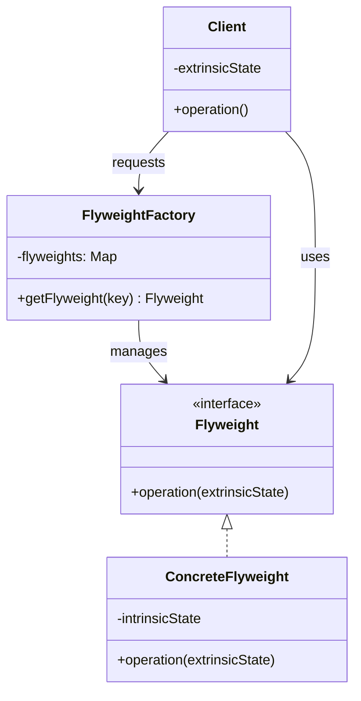
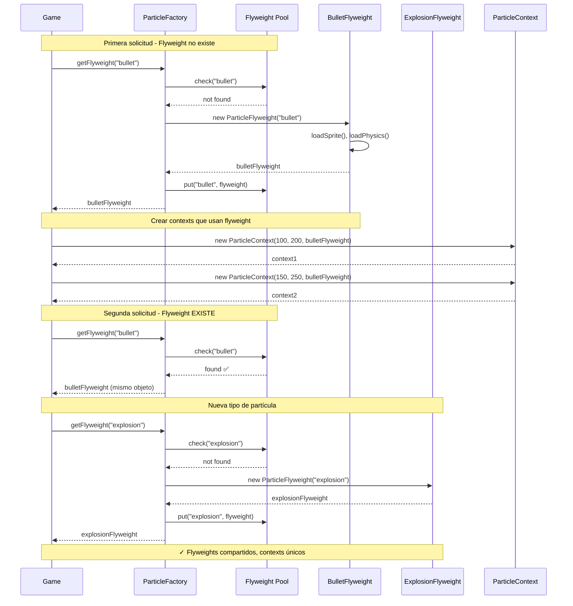
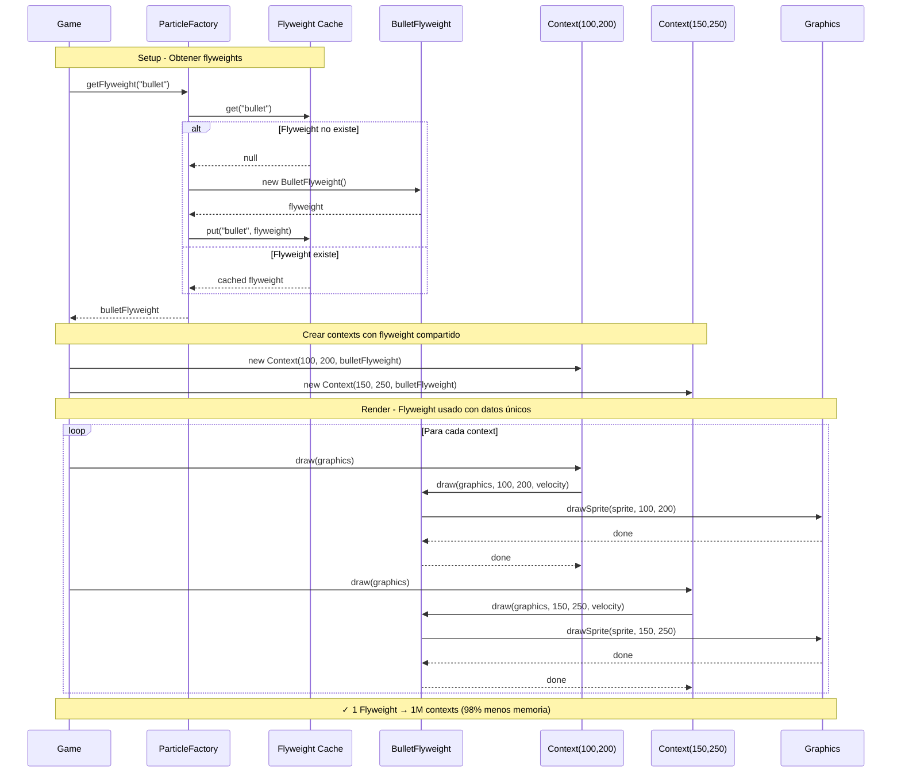

# Flyweight (Peso Ligero)

## Categoría
**Patrón Estructural**

---

## Propósito

Usa compartición para soportar eficientemente grandes cantidades de objetos de grano fino.

---

## Definición Formal

**Flyweight** es un patrón de diseño estructural que permite mantener más objetos en la memoria RAM disponible compartiendo partes comunes del estado entre múltiples objetos, en lugar de mantener toda la información en cada objeto.

### Intención del GoF

> "Usa compartición para soportar grandes cantidades de objetos de grano fino eficientemente."

---

## Explicación Detallada

El patrón Flyweight optimiza el uso de memoria compartiendo objetos en lugar de crear nuevas instancias. La clave es identificar qué parte del estado puede compartirse (intrínseco) y qué parte es única (extrínseco).

### Conceptos Clave

1. **Estado Intrínseco**: Información compartida entre objetos (inmutable, almacenada en flyweight)
2. **Estado Extrínseco**: Información única por contexto (pasada como parámetro, NO almacenada)
3. **Flyweight Factory**: Gestiona pool de flyweights compartidos y controla instanciación
4. **Inmutabilidad**: Flyweights DEBEN ser inmutables para compartirse de forma segura
5. **Pool de objetos**: Cache de flyweights reutilizables
6. **Reducción de memoria**: Reduce uso de RAM al compartir objetos

### Metáfora: Biblioteca Pública

```
Sin Flyweight:
Cada persona compra su propia copia del libro
  - 1000 personas × 1 libro = 1000 libros
  - Alto costo, mucho espacio

Con Flyweight:
Biblioteca (Factory) tiene UNA copia del libro
  - 1000 personas × 1 préstamo = 1 libro compartido
  - 1000 registros de préstamo (extrínseco)
       ↓
Estado Intrínseco: Contenido del libro (compartido)
Estado Extrínseco: Quién lo tiene, cuándo lo devuelve (único)

1 libro físico → 1000 lectores diferentes
```

### Analogía: Fuentes en un Procesador de Texto

```
Sin Flyweight:
Documento con 10,000 caracteres
  - Cada char guarda: carácter + fuente + tamaño + color
  - 10,000 objetos × 100 bytes = 1 MB

Con Flyweight:
  - 1 Flyweight para "Arial 12pt Negro"
  - 1 Flyweight para "Times 14pt Rojo"
  - 10,000 referencias (8 bytes) + posición
  - ~80 KB (reducción del 92%)
```

### ¿Cómo funciona?

```
1. Cliente solicita flyweight a Factory
   factory.getFlyweight("Arial 12pt")

2. Factory verifica si existe
   if (cache.contains("Arial 12pt"))
     return cached  ← ✅ Reutiliza

3. Si no existe, Factory lo crea
   create new Flyweight
   cache.put("Arial 12pt", flyweight)
   return flyweight

4. Cliente usa flyweight con estado extrínseco
   flyweight.render(x, y, character)
   
Estado intrínseco: fuente, tamaño
Estado extrínseco: x, y, character
```

---

## Problema Detallado

### Escenario: Sistema de Partículas para Videojuego

Un juego tiene millones de partículas (balas, explosiones, lluvia, humo). Cada partícula tiene:
- **Características compartidas**: sprite, color, tamaño, física
- **Características únicas**: posición (x, y), velocidad, dirección

**Sin Flyweight**:
```java
// ❌ Cada partícula es un objeto completo
class Particle {
    // ❌ Datos que se repiten MILLONES de veces
    private Sprite sprite;        // 1 KB (imagen)
    private String color;          // 20 bytes
    private int size;              // 4 bytes
    private Physics physics;       // 200 bytes (comportamiento)
    
    // Datos únicos
    private int x, y;              // 8 bytes
    private Vector2D velocity;     // 16 bytes
    
    public void draw(Graphics g) {
        g.drawSprite(sprite, x, y, size, color);
    }
    
    public void update() {
        x += velocity.x;
        y += velocity.y;
        physics.applyGravity(this);
    }
}

// ❌ Problema:
// 1,000,000 partículas × ~1250 bytes = 1.25 GB de RAM ❌❌❌
```

**Análisis del desperdicio**:
```
Partícula "bala":
  - sprite, color, size, physics: ~1225 bytes (SE REPITE en cada bala)
  - x, y, velocity: ~24 bytes (único)

1,000,000 balas:
  - Sin Flyweight: 1,225,000,000 bytes (1.14 GB)
  - Con Flyweight: 1,225 bytes + (1,000,000 × 24) = 24 MB
  - Reducción: 98% ✅
```

**Problemas críticos**:
1. **Memoria desperdiciada**: 98% de datos duplicados
2. **Rendimiento**: Más objetos = más GC (Garbage Collection)
3. **Cache misses**: Muchos objetos = pobre localidad de caché
4. **Inicialización costosa**: Crear 1M objetos es lento
5. **Escalabilidad**: Imposible tener 10M partículas

---

## Solución con Flyweight

```java
// ===========================================
// FLYWEIGHT: Estado compartido (inmutable)
// ===========================================
class ParticleFlyweight {
    private final Sprite sprite;    // Intrínseco (compartido)
    private final String color;     // Intrínseco
    private final int size;         // Intrínseco
    private final Physics physics;  // Intrínseco
    
    public ParticleFlyweight(String type) {
        // Cargar recursos compartidos una sola vez
        this.sprite = SpriteLoader.load(type + ".png");
        this.color = getColorForType(type);
        this.size = getSizeForType(type);
        this.physics = new Physics(type);
        System.out.println("✨ Created Flyweight for: " + type);
    }
    
    // Método que usa estado extrínseco (pasado como parámetro)
    public void draw(Graphics g, int x, int y, Vector2D velocity) {
        // Intrínseco: sprite, color, size
        // Extrínseco: x, y, velocity
        g.drawSprite(sprite, x, y, size);
        // ✅ Flyweight no almacena x, y, velocity
    }
    
    public void update(int x, int y, Vector2D velocity, double deltaTime) {
        physics.applyGravity(velocity, deltaTime);
        // ✅ Lógica compartida, datos únicos pasados como parámetros
    }
}

// ===========================================
// FLYWEIGHT FACTORY: Gestiona pool
// ===========================================
class ParticleFactory {
    private static Map<String, ParticleFlyweight> flyweights = new HashMap<>();
    private static int createdCount = 0;
    
    public static ParticleFlyweight getFlyweight(String type) {
        // ✅ Verifica si ya existe
        if (!flyweights.containsKey(type)) {
            flyweights.put(type, new ParticleFlyweight(type));
            createdCount++;
            System.out.println("📦 Flyweights en pool: " + createdCount);
        } else {
            System.out.println("♻️  Reutilizando flyweight: " + type);
        }
        return flyweights.get(type);
    }
    
    public static int getFlyweightCount() {
        return flyweights.size();
    }
}

// ===========================================
// CONTEXT: Almacena estado extrínseco
// ===========================================
class ParticleContext {
    private int x, y;               // Extrínseco (único)
    private Vector2D velocity;      // Extrínseco
    private ParticleFlyweight type; // Referencia al flyweight compartido
    
    public ParticleContext(int x, int y, ParticleFlyweight type) {
        this.x = x;
        this.y = y;
        this.velocity = new Vector2D(0, 0);
        this.type = type;
    }
    
    public void draw(Graphics g) {
        type.draw(g, x, y, velocity);  // Pasa estado extrínseco
    }
    
    public void update(double deltaTime) {
        type.update(x, y, velocity, deltaTime);
        x += velocity.x * deltaTime;
        y += velocity.y * deltaTime;
    }
}

// ===========================================
// CLIENTE: Gestiona millones de partículas
// ===========================================
public class Game {
    private List<ParticleContext> particles = new ArrayList<>();
    
    public void createParticles() {
        // Obtener flyweights (compartidos)
        ParticleFlyweight bulletFlyweight = ParticleFactory.getFlyweight("bullet");
        ParticleFlyweight explosionFlyweight = ParticleFactory.getFlyweight("explosion");
        ParticleFlyweight smokeFlyweight = ParticleFactory.getFlyweight("smoke");
        
        // Crear 1,000,000 de partículas
        for (int i = 0; i < 1_000_000; i++) {
            String type = selectRandomType();
            ParticleFlyweight flyweight;
            
            if (type.equals("bullet")) {
                flyweight = bulletFlyweight;  // ✅ Reutiliza
            } else if (type.equals("explosion")) {
                flyweight = explosionFlyweight;  // ✅ Reutiliza
            } else {
                flyweight = smokeFlyweight;  // ✅ Reutiliza
            }
            
            // Solo crea context (pequeño: 24 bytes)
            particles.add(new ParticleContext(randomX(), randomY(), flyweight));
        }
        
        System.out.println("\n📊 ESTADÍSTICAS:");
        System.out.println("Partículas creadas: " + particles.size());
        System.out.println("Flyweights únicos: " + ParticleFactory.getFlyweightCount());
        System.out.println("Ratio de compartición: " + 
            (particles.size() / ParticleFactory.getFlyweightCount()) + ":1");
    }
    
    public void render(Graphics g) {
        for (ParticleContext particle : particles) {
            particle.draw(g);  // Usa flyweight compartido con datos únicos
        }
    }
}

// ✅ Resultado:
// - 3 Flyweights × ~1225 bytes = 3.7 KB
// - 1,000,000 Contexts × 24 bytes = 24 MB
// - Total: ~24 MB (vs. 1.14 GB sin Flyweight)
// - Reducción: 98% ✅
```

---

## Estructura UML



---

## Implementaciones por Lenguaje

### 📁 Ejemplos Disponibles

- **[Java](./java/)** - String pool, Integer cache
- **[C#](./csharp/)** - Character cache
- **[TypeScript](./typescript/)** - Sprite sharing

Cada carpeta contiene:
- ✅ Separación clara de estado intrínseco/extrínseco
- ✅ Flyweight Factory con pool
- ✅ Ejemplos de reducción de memoria
- ✅ Flyweights inmutables
- ✅ Referencias a repositorios reconocidos

---

## Diagrama de Secuencia

**Escenario**: Cliente crea millones de partículas reutilizando flyweights



---

## Componentes

1. **Flyweight**: Interfaz que declara métodos que aceptan estado extrínseco
2. **ConcreteFlyweight**: Implementa Flyweight y almacena estado intrínseco (inmutable)
3. **FlyweightFactory**: Crea y gestiona flyweights, asegura compartición
4. **Client/Context**: Mantiene estado extrínseco y referencias a flyweights
5. **UnsharedConcreteFlyweight** (opcional): Flyweight que no se comparte

---

## Ventajas ✅

1. **Ahorro masivo de RAM**: Reducción del 70-98% en casos típicos
2. **Mejor rendimiento**: Menos objetos = menos presión en GC
3. **Caché eficiente**: Mejor localidad de datos
4. **Escalabilidad**: Permite millones de objetos en RAM limitada
5. **Reutilización**: Objetos compartidos son muy eficientes
6. **Inicialización una sola vez**: Recursos costosos cargados una vez

---

## Desventajas ❌

1. **Complejidad aumentada**: Separar estado intrínseco/extrínseco
2. **Overhead de Factory**: Búsqueda en pool tiene costo
3. **Código más complejo**: Más difícil de entender que objetos normales
4. **Inflexibilidad**: Flyweights inmutables no pueden cambiar
5. **Thread-safety**: Factory debe ser thread-safe
6. **Puede ser innecesario**: Solo vale la pena con MUCHOS objetos

---

## Cuándo Usar

✅ **Usa Flyweight cuando:**

- Tu aplicación usa gran cantidad de objetos similares
- El almacenamiento de objetos es costoso (RAM limitada)
- Puedes separar claramente estado intrínseco de extrínseco
- La mayoría del estado puede hacerse extrínseco
- La identidad de objetos no importa
- Tienes al menos cientos o miles de objetos similares

❌ **Evita Flyweight cuando:**

- Tienes pocos objetos (< 100)
- Casi todo el estado es único (extrínseco)
- Los objetos deben ser mutables
- La complejidad no justifica el ahorro de memoria
- Los objetos son baratos de crear

---

## Casos de Uso Reales

### 1. **String Pool (Java)**
```java
// Java usa Flyweight para strings
String s1 = "hello";  // Flyweight automático
String s2 = "hello";  // Mismo objeto compartido
System.out.println(s1 == s2);  // true

// Integer cache (-128 a 127)
Integer i1 = 100;
Integer i2 = 100;
System.out.println(i1 == i2);  // true (flyweight)

Integer i3 = 1000;
Integer i4 = 1000;
System.out.println(i3 == i4);  // false (fuera del rango cache)
```

### 2. **Videojuegos - Partículas**
```
1,000,000 bullets compartiendo:
  - Sprite de bala
  - Comportamiento de física
  - Sonido de disparo
  - Efectos visuales
```

### 3. **Editores de Texto - Caracteres**
```java
// Cada carácter en documento comparte:
class CharacterFlyweight {
    private final String font;      // Intrínseco
    private final int fontSize;     // Intrínseco
    private final Color color;      // Intrínseco
    
    public void render(int x, int y, char character) {
        // x, y, character son extrínsecos
    }
}
```

### 4. **Mapas de Juegos - Tiles**
```
Mapa 1000×1000 = 1,000,000 tiles
  - 10 tipos diferentes de tiles
  - Cada tile comparte sprite y propiedades
  - Solo posición es única
```

### 5. **Árboles en Juegos/Simulaciones**
```
Bosque con 100,000 árboles
  - 5 tipos de árboles (pino, roble, etc.)
  - Comparten modelo 3D y texturas
  - Solo posición y rotación son únicas
```

---

## Errores Comunes

### ❌ Error 1: Mezclar estado intrínseco con extrínseco

```java
// ❌ INCORRECTO: Flyweight con estado mutable
class BadFlyweight {
    private final String sprite;  // ✅ Intrínseco OK
    private int x, y;              // ❌ Extrínseco en flyweight
    
    public void setPosition(int x, int y) {
        this.x = x;  // ❌ Flyweight compartido cambiando estado
        this.y = y;  // ❌ Afecta a TODOS los que lo usan
    }
}

// ✅ CORRECTO: Flyweight inmutable, extrínseco como parámetros
class GoodFlyweight {
    private final String sprite;  // ✅ Solo intrínseco
    
    public void render(int x, int y) {  // ✅ Extrínseco como parámetros
        // No almacena x, y
    }
}
```

### ❌ Error 2: Flyweights mutables

```java
// ❌ INCORRECTO: Flyweight que puede modificarse
class MutableFlyweight {
    private String color;  // ❌ No es final
    
    public void setColor(String color) {
        this.color = color;  // ❌ Modificar flyweight compartido
    }
}

// Si cambias color:
flyweight.setColor("red");
// ❌ TODOS los objetos que usan este flyweight ahora son rojos

// ✅ CORRECTO: Flyweight completamente inmutable
class ImmutableFlyweight {
    private final String color;  // ✅ Final
    
    public ImmutableFlyweight(String color) {
        this.color = color;
    }
    
    // ✅ Solo getters, sin setters
    public String getColor() {
        return color;
    }
}
```

### ❌ Error 3: No usar Factory

```java
// ❌ INCORRECTO: Cliente crea flyweights directamente
class BadClient {
    public void createParticles() {
        for (int i = 0; i < 1000000; i++) {
            ParticleFlyweight fw = new ParticleFlyweight("bullet");  // ❌ 1M objetos
            particles.add(new Context(x, y, fw));
        }
    }
}

// ✅ CORRECTO: Usar Factory para compartir
class GoodClient {
    public void createParticles() {
        ParticleFlyweight bulletFw = ParticleFactory.get("bullet");  // ✅ 1 objeto
        
        for (int i = 0; i < 1000000; i++) {
            particles.add(new Context(x, y, bulletFw));  // ✅ Reutiliza
        }
    }
}
```

### ❌ Error 4: Exponer constructor público

```java
// ❌ INCORRECTO: Constructor público permite bypass del factory
public class BadFlyweight {
    public BadFlyweight(String type) {  // ❌ Público
        // ...
    }
}

// Cliente puede hacer:
Flyweight fw = new BadFlyweight("bullet");  // ❌ Bypasea factory

// ✅ CORRECTO: Constructor package-private o privado
class GoodFlyweight {
    // Package-private: solo factory puede crear
    GoodFlyweight(String type) {  // ✅ Sin modificador = package-private
        // ...
    }
}

// O mejor aún, inner class estática
class FlyweightFactory {
    private static class Flyweight {
        private Flyweight(String type) { }  // ✅ Privado
    }
    
    public static Flyweight get(String type) { /* ... */ }
}
```

### ❌ Error 5: Estado extrínseco dentro del Flyweight

```java
// ❌ INCORRECTO: Guardar lista de contextos en flyweight
class BadFlyweight {
    private final String sprite;           // Intrínseco OK
    private List<Point> positions;         // ❌ Extrínseco en flyweight
    
    public void addPosition(int x, int y) {
        positions.add(new Point(x, y));    // ❌ Crece infinitamente
    }
}

// ✅ CORRECTO: Cliente maneja estado extrínseco
class GoodClient {
    private Map<Flyweight, List<Point>> contexts = new HashMap<>();
    
    public void addParticle(Flyweight fw, int x, int y) {
        contexts.computeIfAbsent(fw, k -> new ArrayList<>())
                .add(new Point(x, y));  // ✅ Cliente almacena extrínseco
    }
}
```

---

## Anti-Patrones

### 1. **Mutable Flyweight Anti-Pattern**

```java
// ❌ ANTI-PATRÓN: Flyweight con setters
class MutableFlyweight {
    private String sprite;  // ❌ Puede cambiar
    
    public void setSprite(String sprite) {
        this.sprite = sprite;  // ❌ Modifica objeto compartido
    }
}

// Uso:
Flyweight fw = factory.get("bullet");
fw.setSprite("missile");  // ❌ Ahora TODAS las "balas" son "misiles"
```

**Problema**: Modificar flyweight compartido afecta a todos los que lo usan.  
**Solución**: Flyweights DEBEN ser inmutables (final fields, sin setters).

### 2. **Flyweight sin Factory (Direct Instantiation)**

```java
// ❌ ANTI-PATRÓN: Crear flyweights sin factory
class BadClient {
    public void setup() {
        for (int i = 0; i < 1000000; i++) {
            // ❌ Crea 1M objetos que deberían compartirse
            Flyweight fw = new Flyweight("bullet");
            particles.add(fw);
        }
    }
}
```

**Problema**: Pierde completamente el beneficio del patrón.  
**Solución**: SIEMPRE usar Factory para obtener flyweights.

---

## Relación con Otros Patrones

- **Composite**: Flyweight puede usarse para compartir nodos hoja en Composite
- **State**: Estados pueden implementarse como Flyweights si no tienen estado extrínseco
- **Strategy**: Estrategias pueden ser Flyweights si son stateless
- **Singleton**: Factory suele implementarse como Singleton
- **Factory Method**: FlyweightFactory usa Factory Method para crear flyweights

---

## Relación con Principios SOLID

| Principio | Cómo lo cumple |
|-----------|----------------|
| **SRP** | Factory maneja creación, Flyweight maneja lógica compartida |
| **OCP** | Puedes añadir nuevos tipos de flyweights sin modificar factory |
| **LSP** | Flyweights son intercambiables |
| **ISP** | Interfaz Flyweight es específica |
| **DIP** | Cliente depende de interfaz Flyweight, no de implementación |

---

## Diagrama de Secuencia Completo

**Escenario**: Juego renderiza 1M partículas usando 3 flyweights



---

## Ventajas Detalladas ✅

1. **Reducción masiva de memoria**: 70-98% típicamente
2. **Mejor rendimiento de GC**: Menos objetos = menos trabajo para GC
3. **Localidad de caché mejorada**: Objetos compartidos en caché CPU
4. **Inicialización una vez**: Recursos costosos cargados una sola vez
5. **Escalabilidad**: Soporta millones de instancias
6. **Transparente**: Cliente puede no saber que usa flyweights

---

## Desventajas Detalladas ❌

1. **Complejidad conceptual**: Difícil de entender al principio
2. **Separación de estado**: Requiere análisis cuidadoso
3. **Overhead de Factory**: Búsqueda en HashMap tiene costo
4. **Código más verbose**: Más código que instanciación directa
5. **Thread-safety**: Factory necesita sincronización
6. **Trade-off CPU-RAM**: Ahorra RAM pero usa más CPU (búsquedas)
7. **Solo vale para MUCHOS objetos**: Overhead no justificado con pocos objetos

---

## Cuándo Usar Detallado

✅ **Usa Flyweight cuando:**

- Tienes **cientos de miles** de objetos similares
- El uso de RAM es un problema crítico
- Los objetos comparten mucho estado común
- El estado extrínseco puede calcularse o pasarse fácilmente
- La identidad de objetos no importa (comparación por valor, no por referencia)
- Rendimiento de GC es un cuello de botella

**Regla práctica**: Si no tienes al menos 10,000 objetos, probablemente no lo necesitas.

❌ **Evita Flyweight cuando:**

- Tienes menos de 1,000 objetos
- El 80%+ del estado es único (extrínseco)
- Los objetos necesitan ser mutables
- La identidad de objetos es importante
- El código simple es más importante que optimización
- No tienes problemas de memoria

---

## Casos de Uso Reales Expandidos

### 1. **Java String Pool**
```java
// JVM mantiene pool de strings
String s1 = "hello";
String s2 = "hello";
System.out.println(s1 == s2);  // true - mismo objeto

String s3 = new String("hello");  // Fuerza creación
System.out.println(s1 == s3);     // false - diferente objeto

String s4 = s3.intern();          // Añade al pool
System.out.println(s1 == s4);     // true - mismo del pool
```

### 2. **Videojuegos - Sistema de Partículas**
```
Shooter game:
  - Bullets: 10,000 activas
  - Explosions: 1,000 activas
  - Smoke: 5,000 partículas
  - Total: 16,000 partículas

Flyweights: 3 tipos
Memoria: 3 KB + 384 KB = 387 KB
vs. 20 MB sin Flyweight
```

### 3. **Editor de Texto - Formatting**
```java
// Word processor con 100,000 caracteres
class CharacterFlyweight {
    private final Font font;        // Compartido
    private final Color color;      // Compartido
    // NO guarda: posición, carácter actual
}

// 100,000 chars usando 10 flyweights diferentes
// 10 objetos Font vs. 100,000
```

### 4. **Juegos de Estrategia - Unidades**
```
RTS game con 10,000 unidades
  - 20 tipos diferentes (soldado, tanque, etc.)
  - Cada tipo comparte:
    * Modelo 3D
    * Animaciones
    * Estadísticas base
    * Sonidos
  - Único por unidad:
    * Posición
    * Salud actual
    * Orientación
```

### 5. **Sistemas de Mapeo - Iconos**
```
Google Maps mostrando 1,000 restaurantes
  - 1 flyweight para icono de restaurante
  - 1,000 contextos con (lat, lng, nombre)
```

---

## Errores Comunes Adicionales

### ❌ Error Extra: Factory no thread-safe

```java
// ❌ INCORRECTO: Race condition en factory
class BadFactory {
    private static Map<String, Flyweight> cache = new HashMap<>();
    
    public static Flyweight get(String key) {
        if (!cache.containsKey(key)) {  // ❌ Check
            cache.put(key, new Flyweight(key));  // ❌ Then Act
            // Race condition: dos threads pueden crear dos flyweights
        }
        return cache.get(key);
    }
}

// ✅ CORRECTO: Thread-safe factory
class GoodFactory {
    private static final Map<String, Flyweight> cache = new ConcurrentHashMap<>();
    
    public static Flyweight get(String key) {
        return cache.computeIfAbsent(key, k -> new Flyweight(k));
        // ✅ Atómico: solo crea si no existe
    }
}
```

---

## Variantes del Patrón

### 1. Flyweight con Unshared Flyweights

A veces algunos objetos no deben compartirse:

```java
interface Flyweight {
    void operation(String extrinsicState);
}

// Flyweight compartido
class SharedFlyweight implements Flyweight {
    private final String intrinsicState;
    // Puede compartirse
}

// Flyweight NO compartido (cuando la compartición no es posible)
class UnsharedFlyweight implements Flyweight {
    private String allState;  // Todo el estado
    // No se beneficia de compartición pero usa misma interfaz
}
```

### 2. Flyweight con Weak References

```java
class FlyweightFactory {
    private Map<String, WeakReference<Flyweight>> cache = new HashMap<>();
    
    public Flyweight get(String key) {
        WeakReference<Flyweight> ref = cache.get(key);
        Flyweight fw = (ref != null) ? ref.get() : null;
        
        if (fw == null) {
            fw = new Flyweight(key);
            cache.put(key, new WeakReference<>(fw));
        }
        
        return fw;
    }
}
// Permite que GC libere flyweights no usados
```

---

## Ejercicios Prácticos

### Ejercicio 1: Sistema de Partículas para Juego

Implementa un sistema de partículas con Flyweight.

**Requisitos**:
- 3 tipos de partículas: bullet, explosion, smoke
- Cada tipo comparte: sprite (imagen), color, tamaño, comportamiento físico
- Único por partícula: posición (x, y), velocidad, tiempo de vida
- Crear 100,000 partículas
- Medir memoria antes/después

### Ejercicio 2: Editor de Texto con Formato

Crea un editor que use Flyweight para caracteres formateados.

**Requisitos**:
- Flyweights: Diferentes combinaciones de Font, Size, Color
- Extrínseco: Posición del carácter, carácter actual
- Documento con 50,000 caracteres
- Método para cambiar formato de rango de caracteres
- Comparar memoria con/sin Flyweight

### Ejercicio 3: Juego de Ajedrez - Piezas Reutilizables

Diseña un tablero de ajedrez usando Flyweight.

**Requisitos**:
- Flyweights: 6 tipos de piezas (Rey, Reina, Torre, Alfil, Caballo, Peón)
- Cada tipo comparte: imagen, reglas de movimiento
- Extrínseco: posición en tablero, color (blanco/negro)
- Factory que gestiona 12 flyweights (6 tipos × 2 colores)

---

## Diferencia con Object Pool

| Aspecto | Flyweight | Object Pool |
|---------|-----------|-------------|
| **Propósito** | Compartir objetos para ahorrar RAM | Reutilizar objetos para evitar creación |
| **Inmutabilidad** | Flyweights son inmutables | Objects pueden ser mutables |
| **Compartición** | Simultánea (muchos usan el mismo) | Exclusiva (uno a la vez) |
| **Retorno** | No se "devuelve" | Se devuelve al pool |
| **Ejemplo** | String pool | Connection pool |

---

## Relación Detallada con Composite

Flyweight y Composite trabajan bien juntos:

```java
// Composite con Flyweight para hojas
class Folder implements FileComponent {
    private List<FileComponent> children;  // Pueden ser flyweights
}

class File implements FileComponent {
    private IconFlyweight icon;  // ✅ Compartido entre muchos archivos
    private String name;          // Único
    private long size;            // Único
}

// Miles de archivos .txt comparten el mismo IconFlyweight
```

---

## Referencias

- **Gang of Four** - "Design Patterns" (Capítulo sobre Flyweight)
- [Refactoring Guru - Flyweight](https://refactoring.guru/design-patterns/flyweight)
- [SourceMaking - Flyweight](https://sourcemaking.com/design_patterns/flyweight)
- [Java String Pool](https://www.baeldung.com/java-string-pool)

---

## Recursos Adicionales

### Libros
- **"Design Patterns Explained"** - Alan Shalloway
- **"Game Programming Patterns"** - Robert Nystrom (Capítulo sobre Flyweight)

### Artículos
- [Flyweight Pattern in Games](http://gameprogrammingpatterns.com/flyweight.html)
- [Java Integer Cache](https://www.baeldung.com/java-integer-cache)
- [Memory Optimization Patterns](https://www.baeldung.com/java-memory-optimization)

---

[📂 Ver patrones estructurales](../Estructurales.md) | [🏠 Volver a inicio](../../README.md)

---

*Última actualización: Octubre 2025*
