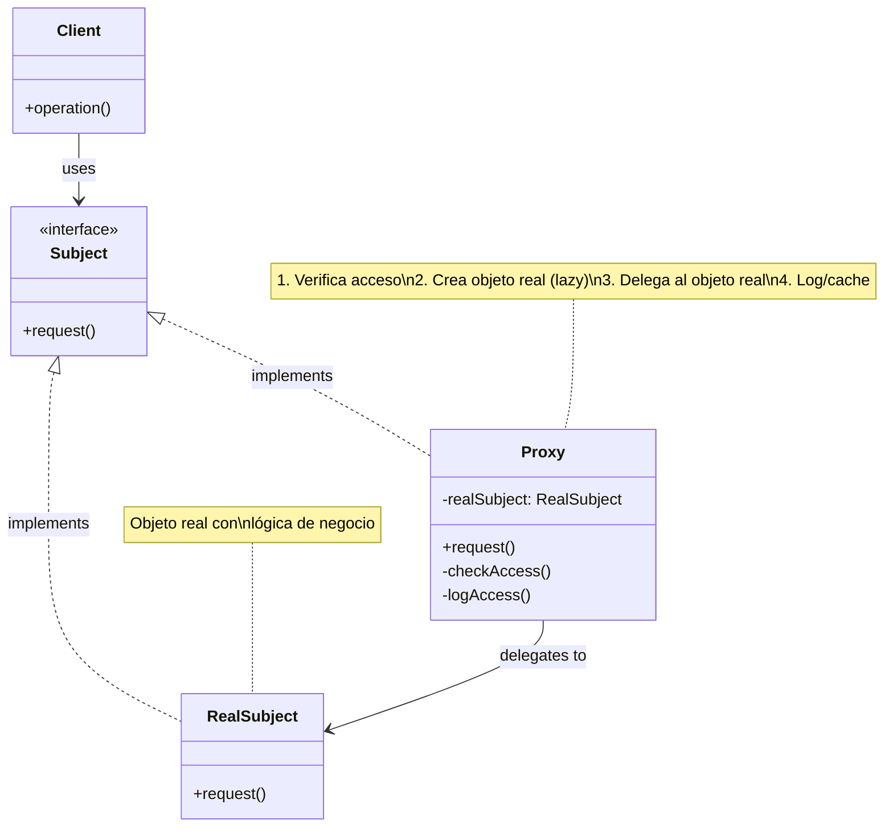
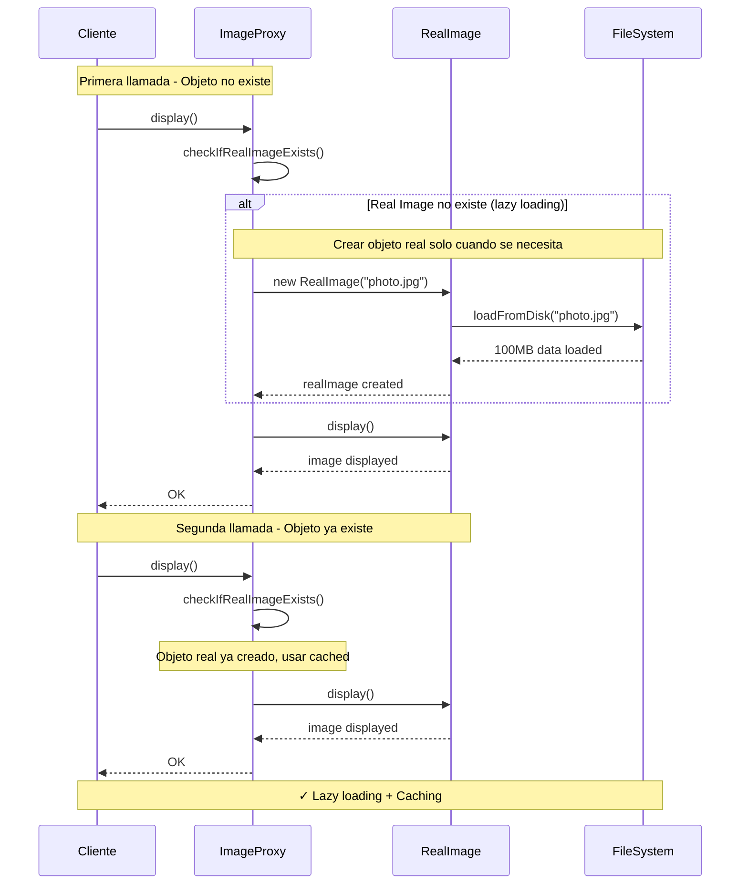

# Proxy (Apoderado)

## Categoría

**Patrón Estructural**

---

## Propósito

Proporciona un sustituto o marcador de posición para otro objeto. Un proxy controla el acceso al objeto original, permitiendo hacer algo antes o después de que la solicitud llegue al objeto original.

---

## Problema

Imagina que tienes un objeto que realiza operaciones costosas (consultas a base de datos, carga de imágenes grandes, etc.) y no siempre necesitas usar ese objeto inmediatamente.

**Sin Proxy**:
```java
// Cliente carga objeto pesado innecesariamente
HugeImage image = new HugeImage("large_photo.jpg"); // ❌ Carga 100MB inmediatamente
// ... código que no usa la imagen ...
// Mucho después:
image.display(); // Finalmente se usa
```

**Problemas**:

1. Recursos desperdiciados cargando objetos que tal vez no se usen
2. No hay control sobre el acceso al objeto
3. No hay logging o caching centralizado
4. Tiempo de inicio lento

---

## Solución

El patrón Proxy sugiere crear una clase proxy que implemente la misma interfaz que el objeto original. El proxy puede controlar cuándo crear el objeto real, cachear resultados, verificar permisos, etc.

**Características**:

- Misma interfaz que el objeto real
- Control sobre creación y acceso
- Lazy initialization (carga perezosa)
- Caching, logging, control de acceso

---

## Tipos de Proxy

### 1. **Virtual Proxy (Proxy Virtual)**

Posterga la creación de objetos costosos hasta que sean realmente necesarios.

### 2. **Remote Proxy (Proxy Remoto)**

Representa un objeto que está en un espacio de direcciones diferente (otro servidor).

### 3. **Protection Proxy (Proxy de Protección)**

Controla el acceso al objeto original basándose en permisos.

### 4. **Smart Reference (Referencia Inteligente)**

Realiza acciones adicionales cuando se accede al objeto (logging, conteo de referencias).

### 5. **Cache Proxy**

Almacena resultados de operaciones costosas.

---

## Estructura UML

### Diagrama de Clases



**Visualización**: [Ver en Mermaid Live](https://mermaid.live/)

---

## Componentes

1. **Subject**: Interfaz común para RealSubject y Proxy
2. **RealSubject**: Objeto real que contiene la lógica de negocio
3. **Proxy**: Mantiene referencia al RealSubject y controla el acceso
4. **Client**: Trabaja con objetos a través de la interfaz Subject

---

## Implementaciones por Lenguaje

Este patrón ha sido implementado en múltiples lenguajes. A continuación encontrarás ejemplos de código en carpetas organizadas por lenguaje:

### 📁 Ejemplos Disponibles

- **[Java](./java/)** - Implementación con proxies dinámicos (java.lang.reflect.Proxy)
- **[C#](./csharp/)** - Implementación .NET con DispatchProxy y Castle DynamicProxy
- **[TypeScript](./typescript/)** - Implementación con ES6 Proxy nativo

Cada carpeta contiene:

- ✅ Implementaciones de los 5 tipos de proxy
- ✅ Ejemplos de lazy loading
- ✅ Control de acceso y validación
- ✅ Referencias a repositorios reconocidos
- ✅ Proxies dinámicos y estáticos

---

## Diagrama de Secuencia

**Escenario**: Cliente accede a imagen a través de Virtual Proxy (lazy loading)



---

## Ventajas ✅

1. **Lazy initialization**: Posterga creación de objetos costosos
2. **Control de acceso**: Verifica permisos antes de acceder
3. **Logging centralizado**: Registra todas las operaciones
4. **Caching**: Almacena resultados de operaciones costosas
5. **Open/Closed Principle**: Puedes introducir nuevos proxies sin cambiar el servicio
6. **Transparente**: Cliente no nota la diferencia

---

## Desventajas ❌

1. **Complejidad aumentada**: Más clases en el sistema
2. **Latencia**: Puede introducir demora en algunas respuestas
3. **Overhead**: Capa adicional de abstracción
4. **Debugging complicado**: Más difícil seguir el flujo

---

## Cuándo Usar

✅ **Usa Proxy cuando:**

- Lazy initialization (virtual proxy): Objeto costoso que no siempre se usa
- Control de acceso (protection proxy): Restricciones de seguridad
- Ejecución local de servicio remoto (remote proxy): RPC, web services
- Logging de requests (logging proxy): Auditoría
- Caching de resultados (caching proxy): Optimización
- Smart reference: Acciones adicionales al acceder al objeto

❌ **Evita Proxy cuando:**

- El objeto no es costoso de crear
- No necesitas control adicional sobre el acceso
- La simplicidad es más importante que el control

---

## Casos de Uso Reales

### 1. **Virtual Proxy - Lazy Loading**

```
Contexto: Editor de imágenes
Proxy: ImageProxy
Real: HighResolutionImage
Beneficio: Carga imágenes solo cuando se visualizan
```

### 2. **Protection Proxy - Control de Acceso**

```
Contexto: Sistema bancario
Proxy: BankAccountProxy
Real: BankAccount
Beneficio: Verifica permisos antes de operaciones
```

### 3. **Remote Proxy - Servicios Remotos**

```
Contexto: Aplicación distribuida
Proxy: ServiceProxy
Real: RemoteService
Beneficio: Oculta complejidad de comunicación de red
```

### 4. **Caching Proxy**

```
Contexto: API externa
Proxy: CachedApiProxy
Real: ExternalApiClient
Beneficio: Reduce llamadas costosas a API
```

### 5. **Smart Reference**

```
Contexto: Gestión de recursos
Proxy: ResourceProxy
Real: Resource
Beneficio: Cuenta referencias, libera recursos automáticamente
```

---

## Ejemplo Conceptual

```java
// Subject Interface
interface Image {
    void display();
}

// Real Subject
class RealImage implements Image {
    private String filename;
    
    public RealImage(String filename) {
        this.filename = filename;
        loadFromDisk(); // Operación costosa
    }
    
    private void loadFromDisk() {
        System.out.println("Loading image: " + filename);
    }
    
    public void display() {
        System.out.println("Displaying image: " + filename);
    }
}

// Proxy
class ImageProxy implements Image {
    private RealImage realImage;
    private String filename;
    
    public ImageProxy(String filename) {
        this.filename = filename;
    }
    
    public void display() {
        // Lazy loading: crear objeto real solo cuando se necesita
        if (realImage == null) {
            realImage = new RealImage(filename);
        }
        realImage.display();
    }
}

// Client
Image image = new ImageProxy("large_photo.jpg"); // No carga aún
// ... código ...
image.display(); // Ahora sí carga y muestra
image.display(); // Segunda vez: usa objeto ya creado
```

---

## Relación con Otros Patrones

- **Adapter**: Provee interfaz diferente; Proxy provee la misma
- **Decorator**: Añade responsabilidades; Proxy controla acceso
- **Facade**: Simplifica interfaz compleja; Proxy misma interfaz con control

---

## Relación con Principios SOLID

| Principio | Cómo lo cumple |
|-----------|----------------|
| **SRP** | Proxy tiene responsabilidad de control de acceso |
| **OCP** | Puedes añadir proxies sin modificar RealSubject |
| **LSP** | Proxy puede sustituir a RealSubject completamente |
| **ISP** | Misma interfaz que Subject |
| **DIP** | Cliente depende de interfaz Subject, no de implementación |

---

## Ejercicios Prácticos

### Ejercicio 1: Virtual Proxy para Videos

Crea un proxy que cargue videos solo cuando el usuario presione play.

### Ejercicio 2: Protection Proxy para Documentos

Implementa un proxy que verifique permisos antes de abrir documentos.

### Ejercicio 3: Caching Proxy para API

Diseña un proxy que cachee respuestas de una API externa.

---

## Referencias

- **Gang of Four** - "Design Patterns" (Capítulo sobre Proxy)
- [Refactoring Guru - Proxy](https://refactoring.guru/design-patterns/proxy)
- [SourceMaking - Proxy](https://sourcemaking.com/design_patterns/proxy)

---

## Recursos Adicionales

### Libros

- **"Design Patterns Explained"** - Alan Shalloway
- **"Head First Design Patterns"** - Freeman & Freeman

### Artículos

- [Java Dynamic Proxies](https://www.baeldung.com/java-dynamic-proxies)
- [C# DispatchProxy](https://learn.microsoft.com/en-us/dotnet/api/system.reflection.dispatchproxy)
- [JavaScript Proxy](https://developer.mozilla.org/en-US/docs/Web/JavaScript/Reference/Global_Objects/Proxy)

---

[📂 Ver todos los patrones estructurales](../Estructurales.md) | [🏠 Volver a inicio](../../README.md)

---

*Última actualización: Octubre 2025*
