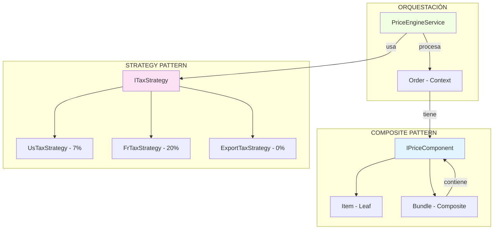
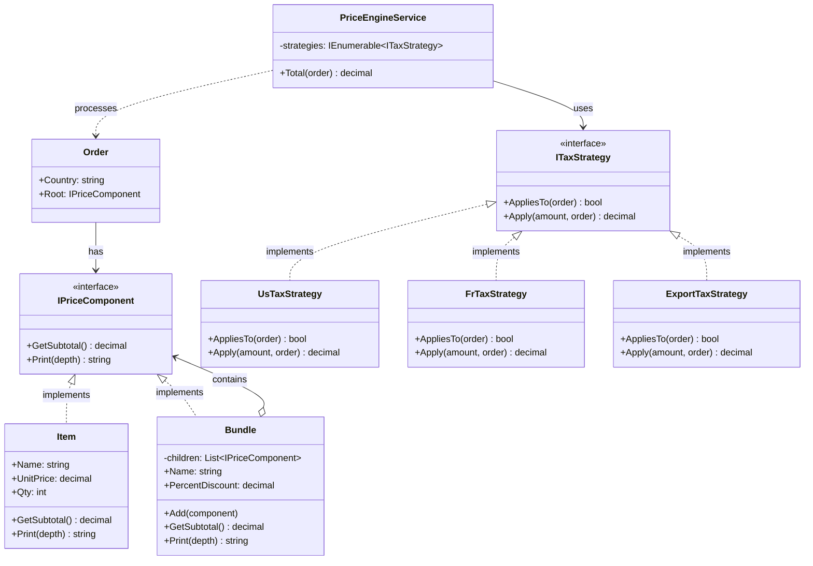
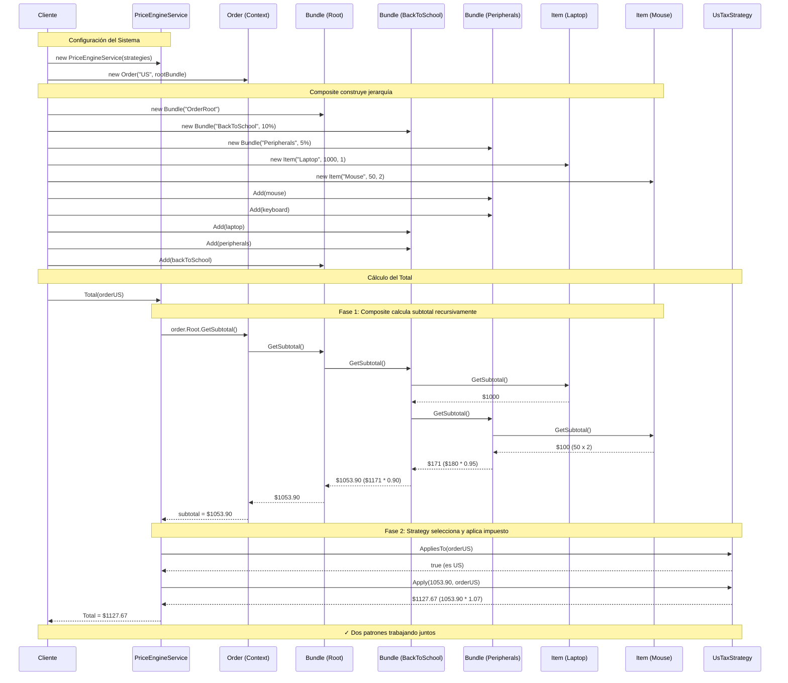
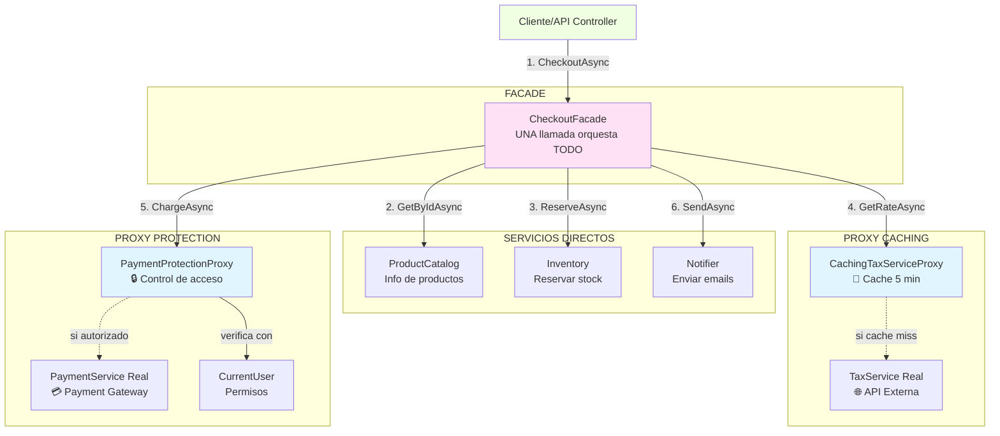
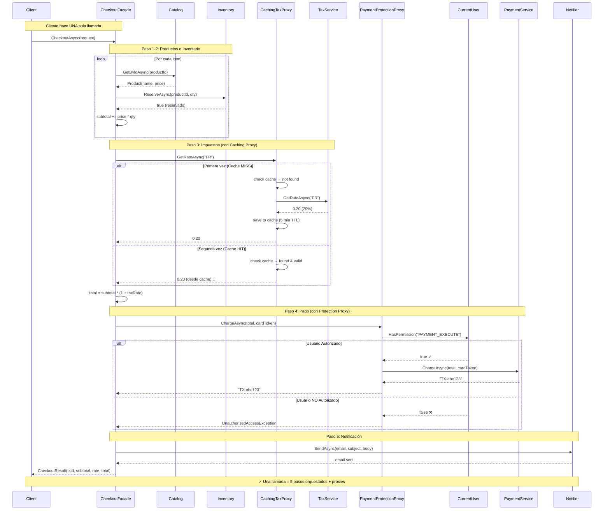

# Ejemplos de Patrones Combinados

## Introducción

Los patrones de diseño raramente se usan de forma aislada. En sistemas del mundo real, múltiples patrones trabajan juntos para resolver problemas complejos. Esta sección documenta ejemplos prácticos de patrones combinados.

---

## 📚 Índice de Ejemplos

1. [Composite + Strategy: Motor de Precios](#composite--strategy-motor-de-precios)
2. _Más ejemplos próximamente_

---

## Composite + Strategy: Motor de Precios

**Crédito**: Profesor **Bismarck Ponce** - Ejemplo de clase

### 🎯 Objetivo del Ejemplo

Crear un sistema de precios para e-commerce que:
- Maneje productos individuales y paquetes con descuentos
- Permita anidación ilimitada de paquetes
- Aplique diferentes reglas de impuestos según el país
- Sea extensible sin modificar código existente

### 🏗️ Arquitectura del Sistema



### 🔄 Diagrama de Clases Completo



### 📊 Diagrama de Secuencia Detallado



### 🔑 Análisis Paso a Paso

#### Paso 1: Construcción de Jerarquía (Composite)

```
OrderRoot (0% desc)
└── BackToSchool (10% desc)
    ├── Laptop: $1000 x 1 = $1000
    └── Peripherals (5% desc)
        ├── Mouse: $50 x 2 = $100
        └── Keyboard: $80 x 1 = $80
```

#### Paso 2: Cálculo Recursivo (Composite)

```
1. Mouse + Keyboard = $100 + $80 = $180
2. Peripherals (5% desc) = $180 * 0.95 = $171
3. Laptop + Peripherals = $1000 + $171 = $1171
4. BackToSchool (10% desc) = $1171 * 0.90 = $1053.90
5. OrderRoot (0% desc) = $1053.90 * 1.00 = $1053.90
```

#### Paso 3: Selección de Estrategia (Strategy)

```csharp
// El servicio busca la primera estrategia aplicable
var strategy = _strategies.FirstOrDefault(s => s.AppliesTo(order))
              ?? new NoTaxStrategy();
```

#### Paso 4: Aplicación de Impuesto (Strategy)

```
País: US → UsTaxStrategy → $1053.90 * 1.07 = $1127.67
País: FR → FrTaxStrategy → $1053.90 * 1.20 = $1264.68
País: EX → ExportTaxStrategy → $1053.90 * 1.00 = $1053.90
```

### 🎨 Patrones Adicionales Identificados

Este ejemplo también implementa sutilmente:

1. **Null Object Pattern**: `NoTaxStrategy` como estrategia por defecto
2. **Chain of Responsibility** (implícito): `FirstOrDefault` con predicado
3. **Template Method** (implícito): `PriceEngineService.Total()` define el flujo

### 💎 Principios de Diseño Aplicados

| Principio SOLID | Cómo se aplica |
|-----------------|----------------|
| **SRP** | Cada estrategia tiene una responsabilidad (calcular impuesto de un país) |
| **OCP** | Abierto a nuevas estrategias/productos, cerrado a modificación |
| **LSP** | Items y Bundles son intercambiables; estrategias son intercambiables |
| **ISP** | Interfaces pequeñas y específicas (`ITaxStrategy`, `IPriceComponent`) |
| **DIP** | `PriceEngineService` depende de abstracciones, no de implementaciones |

### 🧪 Casos de Test Sugeridos

```csharp
[Fact]
public void Bundle_ShouldCalculateRecursiveSubtotal()
{
    // Arrange
    var item1 = new Item("Item1", 100m, 1);
    var item2 = new Item("Item2", 50m, 2);
    var bundle = new Bundle("TestBundle", 0.10m);
    bundle.Add(item1);
    bundle.Add(item2);
    
    // Act
    var subtotal = bundle.GetSubtotal();
    
    // Assert
    Assert.Equal(180m, subtotal); // (100 + 100) * 0.90
}

[Theory]
[InlineData("US", 1127.67)]
[InlineData("FR", 1264.68)]
[InlineData("EXPORT", 1053.90)]
public void PriceEngine_ShouldApplyCorrectTaxStrategy(string country, decimal expected)
{
    // Arrange
    var root = CreateTestBundle(); // $1053.90
    var order = new Order(country, root);
    var strategies = new ITaxStrategy[]
    {
        new UsTaxStrategy(),
        new FrTaxStrategy(),
        new ExportTaxStrategy()
    };
    var engine = new PriceEngineService(strategies);
    
    // Act
    var total = engine.Total(order);
    
    // Assert
    Assert.Equal(expected, total);
}
```

### 📦 Ejecución del Ejemplo

**Ubicación**: `DesignPatterns/Comportamiento/Strategy/csharp/PriceEngineDemo.cs`

```bash
# Crear proyecto
dotnet new console -n PriceEngineDemo
cd PriceEngineDemo

# Copiar el archivo PriceEngineDemo.cs
# Reemplazar Program.cs con PriceEngineDemo.cs

# Ejecutar
dotnet run
```

### 🎓 Valor Educativo

Este ejemplo es excelente para aprender porque:

1. **Mundo real**: Problema común en e-commerce y facturación
2. **Múltiples patrones**: Muestra cómo los patrones colaboran
3. **SOLID en práctica**: Aplica todos los principios SOLID
4. **Código limpio**: Bien estructurado y documentado
5. **Extensible**: Fácil añadir nuevos países o tipos de productos

### 📚 Referencias Cruzadas

- Ver implementación completa: [PriceEngineDemo.cs](./PriceEngineDemo.cs)
- Análisis desde Composite: [Composite C# - Ejemplo Combinado](../../Estructurales/Composite/csharp/README.md#-ejemplo-real-sistema-de-precios-con-composite--strategy)

---

## 📚 Recursos

- [C# Design Patterns](https://www.dofactory.com/net/strategy-design-pattern)
- [Microsoft Docs - Delegates](https://learn.microsoft.com/en-us/dotnet/csharp/programming-guide/delegates/)
- [Func and Action in C#](https://www.c-sharpcorner.com/article/func-and-action-in-c-sharp/)
- [LINQ FirstOrDefault](https://learn.microsoft.com/en-us/dotnet/api/system.linq.enumerable.firstordefault)

---

## 🙏 Créditos

- **Profesor Bismarck Ponce** - Ejemplo de Strategy + Composite en motor de precios
- **Refactoring Guru** - Alexander Shvets
- **DoFactory**
- **Microsoft Learn**

---

## Facade + Proxy: Sistema de Checkout

**Crédito**: Profesor **Bismarck Ponce** - Ejemplo de clase

### 🎯 Problema a Resolver

Una tienda online necesita procesar compras que involucran:

1. **Obtener información de productos** y calcular subtotal
2. **Reservar inventario** para los productos
3. **Aplicar impuestos** según el país del cliente
4. **Cobrar el total** con validación de permisos
5. **Notificar confirmación** por email

**Requisito**: El cliente quiere **una única llamada** `CheckoutAsync()` que maneje toda la complejidad.

**Desafíos adicionales**:
- Las tasas de impuestos se consultan de API externa (costoso)
- No todos los usuarios pueden ejecutar pagos (seguridad)
- Necesitamos optimizar rendimiento

---

### 🏗️ Solución con Facade + Proxy

**Facade** (`CheckoutFacade`):
- Orquesta los 5 pasos del checkout en una operación
- Proporciona interfaz simple al cliente
- Maneja el flujo de negocio

**Proxy #1** (`CachingTaxServiceProxy`):
- Cachea tasas de impuestos (TTL: 5 minutos)
- Evita llamadas repetidas a API externa
- **Tipo**: Caching/Virtual Proxy

**Proxy #2** (`PaymentProtectionProxy`):
- Verifica permisos antes de cobrar
- Bloquea usuarios no autorizados
- **Tipo**: Protection Proxy

---

### 📐 Arquitectura del Sistema



---

### 📊 Diagrama de Secuencia: Escenario Completo



---

### 💻 Código Completo

Ver archivo ejecutable completo: **[CheckoutDemo.cs](../Estructurales/Facade/csharp/CheckoutDemo.cs)**

### Extractos Clave del Código

#### Facade Orquestando Todo

```csharp
public async Task<CheckoutResult> CheckoutAsync(CheckoutRequest req, CancellationToken ct)
{
    // 1. Productos + Inventario + Subtotal
    decimal subtotal = 0m;
    foreach (var item in req.Items)
    {
        var product = await _catalog.GetByIdAsync(item.ProductId, ct) 
                      ?? throw new InvalidOperationException("Producto no existe");
        
        var reserved = await _inventory.ReserveAsync(item.ProductId, item.Qty, ct);
        if (!reserved) throw new InvalidOperationException("Sin stock");
        
        subtotal += product.UnitPrice * item.Qty;
    }

    // 2. Impuestos (usa Caching Proxy)
    var rate = await _tax.GetRateAsync(req.Country, ct);
    var total = Math.Round(subtotal * (1 + rate), 2);

    // 3. Pago (usa Protection Proxy)
    var txId = await _payment.ChargeAsync(total, req.CardToken, ct);

    // 4. Notificación
    await _notifier.SendAsync(req.Email, "Compra confirmada", $"TX: {txId}", ct);

    return new CheckoutResult(txId, subtotal, rate, total);
}
```

#### Caching Proxy

```csharp
public async Task<decimal> GetRateAsync(string country, CancellationToken ct)
{
    var key = country.ToUpperInvariant();
    
    // Check cache
    if (_cache.TryGetValue(key, out var hit) && hit.exp > DateTimeOffset.UtcNow)
        return hit.rate;  // 💾 Cache HIT

    // Cache miss: call real service
    var rate = await _inner.GetRateAsync(country, ct);  // 🔍 Cache MISS
    RealCalls++;
    
    // Save to cache
    _cache[key] = (rate, DateTimeOffset.UtcNow.Add(_ttl));
    return rate;
}
```

#### Protection Proxy

```csharp
public Task<string> ChargeAsync(decimal amount, string cardToken, CancellationToken ct)
{
    // Verificar permisos ANTES de delegar
    if (!_current.HasPermission("PAYMENT_EXECUTE"))
        throw new UnauthorizedAccessException("Missing permission");
    
    // Autorizado: delegar al servicio real
    return _inner.ChargeAsync(amount, cardToken, ct);
}
```

---

### 📈 Resultados de los Escenarios

#### Escenario 1: Usuario con permiso, Francia
```
Input: 1x Laptop ($1000) + 2x Mouse ($100)
Subtotal: $1100.00
Tax (FR 20%): $220.00
Total: $1320.00
✓ Pago procesado
✓ Email enviado
Llamadas TaxService real: 1
```

#### Escenario 1B: Segunda compra (demuestra cache)
```
Input: Mismo request
Subtotal: $1100.00
Tax (FR 20%): $220.00 ← 💾 Desde CACHE
Total: $1320.00
✓ Pago procesado
Llamadas TaxService real: 1 (NO aumentó)
```

#### Escenario 2: Usuario sin permiso
```
Input: Mismo request
Procesamiento:
✓ Productos encontrados
✓ Inventario reservado
✓ Impuestos calculados
❌ BLOQUEADO en el pago por Protection Proxy
Resultado: UnauthorizedAccessException
```

---

### 💡 Ventajas de esta Combinación

#### Facade proporciona:
1. ✅ **Simplicidad**: Una llamada vs. 5 llamadas
2. ✅ **Orquestación**: Coordina el flujo correcto
3. ✅ **Transaccionalidad**: Maneja errores centralizadamente
4. ✅ **Abstracción**: Oculta complejidad al cliente

#### Proxies proporcionan:
1. ✅ **Optimización** (Caching): Reduce latencia y costos
2. ✅ **Seguridad** (Protection): Verifica permisos
3. ✅ **Transparencia**: Cliente no sabe que existen
4. ✅ **Cross-cutting concerns**: Separación de responsabilidades

---

### 🎓 Aplicabilidad en Sistemas Reales

| Dominio | Facade para | Proxies para |
|---------|-------------|--------------|
| **E-commerce** | Checkout process | Caching (precios), Protection (pagos) |
| **Banking** | Transfer money | Logging (auditoría), Protection (límites) |
| **Booking** | Reserve + Pay | Caching (disponibilidad), Remote (APIs) |
| **Healthcare** | Patient admission | Protection (HIPAA), Logging (compliance) |
| **Gaming** | Start game session | Caching (assets), Protection (anti-cheat) |

---

### 🙏 Créditos

- **Profesor Bismarck Ponce** - Ejemplo de Facade + Proxy en sistema de checkout

---

[← Volver a Patrones Combinados](./PatronesCombinadosEjemplos.md)
