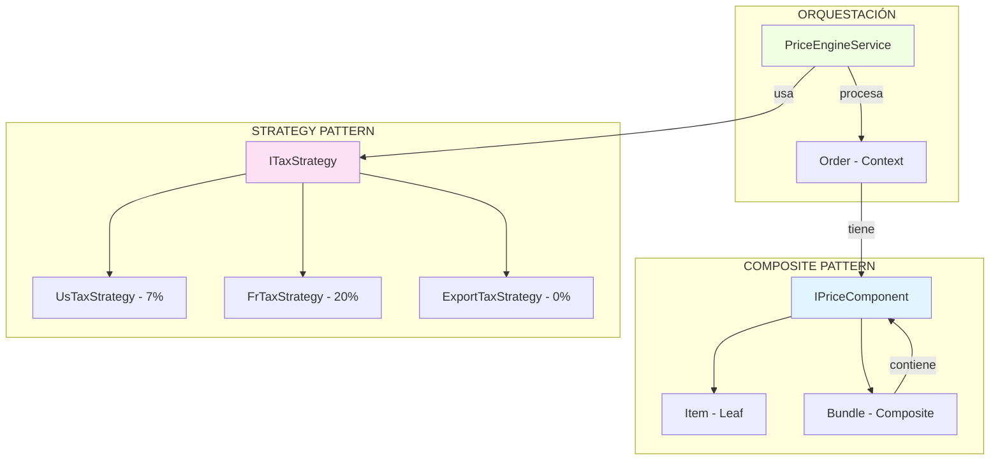
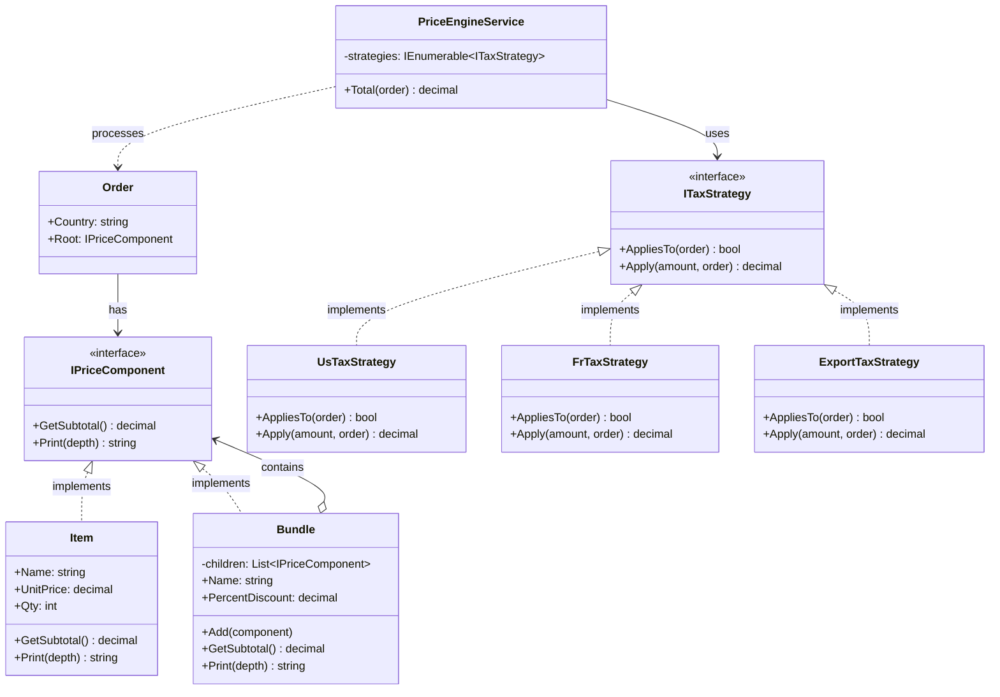
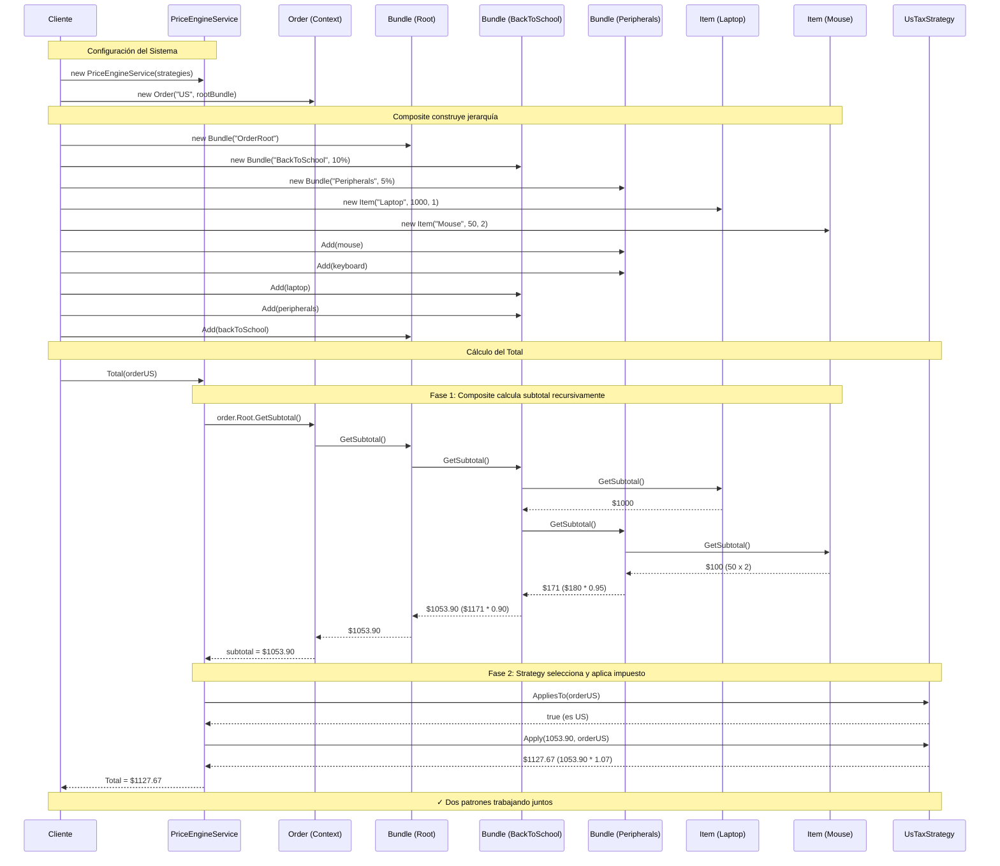

# Ejemplos de Patrones Combinados

## Introducción

Los patrones de diseño raramente se usan de forma aislada. En sistemas del mundo real, múltiples patrones trabajan juntos para resolver problemas complejos. Esta sección documenta ejemplos prácticos de patrones combinados.

---

## 📚 Índice de Ejemplos

1. [Composite + Strategy: Motor de Precios](#composite--strategy-motor-de-precios)
2. _Más ejemplos próximamente_

---

## Composite + Strategy: Motor de Precios

**Crédito**: Profesor **Bismarck Ponce** - Ejemplo de clase

### 🎯 Objetivo del Ejemplo

Crear un sistema de precios para e-commerce que:
- Maneje productos individuales y paquetes con descuentos
- Permita anidación ilimitada de paquetes
- Aplique diferentes reglas de impuestos según el país
- Sea extensible sin modificar código existente

### 🏗️ Arquitectura del Sistema



### 🔄 Diagrama de Clases Completo



### 📊 Diagrama de Secuencia Detallado



### 🔑 Análisis Paso a Paso

#### Paso 1: Construcción de Jerarquía (Composite)

```
OrderRoot (0% desc)
└── BackToSchool (10% desc)
    ├── Laptop: $1000 x 1 = $1000
    └── Peripherals (5% desc)
        ├── Mouse: $50 x 2 = $100
        └── Keyboard: $80 x 1 = $80
```

#### Paso 2: Cálculo Recursivo (Composite)

```
1. Mouse + Keyboard = $100 + $80 = $180
2. Peripherals (5% desc) = $180 * 0.95 = $171
3. Laptop + Peripherals = $1000 + $171 = $1171
4. BackToSchool (10% desc) = $1171 * 0.90 = $1053.90
5. OrderRoot (0% desc) = $1053.90 * 1.00 = $1053.90
```

#### Paso 3: Selección de Estrategia (Strategy)

```csharp
// El servicio busca la primera estrategia aplicable
var strategy = _strategies.FirstOrDefault(s => s.AppliesTo(order))
              ?? new NoTaxStrategy();
```

#### Paso 4: Aplicación de Impuesto (Strategy)

```
País: US → UsTaxStrategy → $1053.90 * 1.07 = $1127.67
País: FR → FrTaxStrategy → $1053.90 * 1.20 = $1264.68
País: EX → ExportTaxStrategy → $1053.90 * 1.00 = $1053.90
```

### 🎨 Patrones Adicionales Identificados

Este ejemplo también implementa sutilmente:

1. **Null Object Pattern**: `NoTaxStrategy` como estrategia por defecto
2. **Chain of Responsibility** (implícito): `FirstOrDefault` con predicado
3. **Template Method** (implícito): `PriceEngineService.Total()` define el flujo

### 💎 Principios de Diseño Aplicados

| Principio SOLID | Cómo se aplica |
|-----------------|----------------|
| **SRP** | Cada estrategia tiene una responsabilidad (calcular impuesto de un país) |
| **OCP** | Abierto a nuevas estrategias/productos, cerrado a modificación |
| **LSP** | Items y Bundles son intercambiables; estrategias son intercambiables |
| **ISP** | Interfaces pequeñas y específicas (`ITaxStrategy`, `IPriceComponent`) |
| **DIP** | `PriceEngineService` depende de abstracciones, no de implementaciones |

### 🧪 Casos de Test Sugeridos

```csharp
[Fact]
public void Bundle_ShouldCalculateRecursiveSubtotal()
{
    // Arrange
    var item1 = new Item("Item1", 100m, 1);
    var item2 = new Item("Item2", 50m, 2);
    var bundle = new Bundle("TestBundle", 0.10m);
    bundle.Add(item1);
    bundle.Add(item2);
    
    // Act
    var subtotal = bundle.GetSubtotal();
    
    // Assert
    Assert.Equal(180m, subtotal); // (100 + 100) * 0.90
}

[Theory]
[InlineData("US", 1127.67)]
[InlineData("FR", 1264.68)]
[InlineData("EXPORT", 1053.90)]
public void PriceEngine_ShouldApplyCorrectTaxStrategy(string country, decimal expected)
{
    // Arrange
    var root = CreateTestBundle(); // $1053.90
    var order = new Order(country, root);
    var strategies = new ITaxStrategy[]
    {
        new UsTaxStrategy(),
        new FrTaxStrategy(),
        new ExportTaxStrategy()
    };
    var engine = new PriceEngineService(strategies);
    
    // Act
    var total = engine.Total(order);
    
    // Assert
    Assert.Equal(expected, total);
}
```

### 📦 Ejecución del Ejemplo

**Ubicación**: `DesignPatterns/Comportamiento/Strategy/csharp/PriceEngineDemo.cs`

```bash
# Crear proyecto
dotnet new console -n PriceEngineDemo
cd PriceEngineDemo

# Copiar el archivo PriceEngineDemo.cs
# Reemplazar Program.cs con PriceEngineDemo.cs

# Ejecutar
dotnet run
```

### 🎓 Valor Educativo

Este ejemplo es excelente para aprender porque:

1. **Mundo real**: Problema común en e-commerce y facturación
2. **Múltiples patrones**: Muestra cómo los patrones colaboran
3. **SOLID en práctica**: Aplica todos los principios SOLID
4. **Código limpio**: Bien estructurado y documentado
5. **Extensible**: Fácil añadir nuevos países o tipos de productos

### 📚 Referencias Cruzadas

- Ver implementación completa: [PriceEngineDemo.cs](./PriceEngineDemo.cs)
- Análisis desde Composite: [Composite C# - Ejemplo Combinado](../../Estructurales/Composite/csharp/README.md#-ejemplo-real-sistema-de-precios-con-composite--strategy)

---

## 📚 Recursos

- [C# Design Patterns](https://www.dofactory.com/net/strategy-design-pattern)
- [Microsoft Docs - Delegates](https://learn.microsoft.com/en-us/dotnet/csharp/programming-guide/delegates/)
- [Func and Action in C#](https://www.c-sharpcorner.com/article/func-and-action-in-c-sharp/)
- [LINQ FirstOrDefault](https://learn.microsoft.com/en-us/dotnet/api/system.linq.enumerable.firstordefault)

---

## 🙏 Créditos

- **Profesor Bismarck Ponce** - Ejemplo de Strategy + Composite en motor de precios
- **Refactoring Guru** - Alexander Shvets
- **DoFactory**
- **Microsoft Learn**

---

[← Volver a Strategy](../README.md)
